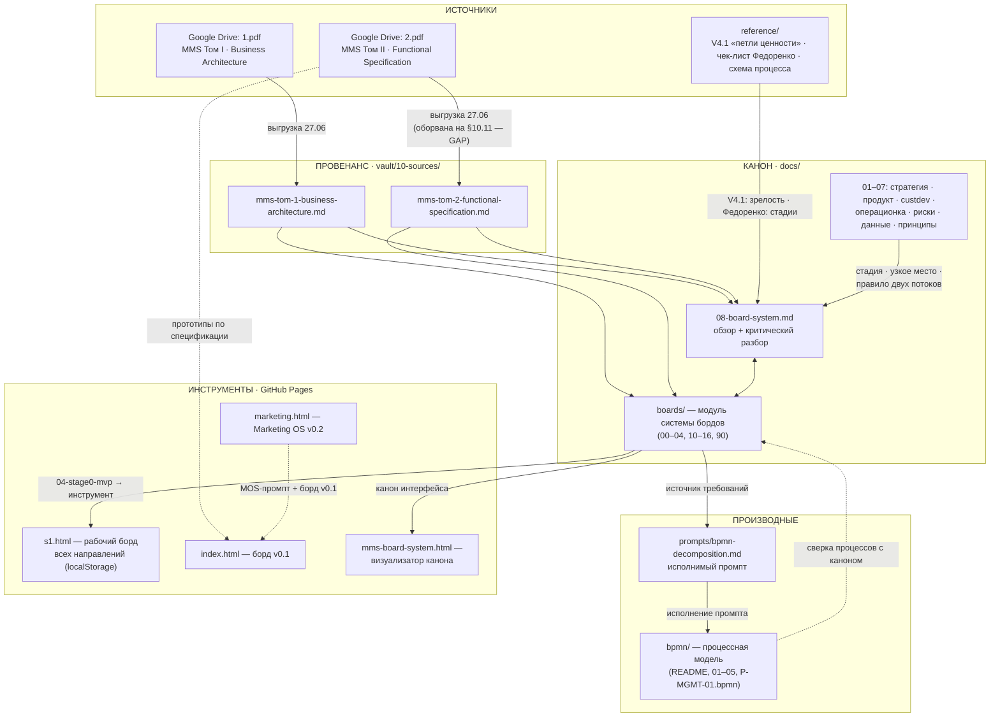
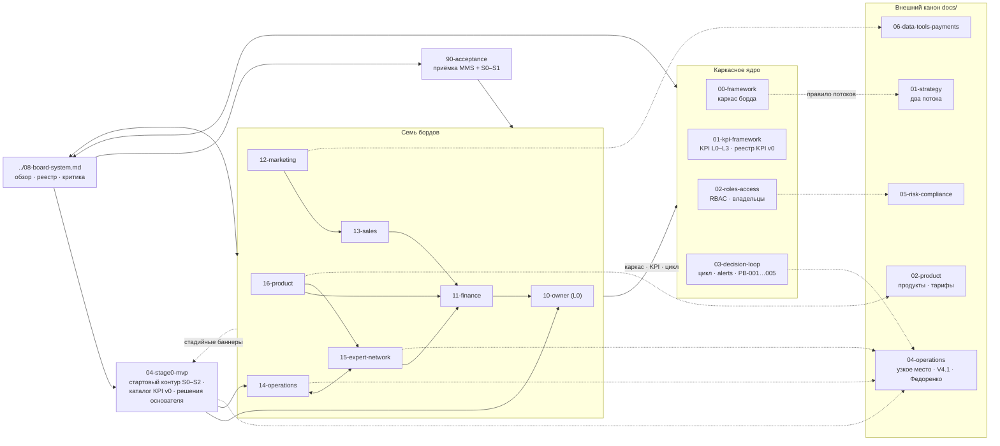

# 09. Блок-схема системы: листы и процессы

Снимок 02.07.2026. Карта того, как связаны между собой документы (листы) и процессы всей
системы бордов: источники → провенанс → канон → процессная модель → рабочие инструменты.
Диаграммы — Mermaid, рендерятся в веб-интерфейсе GitHub.

## 1. Общая карта системы (слои)

Путь знания: PDF с Диска → заметки-источники → канон → производные артефакты → инструменты,
которыми пользуются. Стрелка = «служит источником / порождает».

## 2. Связи листов внутри модуля `docs/boards/`

Каждый борд опирается на каркасное ядро (00 каркас · 01 KPI · 02 роли · 03 цикл решений);
`08` — точка входа и реестр; `04-stage0` — мост к стадии, на него ведут стадийные баннеры
всех L1-бордов; `90` собирает приёмку. Пунктир — ссылка во внешний канон.

## 3. Процессы и их листы

Как процессы связаны между собой и какой лист какой процесс специфицирует (подписи в узлах).
Ядро всего — цикл решений; борды поставляют в него alerts; два потока пересекаются только у
Owner; узкое место наблюдается журналом S0 и выводится на рабочий борд.

```mermaid
flowchart TB
  subgraph VS["Потоки ценности · bpmn/02 · два pool — НЕ смешивать"]
    P1["Поток-1 · Founder Premium (HNW)<br/>личные продажи · ₽ и £ раздельно"]
    P2["Поток-2 · Platform<br/>Трафик → Лид → Скрининг → Оплата → Выдача"]
    BN["★ Узкое место: экспертная проверка отчёта<br/>+ Report Queue · ../04-operations"]
    P2 --> BN
  end

  subgraph DATA["Конвейер данных · bpmn/03 · P-DATA-01"]
    EV["Business Event"] --> RAW["Raw Data"] --> OBJ["Business Objects"]
    OBJ --> KPIC["KPI Catalog · SSOT<br/>(boards/01-kpi-framework)"]
    KPIC --> DASH["Борды L0/L1<br/>(boards/10–16)"]
  end

  subgraph CYCLE["Цикл решений · boards/03 + bpmn/01 · P-MGMT-01"]
    AL["Alert<br/>(Information/Warning/Critical/Emergency)"]
    DR["Drill Down · SP-DRILL"]
    RC["Root Cause · SP-ROOTCAUSE"]
    PB["Playbook PB-001…005<br/>(bpmn/05 — templated)"]
    DEC["Решение — всегда человек"]
    EX["Execution"]
    VER["Verification · SP-VERIFY"]
    KN["Knowledge Base"]
    AL --> DR --> RC --> PB --> DEC --> EX --> VER
    VER -->|"достигнут"| KN
    VER -->|"нет — повторный цикл"| DR
  end

  AI["AI Copilot — ассистент:<br/>объясняет · прогнозирует · рекомендует<br/>НЕ решает (Том I, Принцип №11)"]
  OWNER["Owner: консолидация двух потоков<br/>(boards/10-owner · P-OWNER-01)"]

  subgraph STAGE["Стартовый контур · boards/04-stage0 · сейчас"]
    S0["S0: журнал очереди<br/>5 событий → WIP · p90 · срок · правки"]
    S1["S1: рабочий борд s1.html<br/>воронка + деньги + все направления"]
    DJ["Журнал решений<br/>дата · данные · решение · проверка"]
    S0 --> S1 --> DJ
  end

  P1 ==>|"метрики потока-1"| OWNER
  P2 ==>|"метрики потока-2"| OWNER
  P2 --> EV
  BN -->|"наблюдаемость (V4.1)"| S0
  KPIC -->|"порог превышен"| AL
  DASH --> OWNER
  DASH -->|"отклонение"| AL
  AI -.-> DR
  AI -.-> PB
  KN -.->|"обучение playbook"| PB
  DJ -.->|"ручное исполнение цикла"| CYCLE
  S1 -.->|"алерты по порогам основателя"| AL
```

## Как читать

- **Слой 1** отвечает «откуда что взялось и куда идёт»: любой факт инструмента прослеживается
  через канон к PDF-источнику с датой (правило данных проекта).
- **Слой 2** отвечает «какой лист открывать следом»: борды не читаются в отрыве от ядра
  00–03, а мостом к практике служит `04-stage0-mvp`.
- **Слой 3** отвечает «что происходит в работе»: события → KPI → alert → цикл решений →
  знание; на текущей стадии тот же цикл исполняется вручную связкой журнал S0 → борд S1 →
  журнал решений.

Инварианты, видимые на схеме: два потока пересекаются только у Owner; AI нигде не владеет
решением; узкое место — единственная точка, где клиентский поток входит в операционное
наблюдение S0; каталог KPI — единственный источник истины между данными и бордами.

## Связи

- Обзор системы — `08-board-system.md`; детальный канон — `boards/`; процессы — `bpmn/`.
- Инструменты: `s1.html` (рабочий борд), `mms-board-system.html` (визуализатор канона).
