# 10. Модель данных: запуск любого продукта где угодно

Снимок 08.07.2026.

> Источник: промпт «архитектура базы данных для запуска продуктов в любой точке мира»
> (загружен 08.07.2026). Исполнен как **общая реляционная модель** (табличная среда:
> Google Sheets / Airtable / Notion — связанные таблицы с ключами) плюс мост к канону
> MainExperts. Демо-данные — прескриптивные из промпта (кружка, варианты, подписка, услуга).
> Рабочий контекст, не выверенный источник: перед клиентскими материалами факт
> перепроверять с источником и датой.

Единый источник истины о продуктах, рынках, ценах, продажах и маркетинговых целях. Модель
отвечает на вопрос «запустить **любой** продукт (физический / цифровой / услуга / подписка)
в **любой** стране, на **любом** языке, в **любой** валюте, на **любом** канале — и
управлять этим от бизнес-цели до ежедневных фактов».

**Ядро** (менять нельзя): `Product → SKU → Listing → (Market × Channel) → Fact`.
Продукт не знает о ценах и языках; цена и язык живут на листинге и рынке; факты ссылаются
на `Listing_ID`, а не на продукт напрямую.

## Содержание

- **А. Схема** — ER-диаграмма + поля всех таблиц по слоям.
- **Б. Демо-данные** — связный набор строк, покрывающий все обязательные случаи.
- **В. Витрины** — 6 аналитических представлений с формулами.
- **Г. Сценарии приёмки** — прогон 10 сценариев на демо-данных.
- Допущения, конфликты, правила качества, связь с каноном.

## Допущения (помечены явно)

| # | Допущение | Обоснование |
|---|---|---|
| A1 | Базовая валюта отчётности — **USD** (демо US/RU/DE). | Одна валюта для сводных витрин. В MainExperts база задаётся **на поток** (₽ / £), потоки не смешиваются. |
| A2 | Атрибуция — **last-click, одно касание** через `orders.attribution_campaign_id`. | Мульти-тач требует отдельной событийной таблицы касаний — вне области модели. |
| A3 | Флаг `price_includes_tax` на рынке. | US — цена без налога (налог сверху, не выручка продавца); EU/RU — цена с НДС (net = gross/(1+ставка)). |
| A4 | MRR нормализуется к месяцу **в витрине**; факт хранит период как есть. | MRR — производная, не факт. |
| A5 | Себестоимость и фиксированные сборы канала хранятся в **USD**; в местную валюту/базу пересчитываются по курсу на дату факта. | Закупка и эквайринговый фикс номинированы в опорной валюте. |

## Конфликты требований и их разрешение

1. **«Факты → `Listing_ID`» против остатков.** Сток принадлежит **SKU × складу** (общий запас
   питает несколько листингов). `inventory_snapshots` ссылается на `SKU_ID + Warehouse_ID` —
   единственный факт, легально не идущий через листинг. «Недели запаса по листингу» (В6)
   считаются разложением скорости продаж листингов на их SKU. Осознанное исключение.
2. **P&L требует «− себестоимость», таблицы затрат в промпте нет.** Добавлена `cost_periods`
   (себестоимость SKU с историей, по образцу `price_period`).
3. **Налог — атрибут или таблица.** Ставки меняются во времени, P&L нужна ставка на дату
   факта → отдельная `market_tax` с датами, а не единичный атрибут.
4. **Комиссии (сценарий 10).** Разрешается ядром: два канала → два листинга → у каждого своя
   `channel_fees`. Таблица «комиссия на листинг» не нужна.

---

# А. Схема

## А.0 ER-диаграмма

```mermaid
erDiagram
  PRODUCTS { string Product_ID PK }
  SKUS { string SKU_ID PK
    string Product_ID FK }
  MARKETS { string Market_ID PK
    string Currency_ID FK
    bool price_includes_tax }
  CHANNELS { string Channel_ID PK }
  LISTINGS { string Listing_ID PK
    string SKU_ID FK
    string Channel_ID FK
    string Market_ID FK }
  LANGUAGES { string Language_ID PK }
  CURRENCIES { string Currency_ID PK }
  WAREHOUSES { string Warehouse_ID PK
    string Market_ID FK }
  LISTING_CONTENT { string Content_ID PK
    string Listing_ID FK
    string Language_ID FK }
  FX_RATES { string Rate_ID PK
    string Currency_ID FK
    date rate_date }
  PRICE_PERIODS { string Price_Period_ID PK
    string Listing_ID FK
    string Currency_ID FK
    date valid_from }
  CHANNEL_FEES { string Fee_ID PK
    string Channel_ID FK }
  MARKET_TAX { string Tax_ID PK
    string Market_ID FK }
  COST_PERIODS { string Cost_Period_ID PK
    string SKU_ID FK }
  BUSINESS_OBJECTIVES { string BizObj_ID PK }
  MARKETING_OBJECTIVES { string MktObj_ID PK
    string BizObj_ID FK }
  CAMPAIGN_OBJECTIVES { string CampObj_ID PK
    string MktObj_ID FK
    string Primary_KPI_ID FK }
  CHANNEL_OBJECTIVES { string ChanObj_ID PK
    string MktObj_ID FK
    string Channel_ID FK
    string Primary_KPI_ID FK }
  TEST_OBJECTIVES { string TestObj_ID PK
    string MktObj_ID FK }
  KPI_DEFINITIONS { string KPI_ID PK }
  CAMPAIGN_SUPPORTING_METRICS { string CampObj_ID FK
    string KPI_ID FK }
  CAMPAIGN_CHANNELS { string CampObj_ID FK
    string Channel_ID FK }
  CAMPAIGN_TACTICS { string Tactic_ID PK
    string CampObj_ID FK }
  OBJECTIVE_SCOPE { string Scope_ID PK
    string Objective_Type
    string Objective_ID }
  OUTCOMES { string Outcome_ID PK
    string Objective_ID FK
    string KPI_ID FK
    date outcome_date }
  ORDERS { string Order_ID PK
    string Channel_ID FK
    string Market_ID FK
    string CampObj_ID FK }
  ORDER_LINES { string Line_ID PK
    string Order_ID FK
    string Listing_ID FK
    string Price_Period_ID FK }
  SUBSCRIPTIONS { string Sub_Period_ID PK
    string Listing_ID FK
    string Origin_Order_ID FK }
  BOOKINGS { string Booking_ID PK
    string Listing_ID FK }
  INVENTORY_SNAPSHOTS { string Snapshot_ID PK
    string SKU_ID FK
    string Warehouse_ID FK
    date snap_date }
  MARKETING_DAILY { string Fact_ID PK
    string Channel_ID FK
    string CampObj_ID FK
    string Market_ID FK
    date fact_date }

  PRODUCTS ||--o{ SKUS : "варианты"
  SKUS ||--o{ LISTINGS : "размещается"
  CHANNELS ||--o{ LISTINGS : "продаёт"
  MARKETS ||--o{ LISTINGS : "на рынке"
  CURRENCIES ||--o{ MARKETS : "валюта"
  MARKETS ||--o{ WAREHOUSES : "склады"
  LISTINGS ||--o{ LISTING_CONTENT : "локализация"
  LANGUAGES ||--o{ LISTING_CONTENT : "язык"
  CURRENCIES ||--o{ FX_RATES : "курс"
  LISTINGS ||--o{ PRICE_PERIODS : "цена во времени"
  CURRENCIES ||--o{ PRICE_PERIODS : "в валюте"
  CHANNELS ||--o{ CHANNEL_FEES : "комиссии"
  MARKETS ||--o{ MARKET_TAX : "налог"
  SKUS ||--o{ COST_PERIODS : "себестоимость"
  BUSINESS_OBJECTIVES ||--o{ MARKETING_OBJECTIVES : "раскрывается"
  MARKETING_OBJECTIVES ||--o{ CAMPAIGN_OBJECTIVES : "раскрывается"
  MARKETING_OBJECTIVES ||--o{ CHANNEL_OBJECTIVES : "раскрывается"
  MARKETING_OBJECTIVES ||--o{ TEST_OBJECTIVES : "раскрывается"
  KPI_DEFINITIONS ||--o{ CAMPAIGN_OBJECTIVES : "primary KPI"
  KPI_DEFINITIONS ||--o{ CHANNEL_OBJECTIVES : "primary KPI"
  CAMPAIGN_OBJECTIVES ||--o{ CAMPAIGN_SUPPORTING_METRICS : "метрики"
  KPI_DEFINITIONS ||--o{ CAMPAIGN_SUPPORTING_METRICS : "метрика"
  CAMPAIGN_OBJECTIVES ||--o{ CAMPAIGN_CHANNELS : "каналы"
  CHANNELS ||--o{ CAMPAIGN_CHANNELS : "в кампании"
  CAMPAIGN_OBJECTIVES ||--o{ CAMPAIGN_TACTICS : "тактики"
  CHANNELS ||--o{ CHANNEL_OBJECTIVES : "цель канала"
  KPI_DEFINITIONS ||--o{ OUTCOMES : "измеряет"
  LISTINGS ||--o{ OBJECTIVE_SCOPE : "scope"
  MARKETS ||--o{ OBJECTIVE_SCOPE : "scope"
  CHANNELS ||--o{ OBJECTIVE_SCOPE : "scope"
  ORDERS ||--o{ ORDER_LINES : "строки"
  LISTINGS ||--o{ ORDER_LINES : "продано"
  PRICE_PERIODS ||--o{ ORDER_LINES : "по цене"
  CHANNELS ||--o{ ORDERS : "канал"
  MARKETS ||--o{ ORDERS : "рынок"
  CAMPAIGN_OBJECTIVES ||--o{ ORDERS : "атрибуция"
  LISTINGS ||--o{ SUBSCRIPTIONS : "подписка"
  ORDERS ||--o{ SUBSCRIPTIONS : "породил"
  LISTINGS ||--o{ BOOKINGS : "бронь"
  SKUS ||--o{ INVENTORY_SNAPSHOTS : "остатки"
  WAREHOUSES ||--o{ INVENTORY_SNAPSHOTS : "склад"
  CHANNELS ||--o{ MARKETING_DAILY : "расход"
  MARKETS ||--o{ MARKETING_DAILY : "рынок"
  CAMPAIGN_OBJECTIVES ||--o{ MARKETING_DAILY : "кампания"
```



## А.1 Слой 0 — Справочники ядра

### products — глобальный концепт продукта/услуги
| Поле | Тип | Обяз. | Ключ | Пример |
|---|---|---|---|---|
| Product_ID | string | да | PK | `P001` |
| name | string | да | | `Premium Insulated Mug` |
| type | enum(physical/digital/service/subscription) | да | | `physical` |
| category | string | нет | | `Drinkware` |
| status | enum(active/archived) | да | | `active` |

### skus — конкретный вариант/оффер
| Поле | Тип | Обяз. | Ключ | Пример |
|---|---|---|---|---|
| SKU_ID | string | да | PK | `SKU_MUG_BLACK_500` |
| Product_ID | string | да | FK→products | `P001` |
| variant_label | string | нет | | `Black / 500 ml` |
| unit | string | нет | | `pcs` |
| status | enum(active/archived) | да | | `active` |

### markets — страна/город/таймзона/валюта/налоговый режим
| Поле | Тип | Обяз. | Ключ | Пример |
|---|---|---|---|---|
| Market_ID | string | да | PK | `MKT_US_NYC` |
| country_iso | string | да | | `US` |
| city | string | нет | | `New York` |
| timezone | string(IANA) | да | | `America/New_York` |
| Currency_ID | string | да | FK→currencies | `USD` |
| default_Language_ID | string | да | FK→languages | `EN` |
| price_includes_tax | bool | да | | `FALSE` |

### channels — платформа или продающий аккаунт
| Поле | Тип | Обяз. | Ключ | Пример |
|---|---|---|---|---|
| Channel_ID | string | да | PK | `CH_AMZ_US` |
| name | string | да | | `Amazon US` |
| type | enum(marketplace/own_web/retail/app_store) | да | | `marketplace` |
| settlement_Currency_ID | string | да | FK→currencies | `USD` |

### listings — размещение = SKU × канал × рынок
| Поле | Тип | Обяз. | Ключ | Пример |
|---|---|---|---|---|
| Listing_ID | string | да | PK | `LST_AMZ_US_MUG` |
| SKU_ID | string | да | FK→skus | `SKU_MUG_BLACK_500` |
| Channel_ID | string | да | FK→channels | `CH_AMZ_US` |
| Market_ID | string | да | FK→markets | `MKT_US_NYC` |
| external_ref | string | нет | | `B0MUG123` |
| status | enum(active/paused) | да | | `active` |

*Инвариант: (SKU_ID, Channel_ID, Market_ID) уникальны. Один листинг → ровно один SKU, канал, рынок.*

### languages — справочник языков
| Поле | Тип | Обяз. | Ключ | Пример |
|---|---|---|---|---|
| Language_ID | string | да | PK | `EN` |
| name | string | да | | `English` |

### currencies — справочник валют
| Поле | Тип | Обяз. | Ключ | Пример |
|---|---|---|---|---|
| Currency_ID | string(ISO 4217) | да | PK | `USD` |
| name | string | да | | `US Dollar` |
| is_base | bool | да | | `TRUE` |

### warehouses — склады/точки хранения
| Поле | Тип | Обяз. | Ключ | Пример |
|---|---|---|---|---|
| Warehouse_ID | string | да | PK | `WH_US_EAST` |
| Market_ID | string | да | FK→markets | `MKT_US_NYC` |
| name | string | нет | | `US East (NJ)` |

## А.2 Слой 1 — Локализация, цены, экономика

### listing_content — локализованный контент листинга по языкам
| Поле | Тип | Обяз. | Ключ | Пример |
|---|---|---|---|---|
| Content_ID | string | да | PK | `CNT_MUG_DE_EN` |
| Listing_ID | string | да | FK→listings | `LST_WEB_DE_MUG` |
| Language_ID | string | да | FK→languages | `EN` |
| version | int | да | | `1` |
| title | string | да | | `Premium Insulated Mug` |
| description | text | нет | | `Keeps drinks hot 12h…` |
| keywords | string | нет | | `mug, insulated, eco` |
| is_current | bool | да | | `TRUE` |

### fx_rates — курс валюты к базовой на дату
| Поле | Тип | Обяз. | Ключ | Пример |
|---|---|---|---|---|
| Rate_ID | string | да | PK | `FX_EUR_20260610` |
| Currency_ID | string | да | FK→currencies | `EUR` |
| base_Currency_ID | string | да | FK→currencies | `USD` |
| rate_date | date(ISO) | да | | `2026-06-10` |
| rate_to_base | decimal | да | | `1.08` |

### price_periods — цена листинга с датами действия и типом (история)
| Поле | Тип | Обяз. | Ключ | Пример |
|---|---|---|---|---|
| Price_Period_ID | string | да | PK | `PP_MUG_AMZ_1` |
| Listing_ID | string | да | FK→listings | `LST_AMZ_US_MUG` |
| price | decimal | да | | `24.90` |
| Currency_ID | string | да | FK→currencies | `USD` |
| type | enum(regular/promo) | да | | `regular` |
| valid_from | date | да | | `2026-06-01` |
| valid_to | date | нет (∞ если пусто) | | `2026-06-14` |

### channel_fees — комиссии/сборы канала (% и фикс) с датами
| Поле | Тип | Обяз. | Ключ | Пример |
|---|---|---|---|---|
| Fee_ID | string | да | PK | `FEE_AMZ_1` |
| Channel_ID | string | да | FK→channels | `CH_AMZ_US` |
| percent | decimal | да | | `0.15` |
| fixed | decimal | да | | `0.00` |
| fixed_Currency_ID | string | да | FK→currencies | `USD` |
| valid_from | date | да | | `2026-01-01` |
| valid_to | date | нет | | |

### market_tax — ставка НДС/налога рынка с датами
| Поле | Тип | Обяз. | Ключ | Пример |
|---|---|---|---|---|
| Tax_ID | string | да | PK | `TAX_DE_1` |
| Market_ID | string | да | FK→markets | `MKT_DE_BER` |
| tax_rate | decimal | да | | `0.19` |
| tax_name | string | нет | | `VAT` |
| valid_from | date | да | | `2026-01-01` |
| valid_to | date | нет | | |

### cost_periods — себестоимость SKU с историей *(добавлено, конфликт №2)*
| Поле | Тип | Обяз. | Ключ | Пример |
|---|---|---|---|---|
| Cost_Period_ID | string | да | PK | `COST_MUG_1` |
| SKU_ID | string | да | FK→skus | `SKU_MUG_BLACK_500` |
| unit_cost | decimal | да | | `6.00` |
| Currency_ID | string | да | FK→currencies | `USD` |
| valid_from | date | да | | `2026-01-01` |
| valid_to | date | нет | | |

## А.3 Слой 2 — Слой целей (планирование)

### business_objectives — бизнес-цель
| Поле | Тип | Обяз. | Ключ | Пример |
|---|---|---|---|---|
| BizObj_ID | string | да | PK | `BO1` |
| name | string | да | | `Выйти на $50k выручки/мес к Q4` |
| owner | string | да | | `CEO` |
| horizon | string | нет | | `2026-Q4` |

### marketing_objectives — маркетинговая цель
| Поле | Тип | Обяз. | Ключ | Пример |
|---|---|---|---|---|
| MktObj_ID | string | да | PK | `MO1` |
| BizObj_ID | string | да | FK→business_objectives | `BO1` |
| name | string | да | | `60% выручки через платные каналы` |
| owner | string | да | | `CMO` |

### campaign_objectives — цель кампании
| Поле | Тип | Обяз. | Ключ | Пример |
|---|---|---|---|---|
| CampObj_ID | string | да | PK | `CO1` |
| MktObj_ID | string | да | FK→marketing_objectives | `MO1` |
| name | string | да | | `Запуск Mug в US` |
| target_audience | string | да | | `US, 25–40, эко, кофеманы` |
| desired_change | string | да | | `от незнания бренда к 1-й покупке` |
| Primary_KPI_ID | string | да | FK→kpi_definitions | `KPI_ROAS` |
| status | enum(planned/running/done) | да | | `running` |

### channel_objectives — цель по каналу (baseline/target числами с датами)
| Поле | Тип | Обяз. | Ключ | Пример |
|---|---|---|---|---|
| ChanObj_ID | string | да | PK | `CHO1` |
| MktObj_ID | string | да | FK→marketing_objectives | `MO1` |
| Channel_ID | string | да | FK→channels | `CH_AMZ_US` |
| Primary_KPI_ID | string | да | FK→kpi_definitions | `KPI_ROAS` |
| baseline_value | decimal | да | | `1.8` |
| baseline_date | date | да | | `2026-05-31` |
| target_value | decimal | да | | `3.0` |
| target_date | date | да | | `2026-08-31` |
| optimization_loop | string | да | | `еженедельная переоценка ставок` |

### test_objectives — цель-тест (доводится до решения)
| Поле | Тип | Обяз. | Ключ | Пример |
|---|---|---|---|---|
| TestObj_ID | string | да | PK | `TO1` |
| MktObj_ID | string | да | FK→marketing_objectives | `MO1` |
| assumption | string | да | | `не знаем, какая цена конвертит` |
| hypothesis | string | да | | `$24.90 даёт выручку выше, чем $27.90` |
| test_variable | string | да | | `цена листинга US` |
| success_threshold | string | да | | `выручка/нед при $24.90 ≥ +10%` |
| decision_rule | string | да | | `порог достигнут → $24.90, иначе $27.90` |
| status | enum(planned/running/done) | да | | `done` |
| result_value | string | нет (обяз. при done) | | `−4% выручки, +18% маржи` |
| decision_date | date | нет (обяз. при done) | | `2026-06-21` |
| decision_taken | string | нет (обяз. при done) | | `оставить $27.90` |

### kpi_definitions — словарь KPI (формула из фактов)
| Поле | Тип | Обяз. | Ключ | Пример |
|---|---|---|---|---|
| KPI_ID | string | да | PK | `KPI_ROAS` |
| name | string | да | | `ROAS` |
| meaning | string | да | | `возврат на рекламный расход` |
| formula | string | да | | `Σ attributed net_revenue_base / Σ marketing spend_base` |
| source_tables | string | да | | `order_lines, orders, marketing_daily, fx_rates` |
| unit | string | да | | `x` |

### campaign_supporting_metrics — мост кампания ↔ вспом. метрики
| Поле | Тип | Обяз. | Ключ | Пример |
|---|---|---|---|---|
| CampObj_ID | string | да | FK→campaign_objectives | `CO1` |
| KPI_ID | string | да | FK→kpi_definitions | `KPI_CTR` |

*(PK — составной: CampObj_ID + KPI_ID.)*

### campaign_channels — мост кампания ↔ каналы (M:N)
| Поле | Тип | Обяз. | Ключ | Пример |
|---|---|---|---|---|
| CampObj_ID | string | да | FK→campaign_objectives | `CO1` |
| Channel_ID | string | да | FK→channels | `CH_AMZ_US` |

*(PK — составной.)*

### campaign_tactics — тактики кампании
| Поле | Тип | Обяз. | Ключ | Пример |
|---|---|---|---|---|
| Tactic_ID | string | да | PK | `TAC_CO1_1` |
| CampObj_ID | string | да | FK→campaign_objectives | `CO1` |
| tactic | string | да | | `видео-обзоры у блогеров` |

### objective_scope — мост: цель ↔ продукт/SKU/листинг/рынок/канал
| Поле | Тип | Обяз. | Ключ | Пример |
|---|---|---|---|---|
| Scope_ID | string | да | PK | `SCP_CO1_1` |
| Objective_Type | enum(business/marketing/campaign/channel/test) | да | | `campaign` |
| Objective_ID | string | да | FK(логич.)→*_objectives | `CO1` |
| Product_ID | string | нет | FK→products | |
| SKU_ID | string | нет | FK→skus | |
| Listing_ID | string | нет | FK→listings | `LST_AMZ_US_MUG` |
| Market_ID | string | нет | FK→markets | `MKT_US_NYC` |
| Channel_ID | string | нет | FK→channels | |

*Полиморфная ссылка (Objective_Type + Objective_ID) — в Airtable/Notion реализуется отдельными linked-полями по типам; в Sheets — парой колонок с проверкой.*

### outcomes — факт результата цели (план в цели, факт здесь)
| Поле | Тип | Обяз. | Ключ | Пример |
|---|---|---|---|---|
| Outcome_ID | string | да | PK | `OUT_CO1_1` |
| Objective_Type | enum(...) | да | | `campaign` |
| Objective_ID | string | да | FK(логич.) | `CO1` |
| KPI_ID | string | да | FK→kpi_definitions | `KPI_ROAS` |
| outcome_date | date | да | | `2026-06-30` |
| actual_value | decimal | да | | `2.4` |

## А.4 Слой 3 — Фактовый слой (append-only)

### orders — шапка заказа
| Поле | Тип | Обяз. | Ключ | Пример |
|---|---|---|---|---|
| Order_ID | string | да | PK | `ORD001` |
| order_date | date | да | | `2026-06-10` |
| Channel_ID | string | да | FK→channels | `CH_AMZ_US` |
| Market_ID | string | да | FK→markets | `MKT_US_NYC` |
| attribution_CampObj_ID | string | нет | FK→campaign_objectives | `CO1` |
| status | enum(paid/cancelled/returned) | да | | `paid` |

### order_lines — строка заказа (грань факта продаж)
| Поле | Тип | Обяз. | Ключ | Пример |
|---|---|---|---|---|
| Line_ID | string | да | PK | `L001` |
| Order_ID | string | да | FK→orders | `ORD001` |
| Listing_ID | string | да | FK→listings | `LST_AMZ_US_MUG` |
| qty | int (может быть <0 для сторно) | да | | `2` |
| unit_price | decimal | да | | `24.90` |
| Currency_ID | string | да | FK→currencies | `USD` |
| Price_Period_ID | string | да | FK→price_periods | `PP_MUG_AMZ_1` |
| line_date | date | да | | `2026-06-10` |
| status | enum(paid/return) | да | | `paid` |

### subscriptions — период подписки (append-only, одна строка = один биллинг-период)
| Поле | Тип | Обяз. | Ключ | Пример |
|---|---|---|---|---|
| Sub_Period_ID | string | да | PK | `SUBP001` |
| Subscription_ID | string | да | (группа) | `SUBSCR_APP_001` |
| Listing_ID | string | да | FK→listings | `LST_WEB_US_APPPRO` |
| Origin_Order_ID | string | да | FK→orders | `ORD007` |
| period_start | date | да | | `2026-06-19` |
| period_end | date | да | | `2026-07-19` |
| status | enum(active/renewed/cancelled) | да | | `active` |
| mrr_amount | decimal | да | | `9.99` |
| Currency_ID | string | да | FK→currencies | `USD` |

### bookings — запись на услугу
| Поле | Тип | Обяз. | Ключ | Пример |
|---|---|---|---|---|
| Booking_ID | string | да | PK | `BKG001` |
| Listing_ID | string | да | FK→listings | `LST_WEB_US_CONSULT` |
| slot_datetime | datetime(ISO) | да | | `2026-06-25T15:00` |
| status | enum(booked/completed/cancelled) | да | | `completed` |
| Origin_Order_ID | string | нет | FK→orders | `ORD010` |

### inventory_snapshots — остатки SKU × склад на дату *(грануляция, конфликт №1)*
| Поле | Тип | Обяз. | Ключ | Пример |
|---|---|---|---|---|
| Snapshot_ID | string | да | PK | `INV_MUG_USE_0601` |
| SKU_ID | string | да | FK→skus | `SKU_MUG_BLACK_500` |
| Warehouse_ID | string | да | FK→warehouses | `WH_US_EAST` |
| snap_date | date | да | | `2026-06-01` |
| qty_on_hand | int | да | | `200` |

### marketing_daily — дневной факт маркетинга
| Поле | Тип | Обяз. | Ключ | Пример |
|---|---|---|---|---|
| Fact_ID | string | да | PK | `MKT_0610_AMZ` |
| fact_date | date | да | | `2026-06-10` |
| Channel_ID | string | да | FK→channels | `CH_AMZ_US` |
| CampObj_ID | string | нет | FK→campaign_objectives | `CO1` |
| Market_ID | string | да | FK→markets | `MKT_US_NYC` |
| spend | decimal | да | | `120.00` |
| spend_Currency_ID | string | да | FK→currencies | `USD` |
| impressions | int | нет | | `20000` |
| clicks | int | нет | | `400` |
| conversions | int | нет | | `12` |

---

# Б. Демо-данные

> Валюты: USD (база), EUR, RUB. Курсы на 2026-06-10 и 2026-06-15: EUR→USD 1.08, RUB→USD 0.0125.

**products**

| Product_ID | name | type |
|---|---|---|
| P001 | Premium Insulated Mug | physical |
| P002 | Aroma Diffuser | physical |
| P003 | Focus App Pro | subscription |
| P004 | 1:1 Consultation | service |

**skus**

| SKU_ID | Product_ID | variant_label |
|---|---|---|
| SKU_MUG_BLACK_500 | P001 | Black / 500 ml |
| SKU_DIFF_100 | P002 | 100 ml |
| SKU_DIFF_200 | P002 | 200 ml |
| SKU_DIFF_300 | P002 | 300 ml |
| SKU_APP_PRO_M | P003 | Monthly |
| SKU_CONSULT_60 | P004 | 60 min |

**markets**

| Market_ID | country | timezone | Currency_ID | default_lang | price_includes_tax |
|---|---|---|---|---|---|
| MKT_US_NYC | US | America/New_York | USD | EN | FALSE |
| MKT_RU_MOW | RU | Europe/Moscow | RUB | RU | TRUE |
| MKT_DE_BER | DE | Europe/Berlin | EUR | DE | TRUE |

**channels**

| Channel_ID | name | type | settlement |
|---|---|---|---|
| CH_AMZ_US | Amazon US | marketplace | USD |
| CH_WEB | Own Web (Stripe) | own_web | USD |
| CH_OZON_RU | Ozon RU | marketplace | RUB |

**listings**

| Listing_ID | SKU_ID | Channel_ID | Market_ID |
|---|---|---|---|
| LST_AMZ_US_MUG | SKU_MUG_BLACK_500 | CH_AMZ_US | MKT_US_NYC |
| LST_WEB_US_MUG | SKU_MUG_BLACK_500 | CH_WEB | MKT_US_NYC |
| LST_WEB_DE_MUG | SKU_MUG_BLACK_500 | CH_WEB | MKT_DE_BER |
| LST_WEB_RU_MUG | SKU_MUG_BLACK_500 | CH_WEB | MKT_RU_MOW |
| LST_OZON_RU_MUG | SKU_MUG_BLACK_500 | CH_OZON_RU | MKT_RU_MOW |
| LST_WEB_US_DIFF100 | SKU_DIFF_100 | CH_WEB | MKT_US_NYC |
| LST_WEB_US_DIFF200 | SKU_DIFF_200 | CH_WEB | MKT_US_NYC |
| LST_WEB_US_DIFF300 | SKU_DIFF_300 | CH_WEB | MKT_US_NYC |
| LST_WEB_US_APPPRO | SKU_APP_PRO_M | CH_WEB | MKT_US_NYC |
| LST_WEB_US_CONSULT | SKU_CONSULT_60 | CH_WEB | MKT_US_NYC |

*Кружка (один SKU): US на 2 каналах (Amazon + Web), плюс DE и RU через Web = 3 страны / 2 канала. `LST_OZON_RU_MUG` добавлен как демонстрация выхода на новый канал (сценарий 3).*

**languages:** `EN` English · `RU` Русский · `DE` Deutsch

**currencies:** `USD` (is_base=TRUE) · `EUR` · `RUB`

**warehouses:** `WH_US_EAST` (MKT_US_NYC) · `WH_DE_CENTRAL` (MKT_DE_BER)

**listing_content** *(листинг DE — на двух языках; сценарий 4)*

| Content_ID | Listing_ID | Language_ID | version | title | is_current |
|---|---|---|---|---|---|
| CNT_MUG_DE_DE | LST_WEB_DE_MUG | DE | 1 | Premium Thermobecher | TRUE |
| CNT_MUG_DE_EN | LST_WEB_DE_MUG | EN | 1 | Premium Insulated Mug | TRUE |
| CNT_MUG_RU_RU | LST_WEB_RU_MUG | RU | 1 | Премиальная термокружка | TRUE |
| CNT_MUG_AMZ_EN | LST_AMZ_US_MUG | EN | 1 | Premium Insulated Mug 500ml | TRUE |
| CNT_APP_EN | LST_WEB_US_APPPRO | EN | 2 | Focus App Pro | TRUE |

**fx_rates**

| Rate_ID | Currency_ID | base | rate_date | rate_to_base |
|---|---|---|---|---|
| FX_EUR_0610 | EUR | USD | 2026-06-10 | 1.08 |
| FX_RUB_0610 | RUB | USD | 2026-06-10 | 0.0125 |
| FX_EUR_0615 | EUR | USD | 2026-06-15 | 1.08 |
| FX_RUB_0615 | RUB | USD | 2026-06-15 | 0.0125 |
| FX_USD_0610 | USD | USD | 2026-06-10 | 1.00 |

**price_periods** *(смена цены US Amazon с 15-го; промо на DE)*

| Price_Period_ID | Listing_ID | price | Cur | type | valid_from | valid_to |
|---|---|---|---|---|---|---|
| PP_MUG_AMZ_1 | LST_AMZ_US_MUG | 24.90 | USD | regular | 2026-06-01 | 2026-06-14 |
| PP_MUG_AMZ_2 | LST_AMZ_US_MUG | 27.90 | USD | regular | 2026-06-15 | |
| PP_MUG_WEBUS_1 | LST_WEB_US_MUG | 26.90 | USD | regular | 2026-06-01 | |
| PP_MUG_DE_1 | LST_WEB_DE_MUG | 27.90 | EUR | regular | 2026-06-01 | |
| PP_MUG_RU_1 | LST_WEB_RU_MUG | 1990 | RUB | regular | 2026-06-01 | |
| PP_MUG_OZON_1 | LST_OZON_RU_MUG | 2090 | RUB | regular | 2026-06-20 | |
| PP_DIFF200_1 | LST_WEB_US_DIFF200 | 39.00 | USD | regular | 2026-06-01 | |
| PP_APP_1 | LST_WEB_US_APPPRO | 9.99 | USD | regular | 2026-06-01 | |
| PP_CONSULT_1 | LST_WEB_US_CONSULT | 120.00 | USD | regular | 2026-06-01 | |

**channel_fees**

| Fee_ID | Channel_ID | percent | fixed | fixed_Cur | valid_from |
|---|---|---|---|---|---|
| FEE_AMZ_1 | CH_AMZ_US | 0.15 | 0.00 | USD | 2026-01-01 |
| FEE_WEB_1 | CH_WEB | 0.029 | 0.30 | USD | 2026-01-01 |
| FEE_OZON_1 | CH_OZON_RU | 0.12 | 0.00 | RUB | 2026-01-01 |

**market_tax**

| Tax_ID | Market_ID | tax_rate | tax_name | valid_from |
|---|---|---|---|---|
| TAX_US_1 | MKT_US_NYC | 0.08875 | Sales Tax | 2026-01-01 |
| TAX_DE_1 | MKT_DE_BER | 0.19 | VAT | 2026-01-01 |
| TAX_RU_1 | MKT_RU_MOW | 0.20 | VAT | 2026-01-01 |

**cost_periods**

| Cost_Period_ID | SKU_ID | unit_cost | Cur | valid_from |
|---|---|---|---|---|
| COST_MUG_1 | SKU_MUG_BLACK_500 | 6.00 | USD | 2026-01-01 |
| COST_DIFF200_1 | SKU_DIFF_200 | 5.50 | USD | 2026-01-01 |
| COST_APP_1 | SKU_APP_PRO_M | 0.80 | USD | 2026-01-01 |
| COST_CONSULT_1 | SKU_CONSULT_60 | 20.00 | USD | 2026-01-01 |

**Слой целей**

business_objectives: `BO1` — «Выйти на $50k выручки/мес к Q4 2026» (owner CEO).

marketing_objectives: `MO1 → BO1` — «60% выручки через платные каналы» (owner CMO).

campaign_objectives:

| CampObj_ID | MktObj_ID | name | target_audience | desired_change | Primary_KPI | status |
|---|---|---|---|---|---|---|
| CO1 | MO1 | Запуск Mug в US | US 25–40, эко, кофеманы | незнание → 1-я покупка | KPI_ROAS | running |

channel_objectives:

| ChanObj_ID | MktObj_ID | Channel_ID | Primary_KPI | baseline | base_date | target | target_date |
|---|---|---|---|---|---|---|---|
| CHO1 | MO1 | CH_AMZ_US | KPI_ROAS | 1.8 | 2026-05-31 | 3.0 | 2026-08-31 |
| CHO2 | MO1 | CH_WEB | KPI_CVR | 0.012 | 2026-05-31 | 0.025 | 2026-08-31 |

test_objectives:

| TestObj_ID | hypothesis | test_variable | success_threshold | decision_rule | status | result_value | decision_date | decision_taken |
|---|---|---|---|---|---|---|---|---|
| TO1 | $24.90 > $27.90 по выручке | цена US Amazon | выручка/нед +10% | порог → $24.90, иначе $27.90 | done | −4% выручки, +18% маржи | 2026-06-21 | оставить $27.90 |

kpi_definitions:

| KPI_ID | name | formula | source_tables |
|---|---|---|---|
| KPI_ROAS | ROAS | Σ attributed net_revenue_base / Σ spend_base | order_lines, orders, marketing_daily, fx_rates |
| KPI_CVR | Conversion Rate | Σ conversions / Σ clicks | marketing_daily |
| KPI_CTR | CTR | Σ clicks / Σ impressions | marketing_daily |
| KPI_REVENUE | Net Revenue | Σ net_revenue_base (order_lines) | order_lines, market_tax, fx_rates |
| KPI_MRR | MRR | Σ active mrr_amount_base за месяц | subscriptions, fx_rates |

campaign_supporting_metrics: `(CO1, KPI_CTR)`, `(CO1, KPI_CVR)`.
campaign_channels: `(CO1, CH_AMZ_US)`, `(CO1, CH_WEB)`.
campaign_tactics: `TAC_CO1_1` видео-обзоры · `TAC_CO1_2` ретаргетинг · `TAC_CO1_3` промо первую неделю.

objective_scope:

| Scope_ID | Obj_Type | Obj_ID | Listing_ID | Market_ID | Channel_ID |
|---|---|---|---|---|---|
| SCP_CO1_1 | campaign | CO1 | LST_AMZ_US_MUG | MKT_US_NYC | |
| SCP_CO1_2 | campaign | CO1 | LST_WEB_US_MUG | MKT_US_NYC | |
| SCP_CHO1 | channel | CHO1 | | MKT_US_NYC | CH_AMZ_US |
| SCP_CHO2 | channel | CHO2 | | MKT_US_NYC | CH_WEB |
| SCP_TO1 | test | TO1 | LST_AMZ_US_MUG | MKT_US_NYC | |

outcomes:

| Outcome_ID | Obj_Type | Obj_ID | KPI_ID | outcome_date | actual_value |
|---|---|---|---|---|---|
| OUT_CO1 | campaign | CO1 | KPI_ROAS | 2026-06-30 | 2.4 |
| OUT_CHO1 | channel | CHO1 | KPI_ROAS | 2026-06-30 | 2.1 |
| OUT_CHO2 | channel | CHO2 | KPI_CVR | 2026-06-30 | 0.017 |

**Фактовый слой**

orders:

| Order_ID | order_date | Channel_ID | Market_ID | attribution | status |
|---|---|---|---|---|---|
| ORD001 | 2026-06-10 | CH_AMZ_US | MKT_US_NYC | CO1 | paid |
| ORD002 | 2026-06-12 | CH_WEB | MKT_DE_BER | | paid |
| ORD003 | 2026-06-13 | CH_WEB | MKT_RU_MOW | | paid |
| ORD004 | 2026-06-16 | CH_AMZ_US | MKT_US_NYC | CO1 | paid |
| ORD005 | 2026-06-17 | CH_WEB | MKT_US_NYC | CO1 | paid |
| ORD006 | 2026-06-18 | CH_WEB | MKT_US_NYC | | paid |
| ORD007 | 2026-06-19 | CH_WEB | MKT_US_NYC | | paid |
| ORD008 | 2026-06-20 | CH_AMZ_US | MKT_US_NYC | CO1 | returned |
| ORD009 | 2026-07-19 | CH_WEB | MKT_US_NYC | | paid |
| ORD010 | 2026-06-24 | CH_WEB | MKT_US_NYC | | paid |

order_lines:

| Line_ID | Order_ID | Listing_ID | qty | unit_price | Cur | Price_Period_ID | line_date | status |
|---|---|---|---|---|---|---|---|---|
| L001 | ORD001 | LST_AMZ_US_MUG | 2 | 24.90 | USD | PP_MUG_AMZ_1 | 2026-06-10 | paid |
| L002 | ORD002 | LST_WEB_DE_MUG | 1 | 27.90 | EUR | PP_MUG_DE_1 | 2026-06-12 | paid |
| L003 | ORD003 | LST_WEB_RU_MUG | 3 | 1990 | RUB | PP_MUG_RU_1 | 2026-06-13 | paid |
| L004 | ORD004 | LST_AMZ_US_MUG | 1 | 27.90 | USD | PP_MUG_AMZ_2 | 2026-06-16 | paid |
| L005 | ORD005 | LST_WEB_US_MUG | 1 | 26.90 | USD | PP_MUG_WEBUS_1 | 2026-06-17 | paid |
| L006 | ORD006 | LST_WEB_US_DIFF200 | 1 | 39.00 | USD | PP_DIFF200_1 | 2026-06-18 | paid |
| L007 | ORD007 | LST_WEB_US_APPPRO | 1 | 9.99 | USD | PP_APP_1 | 2026-06-19 | paid |
| L008 | ORD008 | LST_AMZ_US_MUG | 1 | 27.90 | USD | PP_MUG_AMZ_2 | 2026-06-20 | paid |
| L008R | ORD008 | LST_AMZ_US_MUG | −1 | 27.90 | USD | PP_MUG_AMZ_2 | 2026-06-24 | return |
| L009 | ORD009 | LST_WEB_US_APPPRO | 1 | 9.99 | USD | PP_APP_1 | 2026-07-19 | paid |
| L010 | ORD010 | LST_WEB_US_CONSULT | 1 | 120.00 | USD | PP_CONSULT_1 | 2026-06-24 | paid |

*Возврат (сценарий 6): исходная строка `L008` (paid) сохраняется; корректировка — новая строка `L008R` (qty −1, status return). Факт не удаляется.*

subscriptions:

| Sub_Period_ID | Subscription_ID | Listing_ID | Origin_Order | period_start | period_end | status | mrr | Cur |
|---|---|---|---|---|---|---|---|---|
| SUBP001 | SUBSCR_APP_001 | LST_WEB_US_APPPRO | ORD007 | 2026-06-19 | 2026-07-19 | active | 9.99 | USD |
| SUBP002 | SUBSCR_APP_001 | LST_WEB_US_APPPRO | ORD009 | 2026-07-19 | 2026-08-19 | renewed | 9.99 | USD |
| SUBP003 | SUBSCR_APP_001 | LST_WEB_US_APPPRO | ORD009 | 2026-08-19 | 2026-09-19 | cancelled | 0.00 | USD |

bookings:

| Booking_ID | Listing_ID | slot_datetime | status | Origin_Order |
|---|---|---|---|---|
| BKG001 | LST_WEB_US_CONSULT | 2026-06-25T15:00 | completed | ORD010 |
| BKG002 | LST_WEB_US_CONSULT | 2026-06-27T10:00 | cancelled | |

inventory_snapshots:

| Snapshot_ID | SKU_ID | Warehouse_ID | snap_date | qty_on_hand |
|---|---|---|---|---|
| INV_MUG_USE_0601 | SKU_MUG_BLACK_500 | WH_US_EAST | 2026-06-01 | 200 |
| INV_MUG_USE_0615 | SKU_MUG_BLACK_500 | WH_US_EAST | 2026-06-15 | 150 |
| INV_MUG_USE_0622 | SKU_MUG_BLACK_500 | WH_US_EAST | 2026-06-22 | 120 |
| INV_MUG_DE_0601 | SKU_MUG_BLACK_500 | WH_DE_CENTRAL | 2026-06-01 | 80 |
| INV_DIFF200_USE_0622 | SKU_DIFF_200 | WH_US_EAST | 2026-06-22 | 40 |

marketing_daily:

| Fact_ID | fact_date | Channel_ID | CampObj_ID | Market_ID | spend | Cur | impressions | clicks | conversions |
|---|---|---|---|---|---|---|---|---|---|
| MKT_0610_AMZ | 2026-06-10 | CH_AMZ_US | CO1 | MKT_US_NYC | 120.00 | USD | 20000 | 400 | 12 |
| MKT_0610_WEB | 2026-06-10 | CH_WEB | CO1 | MKT_US_NYC | 80.00 | USD | 15000 | 300 | 6 |
| MKT_0616_AMZ | 2026-06-16 | CH_AMZ_US | CO1 | MKT_US_NYC | 130.00 | USD | 21000 | 380 | 9 |
| MKT_0617_WEB | 2026-06-17 | CH_WEB | CO1 | MKT_US_NYC | 75.00 | USD | 14000 | 280 | 7 |

---

# В. Аналитические витрины (представления + формулы)

Все денежные величины сводятся в **базовую валюту** через `fx_rates` на дату факта.
Обозначим для строки `order_lines`:

- `gross = qty × unit_price` (в валюте листинга)
- `tax_rate` = `market_tax` рынка листинга на `line_date`
- `net_revenue = price_includes_tax ? gross / (1 + tax_rate) : gross`
  *(US: налог сверху, не выручка продавца → net = gross; DE/RU: цена с НДС → net = gross/(1+ставка))*
- `fee = channel_fees.percent × gross + channel_fees.fixed_base` *(фикс → база по курсу)*
- `cogs = qty × cost_periods.unit_cost` (в USD)
- `fx` = курс валюты листинга к базе на `line_date`
- `net_revenue_base = net_revenue × fx` · `fee_base = fee_local × fx` (или фикс уже в базе)

### В1. `v_pnl_listing` — P&L по листингу
Группировка: `Listing_ID` за период. Поля:

```
gross_local        = Σ gross
net_revenue_local  = Σ net_revenue
channel_fee_local  = Σ fee
cogs_base          = Σ cogs
net_revenue_base   = Σ (net_revenue × fx)
channel_fee_base   = Σ (fee_local × fx)
margin_base        = net_revenue_base − channel_fee_base − cogs_base
```
Возвраты входят автоматически: строки со `status=return` имеют `qty<0` и вычитаются.

### В2. `v_pnl_rollup` — P&L сводно
`v_pnl_listing` ⋈ `listings` ⋈ `skus`. Группировки: по `Product_ID`, по `Market_ID`,
по `Channel_ID`. Метрика: `Σ margin_base`, `Σ net_revenue_base`.

### В3. `v_mkt_share_vs_target` — доля расхода от выручки vs target
Группировка: `Channel_ID × период`.
```
spend_base      = Σ (marketing_daily.spend × fx)
revenue_base    = Σ net_revenue_base атрибутированных заказов канала
mkt_share (DRR) = spend_base / revenue_base
target          = channel_objectives.target_value (для KPI доли/ROAS)
delta           = mkt_share − target  (или ROAS = revenue_base/spend_base против target)
```

### В4. `v_objective_status` — статус целей (план vs факт)
Для каждой Campaign/Channel/Test Objective:
```
plan   = target_value (channel) | Primary KPI target (campaign) | success_threshold (test)
fact   = outcomes.actual_value ИЛИ пересчёт KPI по kpi_definitions.formula из фактов
pct    = fact / plan
status = pct ≥ 1 → зелёный; 0.7 ≤ pct < 1 → жёлтый; < 0.7 → красный
```

### В5. `v_test_registry` — реестр тестов
`test_objectives`: гипотеза → переменная → порог → результат → решение + статус.
Прямое представление таблицы `test_objectives` с фильтром `status`.

### В6. `v_weeks_of_stock` — недели запаса
```
on_hand_sku   = последний inventory_snapshots.qty_on_hand по SKU (Σ по складам)
weekly_sales  = Σ qty (order_lines, status=paid) по SKU за трейлинг-4-недели / 4
weeks_of_stock= on_hand_sku / weekly_sales
```
Разрез по листингу — распределением `weekly_sales` листингов на их SKU.

---

# Г. Сценарии приёмки (прогон на демо-данных)

**1. Кружка в US/RU/DE по трём ценам в трёх валютах — P&L корректен.**
Фильтр `v_pnl_listing` по `LST_AMZ_US_MUG` (ORD001), `LST_WEB_RU_MUG` (ORD003), `LST_WEB_DE_MUG` (ORD002):

| Листинг | gross (лок.) | net_revenue (лок.) | fee_base | cogs_base | net_rev_base | margin_base |
|---|---|---|---|---|---|---|
| US Amazon (2 шт @24.90) | 49.80 USD | 49.80 (налог сверху) | 7.47 | 12.00 | 49.80 | **30.33** |
| DE Web (1 @27.90 EUR, VAT 19%) | 27.90 EUR | 23.45 EUR | 1.20 | 6.00 | 25.33 | **18.13** |
| RU Web (3 @1990 RUB, VAT 20%) | 5970 RUB | 4975 RUB | 2.46 | 18.00 | 62.19 | **41.73** |

Три валюты, три налоговых режима — маржа считается раздельно и корректно. ✓

**2. Появились варианты — 3 SKU без изменения структуры.**
`P002` имеет `SKU_DIFF_100/200/300`, каждый — свои листинги и цены. Добавление вариантов =
новые строки в `skus`/`listings`/`price_periods`, ноль изменений схемы. ✓

**3. Новый рынок и канал — только новые строки.**
`LST_OZON_RU_MUG` + `FEE_OZON_1` + `PP_MUG_OZON_1` добавлены без структурных правок. Тот же
SKU, новый канал `CH_OZON_RU`. ✓

**4. Листинг на двух языках; смена языка рынка не дублирует SKU.**
`LST_WEB_DE_MUG` имеет `CNT_MUG_DE_DE` и `CNT_MUG_DE_EN` — один листинг, один SKU, два языка.
Контент живёт в `listing_content`, не в SKU. ✓

**5. Цена изменилась с 15-го — заказы до/после ссылаются на разные периоды.**
`L001` (2026-06-10) → `PP_MUG_AMZ_1` (24.90); `L004` (2026-06-16) → `PP_MUG_AMZ_2` (27.90).
Выручка недели 06-08…06-14 считается по 24.90, недели 06-15…06-21 — по 27.90. История цен
не затёрта. ✓

**6. Возврат уменьшает P&L, но не удаляет факт.**
`L008` (paid, +27.90) сохранена; `L008R` (return, qty −1) вычитает её из `v_pnl_listing`.
Чистая выручка по этой единице = 0, исходная строка на месте. ✓

**7. Кампания с двумя каналами: расход и продажи разносятся, Primary KPI из фактов.**
`CO1` через `campaign_channels` покрывает `CH_AMZ_US` и `CH_WEB`. `marketing_daily`
разносит расход по каналам; атрибутированные заказы (`attribution=CO1`) дают выручку.
`KPI_ROAS = Σ net_revenue_base(attrib=CO1) / Σ spend_base(CO1)` — считается по словарю KPI,
не «на глаз». ✓

**8. Тест закрыт по decision rule.**
`TO1.status=done`, `result_value=«−4% выручки, +18% маржи»`, `decision_date=2026-06-21`,
`decision_taken=«оставить $27.90»`. Из `v_test_registry` видно: порог (+10% выручки) не
достигнут → по правилу выбрана цена $27.90 (что и отражено сменой на `PP_MUG_AMZ_2`). ✓

**9. Подписка: старт → продление → отмена; MRR без изменения схемы.**
`SUBP001` (active) → `SUBP002` (renewed) → `SUBP003` (cancelled). `v` по месяцам:
июнь MRR=9.99, июль MRR=9.99, с сентября 0. Каждый период — отдельная append-only строка. ✓

**10. Один SKU, два канала одного рынка — разные комиссии, разная маржа.**
`SKU_MUG_BLACK_500` в US: `LST_AMZ_US_MUG` (Amazon, комиссия 15%) и `LST_WEB_US_MUG`
(Web, 2.9%+$0.30). За единицу: Amazon @27.90 → fee 4.19, margin 17.71; Web @26.90 →
fee 1.08, margin 19.82. Одна `channel_fees` на канал — маржа различается корректно. ✓

---

# Правила качества (соблюдено)

- **План и факт не смешаны:** планы — в слое целей (`*_objectives.target`), факты — в
  фактовом слое, сравнение — в `v_objective_status`.
- **Нет дублей между уровнями:** цена только в `price_periods`, контент только в
  `listing_content`, комиссия только в `channel_fees`, себестоимость только в `cost_periods`.
- **Каждая метрика раскладывается до формулы** через `kpi_definitions`.
- **Табличная среда:** первый столбец каждой таблицы — ключ; ссылки — строгими ID; даты в
  ISO; валюта отдельным полем, не в числе.
- **Никаких «прочее»-таблиц.** Единственное явно названное ограничение — грануляция остатков
  (SKU×склад, не листинг) и отсутствие мульти-тач атрибуции (одно касание).

# Связь с каноном MainExperts

- Закрывает пробел **Data Dictionary / ETL**, помеченный в `08-board-system.md` и `boards/`
  как GAP Тома II: слой фактов → `kpi_definitions` → витрины — это словарь KPI, питающий борды
  (`boards/01-kpi-framework.md`).
- Проекция на продукт (`02-product.md`): `products/skus/listings` → Free / Pro / Ultima,
  Профиль 10 / 360, премиум-услуги (визы, релокация) как отдельные SKU/листинги.
- Слой целей стыкуется с иерархией целей Федоренко и KPI L0–L3 (`04-operations.md`).
- **Правило двух потоков** (`01-strategy.md`, `CLAUDE.md`): разрез по `Channel_ID` и базовой
  валюте; поток-1 (₽/£, личные продажи) и поток-2 (воронка) не сводятся в одной витрине.

## Связи

- Канон данных/платежей — `06-data-tools-payments.md`; борды — `08-board-system.md`, `boards/`.
- Блок-схема системы — `09-system-map.md`.
