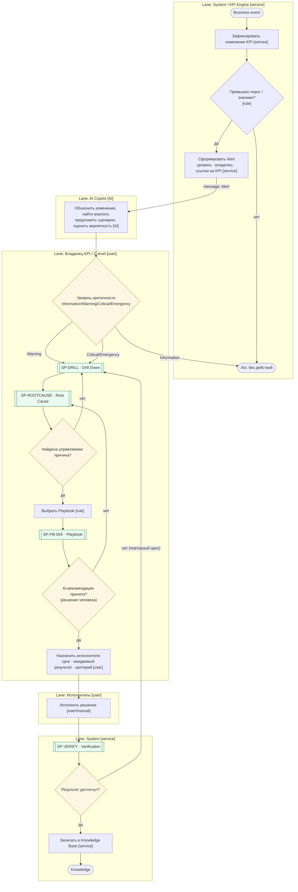
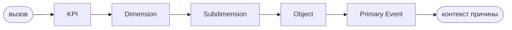

# P-MGMT-01 — Цикл принятия решений (ядро MMS)

> Источник: MMS Том I гл. 4 (Operating Principles), гл. 8 (Decision Architecture); снимок 27.06.2026.
> Это ядро: к нему сводятся все процессы бордов. Импортируемый XML — `P-MGMT-01.bpmn`.

## Паспорт процесса (стандарт «схема процесса»)

| Поле | Значение |
|---|---|
| **ID** | `P-MGMT-01` |
| **Цель** | Сократить время между событием и верным управленческим решением; не оставлять решение без проверки |
| **Владелец** | Owner (для стратегических) / профильный C-level (для операц./такт.) |
| **Триггер** | Business event → изменение KPI |
| **Частота** | Непрерывно (event-driven) |
| **Входы** | Business event, текущие KPI, пороги, история |
| **Выходы** | Принятое и проверенное решение; запись в Knowledge Base |
| **Регулирующие воздействия** | Принципы MMS (один владелец, причина важнее симптома); риск-комплаенс при затрагивании данных |
| **Ресурсы** | KPI Engine, AI Copilot, Playbook Library, Decision Log |
| **Показатели (KPI процесса)** | Время обнаружения, время решения, время устранения, % решений с достигнутым результатом, доля повторных инцидентов |

## Поток (Mermaid)



## Таблица элементов

| Элемент | Тип BPMN | Lane | Примечание |
|---|---|---|---|
| Business event | start (message/conditional) | System | вход цикла |
| Зафиксировать изменение KPI | service task | System | из KPI Engine |
| Превышен порог / значимо? | exclusive gateway + business-rule | System | пороги параметризуемы (GAP: чисел нет) |
| Сформировать Alert | service task | System | уровень, владелец, ссылка на KPI |
| AI-объяснение/сценарии | AI (service) task | AI Copilot | НЕ принимает решение |
| Уровень критичности | exclusive gateway | Владелец | Information/Warning/Critical/Emergency |
| SP-DRILL / SP-ROOTCAUSE | call activity | Владелец | переиспользуемые |
| Найдена причина? | exclusive gateway | Владелец | петля на Drill Down |
| Выбрать Playbook | business-rule task | Владелец | по матрице PB-001…005 |
| SP-PB-00X | call activity | Владелец | playbook |
| AI-рекомендация принята? | exclusive gateway | Владелец | **решение за человеком** |
| Назначить исполнителя | user task | Владелец | срок/результат/критерий |
| Исполнить решение | user/manual task | Исполнитель | |
| SP-VERIFY | call activity | System | факт vs ожидание |
| Результат достигнут? | exclusive gateway | System | нет → повторный цикл |
| Записать в Knowledge Base | service task | System | data store |
| Knowledge | end event | System | |

## Переиспользуемые sub-processes

### SP-DRILL — Drill Down
Раскрытие дерева KPI по фиксированной последовательности; уровень пропустить нельзя.


### SP-ROOTCAUSE — Root Cause Analysis
```mermaid
flowchart LR
  S([вызов]):::ev --> Q["Сузить область: Traffic? Conversion?<br/>Average Check? Retention? [user/AI]"] --> G{"Причина управляема?"}:::gw
  G -- нет --> Q
  G -- да --> R([причина для Playbook]):::ev
  classDef ev fill:#eef,stroke:#88a; classDef gw fill:#fdf6e3,stroke:#b58900;
```

### SP-VERIFY — Verification
```mermaid
flowchart LR
  S([вызов]):::ev --> M["Измерить эффект [service]"] --> C["Сравнить факт vs ожидание [rule]"] --> G{"Достигнут?"}:::gw
  G -- нет --> Loop([повторный цикл P-MGMT]):::ev
  G -- да --> Ok([закрыто]):::ev
  classDef ev fill:#eef,stroke:#88a; classDef gw fill:#fdf6e3,stroke:#b58900;
```

### SP-PB-00X — Playbook (call activity)
Содержит: описание ситуации · последовательность действий · ожидаемый результат · фактические
результаты применения · рекомендации по улучшению. Детали — `05-playbooks.md`.

## Уровни решений (контекст)

| Уровень | Период | Примеры | Шлюз эскалации |
|---|---|---|---|
| Операционные | минуты–часы | отключить кампанию, перераспределить нагрузку | владелец-функция |
| Тактические | дни–недели | изменить цену, нанять экспертов | C-level |
| Стратегические | месяцы–кварталы | новый продукт, новый рынок | Owner/CEO |
| Архитектурные | редко | изменение KPI Framework, оргструктуры | Архитектурный комитет |
