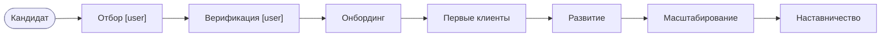
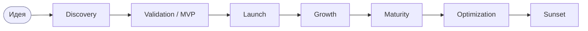
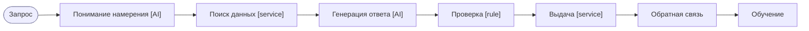
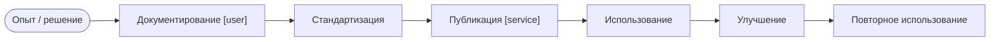

# Потоки ценности (Value Streams)

> Источник: MMS Том I гл. 5 (Business Model), гл. 7 (Value Streams); CJM и узкое место —
> `docs/04-operations.md`. Снимок 27.06.2026.

## P-L0-01 — Сквозной поток ценности (end-to-end), два потока

Главное правило: **Founder Premium (поток-1, HNW)** и **Platform (поток-2, воронка)** —
отдельные pools со своей экономикой; пересекаются только в консолидации у Owner. Метрики не сводить.

```mermaid
flowchart LR
  subgraph P2["Pool: Platform (поток-2) · самообслуживание"]
    A([Awareness]):::ev --> Int["Interest"] --> Lead["Lead"] --> Diag["Diagnostics [AI]"] --> Off["Offer [user]"] --> Buy["Purchase"] --> Del["Delivery"] --> Res["Result"] --> Exp["Expansion"] --> Adv["Advocacy"]
  end
  subgraph P1["Pool: Founder Premium (поток-1) · HNW, high-touch"]
    R1([Рекомендация HNW]):::ev --> Net["Нетворкинг / личные продажи Макса"] --> Deal["Сделка (UK £ / RU ₽)"] --> Acc["Личное сопровождение"]
  end
  subgraph OWN["Pool: Owner"]
    Cons["P-OWNER-01 · Консолидация (только здесь)"]:::sp
  end
  Adv -. метрики потока-2 .-> Cons
  Acc -. метрики потока-1 .-> Cons
  classDef ev fill:#eef,stroke:#88a; classDef sp fill:#eafaf0,stroke:#197a4b;
```

| Поле | Значение |
|---|---|
| **ID** | `P-L0-01` · владелец Owner · непрерывно |
| **Регулирующие воздействия** | разделение потоков (правило проекта); риск-комплаенс на Diagnostics/Delivery |
| **Показатели** | поток-2: Conversion, CAC, LTV, Retention; поток-1: Contribution на час Макса (раздельно) |

## P-VS-CLIENT — Клиентский поток (поток-2), с узким местом и compliance

```mermaid
flowchart TD
  S([Discovery]):::ev --> Cons["Consideration [user]"] --> Qual["Qualification: диагностика [AI]"]
  Qual --> CG{"Compliance-gate:<br/>несовершеннолетний / граница психодиагностики? [rule]"}:::gw
  CG -- не соответствует --> Block["Блок + эскалация Risk [user]"] --> RiskEnd([в риск-процесс]):::ev
  CG -- соответствует --> Off["Offer: подбор траектории [user]"]
  Off --> Pay["Purchase / оплата [service]"] --> Dlv["Delivery: прохождение тестов, генерация отчёта [AI]"]
  Dlv --> Q[("Report Queue (data store)")]:::ds
  Q --> BN["★ Экспертная проверка отчёта [manual] — УЗКОЕ МЕСТО"]:::bn
  BN --> Result["Result: выдача отчёта [user]"] --> Expansion["Expansion / апсейл"] --> Advocacy["Advocacy / реферал"]
  classDef ev fill:#eef,stroke:#88a; classDef gw fill:#fdf6e3,stroke:#b58900;
  classDef ds fill:#eef6ff,stroke:#2a6bb0; classDef bn fill:#fbeae8,stroke:#b23a36;
```

**Узкое место (★).** Ручная экспертная проверка отчёта (этап «Result») — подтверждённое
ограничение всей системы (`04-operations.md`). Моделируется как `[manual]`-задача после очереди
`Report Queue (data store)`. Точки наблюдаемости (V4.1, до автоматизации): размер очереди (WIP),
90-й перцентиль времени ожидания, доля правок после выдачи, срок проверки. Связано с
`P-BOARD-OPS` (Capacity/Queue/SLA) и `P-BOARD-EXP` (нагрузка эксперта).

| Поле | Значение |
|---|---|
| **ID** | `P-VS-CLIENT` · владелец Commercial Director |
| **Регулирующие воздействия** | данные несовершеннолетних, граница психодиагностики (`05-risk-compliance.md`) |
| **Показатели** | Conversion по этапам, срок проверки, доля правок, NPS |

## P-VS-EXPERT — Жизненный цикл эксперта


`P-VS-EXPERT` · владелец Head of Expert Network · KPI: Capacity, Utilization, Rating, Repeat Sessions.

## P-VS-PRODUCT — Жизненный цикл продукта


`P-VS-PRODUCT` · владелец Chief Product Officer · переход между стадиями — только по достижении KPI
(business-rule gateway на каждом стыке).

## P-VS-AI — Поток AI


`P-VS-AI` · владелец CTO · KPI: Cost per Request, Latency, Accuracy, Adoption, Failure Rate.

## P-VS-KNOWLEDGE — Поток знаний


`P-VS-KNOWLEDGE` · владелец CEO · снижает зависимость от отдельных людей; питает Playbook Library.
