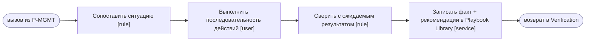

# Playbooks (SP-PB-001…005) — переиспользуемые sub-processes

> Источник: MMS Том I гл. 4.11 (структура Playbook), гл. 8.10 (матрица решений). Снимок 27.06.2026.
> **GAP:** в источнике задана структура playbook и привязка Alert→PB, но **внутренние шаги
> каждого PB не специфицированы**. Ниже последовательности действий помечены как шаблонные
> (templated) — заполняются владельцем; структура (5 полей) — из источника.

## Общая структура playbook (из источника, обязательна)

Каждый `SP-PB-00X` (call activity) содержит:
1. Описание ситуации
2. Последовательность действий
3. Ожидаемый результат
4. Фактические результаты применения
5. Рекомендации по улучшению

При повторении проблемы playbook обновляется (стадия «Обучение системы» цикла `P-MGMT-01`),
запись идёт в Playbook Library (data store).



## Реестр playbooks (матрица решений)

| ID | Триггер (Alert) | KPI | Владелец | Последовательность действий (templated) |
|---|---|---|---|---|
| `SP-PB-001` | Revenue ↓ | Revenue | CCO | Drill: Traffic→Conversion→Avg Check→Retention → найти просевший фактор → корректирующее действие на нём |
| `SP-PB-002` | Burn ↑ / Runway < 6 мес | Burn Rate | CFO | Burn по статьям (Payroll/Marketing/Infra/AI/Ops) → сценарий −15% costs → пересчёт Runway → решение |
| `SP-PB-003` | DRR ↑ / CAC ↑ | Marketing | CMO | CAC по Channel→Campaign→Audience→Creative → отключить убыточное (ROMI<0) → перелить бюджет в каналы с ROMI>цель |
| `SP-PB-004` | Capacity > 95% | Capacity | COO | Capacity по стране/специализации → Hiring Forecast (+N экспертов) или перераспределение нагрузки |
| `SP-PB-005` | AI Cost ↑ / перегрузка AI | AI Cost | CTO | AI по provider→model→prompt type → оптимизация моделей / лимиты / кэш |

> Все PB вызываются как call activities из `P-MGMT-01` и из соответствующих `P-BOARD-*`. Расхождение
> источника: владельца Revenue Том I называет Commercial Director (4.5) и CCO (матрица 8.10) — в
> `SP-PB-001` оставлен CCO по матрице, расхождение зафиксировано, не разрешено.

## Пример развёрнутого playbook — SP-PB-003 (маркетинг)

```mermaid
flowchart TD
  S([Alert: CAC +22% / ROMI<0]):::ev --> D[["SP-DRILL: CAC↓Channel↓Campaign↓Audience↓Creative"]]:::sp
  D --> G1{"Источник роста CAC?"}:::gw
  G1 -- "канал/кампания" --> Stop["Отключить убыточную кампанию (ROMI<0) [service]"]
  G1 -- "креатив" --> Repl["Заменить креатив [user]"]
  Stop --> Re["Перелить бюджет в каналы с ROMI>цель [user]"]
  Repl --> Re
  Re --> Exp["Ожидаемый результат: CAC↓, ROMI↑ [rule]"] --> Lib["Записать факт + рекомендации [service]"] --> R([возврат в Verification]):::ev
  classDef ev fill:#eef,stroke:#88a; classDef gw fill:#fdf6e3,stroke:#b58900; classDef sp fill:#eafaf0,stroke:#197a4b;
```
