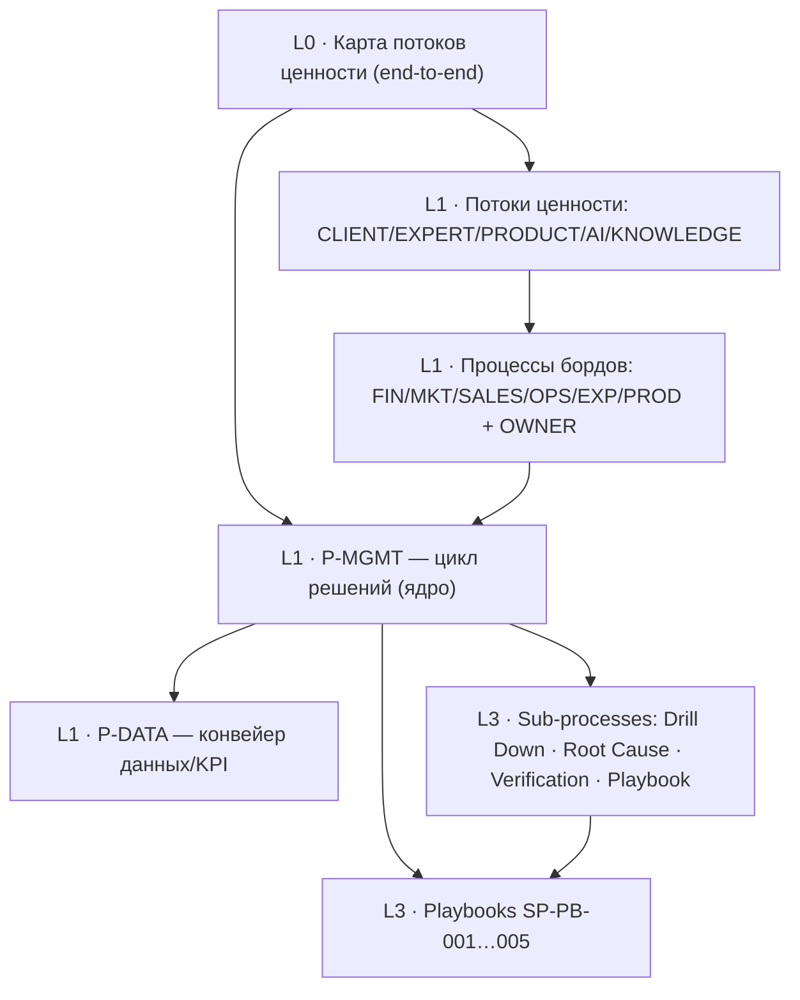

# BPMN-декомпозиция системы управления MainExperts (MMS)

> Результат исполнения промпта `docs/prompts/bpmn-decomposition.md`. Снимок 27.06.2026.
> Источник истины — канон `docs/08-board-system.md` + `docs/boards/` (MMS Том I+II) и
> корпоративные стандарты `docs/04-operations.md` («схема процесса», V4.1).

Модель процессов выражена в трёх переносимых формах: **паспорт процесса** (корпоративный
стандарт), **Mermaid-диаграмма** (рендерится на GitHub/Pages) и **таблица элементов** (BPMN 2.0).
Для ядрового процесса дополнительно дан импортируемый **`P-MGMT-01.bpmn`** (BPMN 2.0 XML,
bpmn.io / Camunda Modeler) как референс-реализация; остальные процессы повторяют тот же шаблон и
эмитируются в XML по запросу.

## Карта файлов

| Файл | Содержание |
|---|---|
| `README.md` (этот) | Архитектура L0–L3, реестры, матрица RACI, каталоги событий/шлюзов, реестр пробелов, покрытие |
| `01-management-cycle.md` | `P-MGMT-01` — ядровой цикл решений + переиспользуемые sub-processes (Drill Down, Root Cause, Verification, Playbook) |
| `02-value-streams.md` | L0 end-to-end + `P-VS-CLIENT/EXPERT/PRODUCT/AI/KNOWLEDGE`; два потока раздельно; **узкое место** |
| `03-data-pipeline.md` | `P-DATA-01` — конвейер Event→Raw→Objects→KPI→Dashboard→Decision; compliance |
| `04-boards.md` | `P-BOARD-FIN/MKT/SALES/OPS/EXP/PROD` + `P-OWNER-01` (консолидация L0) |
| `05-playbooks.md` | `SP-PB-001…005` — playbook-подпроцессы (call activities) |
| `P-MGMT-01.bpmn` | Валидный BPMN 2.0 XML ядрового процесса (импорт) |

## Архитектура процессов (L0–L3)

## Реестр процессов

| ID | Уровень | Название | Владелец (lane) | Триггер | Частота |
|---|---|---|---|---|---|
| `P-L0-01` | L0 | Сквозной поток ценности | Owner | — | непрерывно |
| `P-MGMT-01` | L1 | Цикл принятия решений | Owner / профильный C-level | событие / изменение KPI | непрерывно |
| `P-VS-CLIENT` | L1 | Клиентский поток | Commercial Director | Awareness | непрерывно |
| `P-VS-EXPERT` | L1 | Жизненный цикл эксперта | Head of Expert Network | заявка кандидата | по событию |
| `P-VS-PRODUCT` | L1 | Жизненный цикл продукта | Chief Product Officer | идея продукта | по стадии |
| `P-VS-AI` | L1 | Поток AI | CTO | AI-запрос | непрерывно |
| `P-VS-KNOWLEDGE` | L1 | Поток знаний | CEO | завершённое решение | по событию |
| `P-DATA-01` | L1 | Конвейер данных/KPI | CTO | business event | онлайн / ≤5 мин |
| `P-OWNER-01` | L1→L0 | Консолидация и решения собственника | Owner | 08:00 timer | ежедневно |
| `P-BOARD-FIN` | L1 | Финансовое управление | CFO | финансовое событие | ежедневно/ежемесячно |
| `P-BOARD-MKT` | L1 | Управление маркетингом | CMO | отклонение CAC/DRR/ROMI | еженедельно |
| `P-BOARD-SALES` | L1 | Управление продажами | Commercial Director | изменение Pipeline | еженедельно |
| `P-BOARD-OPS` | L1 | Управление операциями/Capacity | COO | Capacity/Queue/SLA | ежедневно |
| `P-BOARD-EXP` | L1 | Управление экспертной сетью | Head of Expert Network | Rating/Utilization | еженедельно |
| `P-BOARD-PROD` | L1 | Управление продуктами | Chief Product Officer | Product Review | ежеквартально |
| `SP-DRILL` | L3 | Drill Down | владелец KPI | вызов | по требованию |
| `SP-ROOTCAUSE` | L3 | Root Cause Analysis | владелец KPI | вызов | по требованию |
| `SP-VERIFY` | L3 | Verification | владелец решения | вызов | по требованию |
| `SP-PB-001…005` | L3 | Playbooks | профильный C-level | Alert | по событию |

## Переиспользуемые sub-processes (call activities)

`SP-DRILL` (раскрытие дерева KPI до первичного события) · `SP-ROOTCAUSE` (поиск управляемой
причины) · `SP-VERIFY` (сверка факт vs ожидание, при недостижении — повторный цикл) ·
`SP-PB-00X` (утверждённый алгоритм под тип проблемы). Вызываются из `P-MGMT-01` и из всех
`P-BOARD-*` — не дублируются.

## Матрица RACI / lanes (владелец → KPI-домены и решения)

| Lane | Отвечает за (Accountable) | KPI-домены |
|---|---|---|
| Owner | стратегические решения, Runway, консолидация потоков | Revenue, Contribution, Cash, Runway, EV, NRR |
| CEO | управленческие функции, стратегия, знания | стратегические цели |
| CFO | финансы, бюджет, ликвидность | Burn Rate, Gross Margin, Contribution, Runway |
| COO | мощность, операции, наём | Capacity, Utilization, SLA, Queue |
| CMO | маркетинг, продажи, продукты (трафик) | CAC, DRR, ROMI, Conversion |
| CTO | AI, инфраструктура, интеграции, данные | AI Cost, Latency, Failure Rate |
| Commercial Director / CCO | выручка, pipeline | Revenue, Win Rate, Sales Velocity |
| Head of Expert Network | качество и развитие сети | Rating, Utilization, NPS |
| Chief Product Officer | портфель продуктов | Product Contribution, ROI, Adoption |
| AI Copilot (system) | анализ/объяснение/прогноз/рекомендация (НЕ решение) | — |
| Client (external) | прохождение пути ценности | — |

> Инвариант: у каждой задачи — один владелец-lane. Коллективная ответственность запрещена.
> AI Copilot никогда не владеет gateway-решением.

## Каталог событий и таймеров

**Timer-стартовые процессы (частоты управления):**
| Частота | Объекты (процессы) | BPMN |
|---|---|---|
| Постоянно | безопасность, AI, инциденты, платежи | message/conditional start |
| Ежедневно | `P-OWNER-01`, Runway, Contribution, Cash, Critical Alerts | timer start (08:00) |
| Еженедельно | `P-BOARD-MKT/SALES/EXP`, нагрузка, продукты | timer start |
| Ежемесячно | `P-BOARD-FIN`, бюджет, прибыль, инвестиции | timer start |
| Ежеквартально | `P-BOARD-PROD`, стратегия, портфель, оргструктура | timer start |

**Escalation boundary events (SLA реакции):**
| Событие | Лимит | Поведение |
|---|---|---|
| Критический финансовый риск | ≤15 мин | escalation → CFO/Owner |
| Ошибка интеграции | ≤30 мин | escalation → CTO |
| Недоступность платформы | немедленно | interrupting → CTO/Owner |
| Отклонение маркетинга | ≤4 ч | non-interrupting → CMO |
| Плановое снижение KPI | до след. раб. дня | таймер → владелец KPI |

**Message events:** Alert (KPI Engine → борд), Decision approved (Owner → исполнитель),
Result measured (System → Verification).

## Каталог шлюзов / точек решений

| Шлюз | Тип | Условия / ветки |
|---|---|---|
| Уровень критичности Alert | exclusive | Information → лог; Warning → наблюдение; Critical → вмешательство; Emergency → немедленно |
| Статус по исключениям | exclusive | Зелёный → нет действий; Жёлтый → наблюдение; Красный → задача |
| Найдена управляемая причина? | exclusive | да → выбор Playbook; нет → продолжить Drill Down |
| AI-рекомендация принята? | exclusive (решение человека) | да → Execution; нет → пересмотр / ручной сценарий |
| Результат достигнут? (Verification) | exclusive | да → Knowledge; нет → повторный цикл |
| Compliance-gate (данные/психодиагностика) | exclusive | соответствует → продолжить; нет → блок + эскалация Risk |
| Поток клиента | exclusive (на Offer) | Founder Premium (поток-1) / Platform (поток-2) — НЕ смешивать |

## Реестр пробелов (GAP — где источник молчит, BPMN не достроен)

| GAP | Где | Причина |
|---|---|---|
| Product: Alerts / Performance / Acceptance | `P-BOARD-PROD` | извлечение Том II оборвано на §10.11 — alerts/perf/критерии отсутствуют |
| Data Dictionary, ETL детально, Security, Integrations | `P-DATA-01` | разделы V–VII, XII Том II вне извлечённого текста — точные потоки/протоколы не специфицированы |
| Числовые пороги KPI (норма/предупреждение/критическое) | business-rule tasks везде | в источнике пороги не заданы — правила-шлюзы помечены как параметризуемые |
| Footer Owner Dashboard, состав Trends/Actions | `P-OWNER-01`, каркас | в источнике не раскрыты |

## Покрытие (acceptance промпта)

| Критерий | Статус |
|---|---|
| L0-карта потоков ценности | ✅ `02-value-streams.md` |
| Ядро `P-MGMT` + переиспользуемые sub-processes | ✅ `01-management-cycle.md` (+ `.bpmn`) |
| Процессы всех 7 бордов | ✅ `04-boards.md` |
| Все value streams (клиент/эксперт/продукт/AI/знания) | ✅ `02-value-streams.md` |
| Конвейер данных `P-DATA` | ✅ `03-data-pipeline.md` |
| Playbooks PB-001…005 | ✅ `05-playbooks.md` |
| Частоты как timer-процессы; SLA как escalation | ✅ каталог выше + в процессах |
| Оба потока раздельно, консолидация у Owner | ✅ `02-value-streams.md`, `P-OWNER-01` |
| Узкое место с очередью и наблюдаемостью | ✅ `02-value-streams.md` (Delivery), `P-BOARD-OPS` |
| Регулирующие воздействия (compliance) | ✅ `P-DATA-01`, `P-VS-CLIENT` |
| Каждый L0-KPI имеет процесс-владельца | ✅ RACI выше |
| На месте пробелов — GAP, без выдумывания | ✅ реестр пробелов |
| Импортируемый BPMN 2.0 XML | ◑ референс `P-MGMT-01.bpmn`; остальные — по запросу (тот же шаблон) |

> Сознательное ограничение по XML: вместо 20+ рукописных BPMN-XML (риск невалидности) дан один
> выверенный референс ядрового процесса + полная спецификация остальных в паспорт+Mermaid+таблица,
> из которой XML генерируется детерминированно. Это честнее и надёжнее «витрины из 20 файлов».

## Соглашения

ID процессов `P-<домен>-<NN>`, подпроцессы `SP-<имя>`, playbooks `SP-PB-00X`; элементы
`Event_/Task_/Gateway_/Flow_/Data_/Lane_`. Задачи — «глагол + существительное». Lanes = роли.
Подписи русские, типы элементов BPMN 2.0 — английские. Типы задач помечены: `[user]` `[service]`
`[manual]` `[rule]` `[AI]` `[script]` `[send]` `[receive]`.

## Как смотреть

Mermaid-диаграммы рендерятся на GitHub и на Pages (`https://logist888.github.io/max/docs/bpmn/`).
`P-MGMT-01.bpmn` — открыть в [bpmn.io](https://bpmn.io) (Import) или Camunda Modeler.
