# 02a. Карта процессов компании — блок-схемы

> Раздел 3 модуля DMS, визуальный компаньон к `02-process-map.md`. Снимок 12.07.2026.
> Авторская разработка (Claude Code). Нотация — блок-схема (ГОСТ 19.701-90 / ISO 5807),
> отрисована средствами Mermaid (GitHub рендерит `mermaid`-блоки нативно). Содержание
> перенесено без изменений из `02-process-map.md` (подпроцессы, входы/выходы, роли, документы,
> инварианты); опора на `00-architecture.md` (12 процессов, поток ценности) и `01-divisions.md`
> (Divisions D1–D7). Перекрёстные ссылки на соседние файлы модуля DMS разрешаются после слияния
> веток. Утверждает основатель.

Двенадцать сквозных процессов P01–P12 показаны на трёх уровнях детализации:

- **Уровень 0** — ландшафт всей компании (12 процессов, три группы, поток ценности).
- **Уровень 1** — сквозной поток ценности «спрос → выручка → сеть» с разведением двух потоков.
- **Уровень 2** — детальная блок-схема каждого из 12 процессов (вход, операции, ромбы решений,
  документы, выход).

Группы процессов (по APQC-подходу, `02-process-map.md`): **управляющие** — P01, P12;
**основные** — P02–P08; **обеспечивающие** — P09, P10, P11.

---

## Легенда нотации

| Фигура | Синтаксис Mermaid | Значение |
|---|---|---|
| Терминал (овал) | `([…])` | вход / выход процесса (старт, финиш) |
| Операция | `[…]` | действие, шаг подпроцесса |
| Подпроцесс | `[[…]]` | вложенный процесс со своей схемой |
| Решение (ромб) | `{…}` | ветвление, вопрос с ответами да/нет |
| Документ / данные | `[/…/]` | документ (S/I/C) или вход-выход данных |
| Хранилище | `[(…)]` | база: факты append-only, витрины, версии |
| Комплаенс-узел | `{{…}}` (шестиугольник) | обязательная проверка детских/психоданных (инвариант P12) |

Связь «процесс ↔ документ» (из `02-process-map.md`): **S** — обслуживает (документ управляет
ходом), **I** — инициирует (процесс порождает документ), **C** — завершает (использование
документа закрывает процесс).

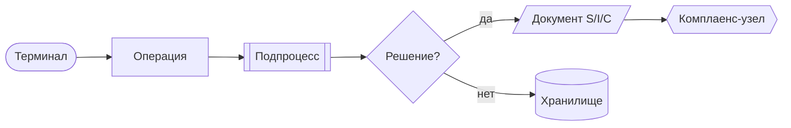

---

## Уровень 0 — Ландшафт процессов компании

Управляющие процессы задают рамку сверху, обеспечивающие поддерживают ядро снизу, основные
образуют поток ценности от спроса до выдачи и роста сети. Премиальная продажа P04 показана
обособленной веткой — инвариант «Поток-1 не смешивается с Потоком-2».

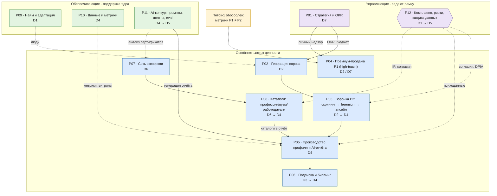

---

## Уровень 1 — Сквозной поток ценности (спрос → выручка → сеть)

Входящий спрос расходится по каналу на два потока, которые дальше не смешиваются: воронка
самообслуживания (Поток-2) и премиальная продажа по рекомендации (Поток-1). Сеть экспертов и
каталоги замыкают контур, обогащая отчёт.

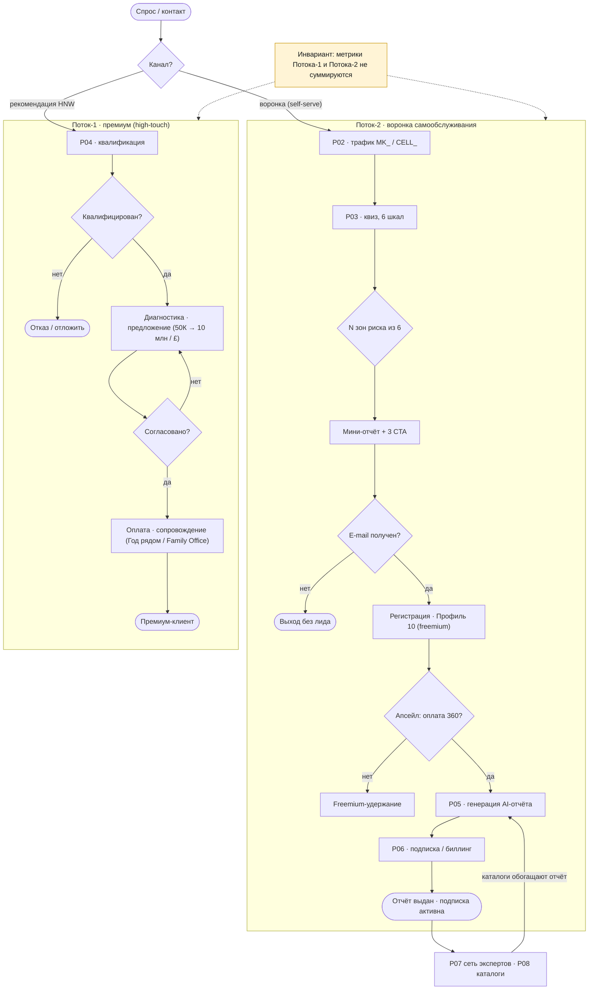

---

## Уровень 2 — Детальные блок-схемы процессов

### P01 — Стратегическое планирование и OKR-цикл · D7

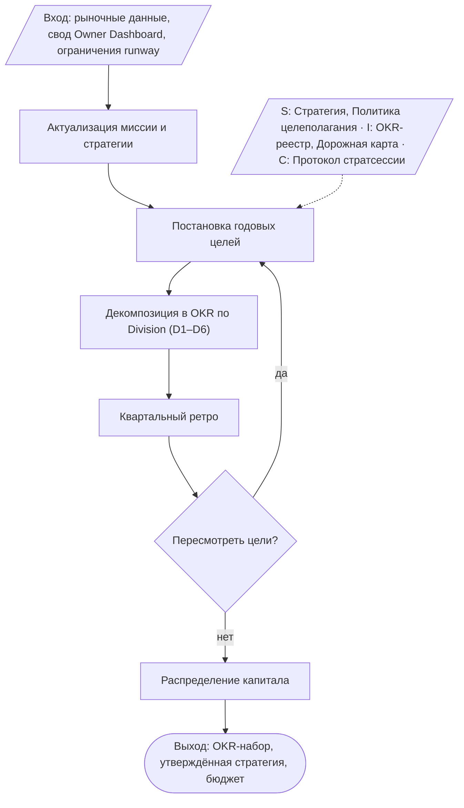

**Роли (RACI):** Owner (A) · C-level (R) · Analyst (C).
**Инвариант:** цели — решения основателя, не выдумываются.

### P02 — Генерация спроса и трафик · D2

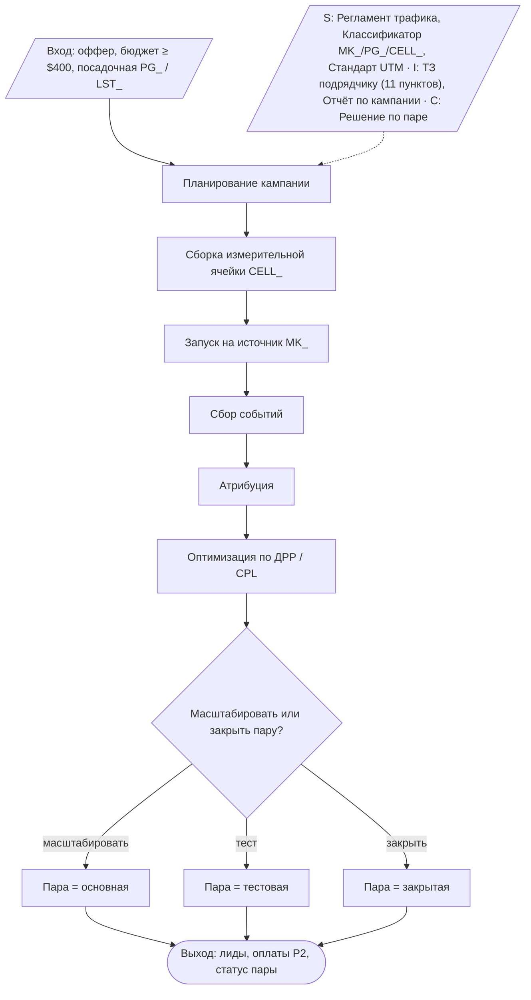

**Роли (RACI):** CMO (A) · Traffic-специалист (R) · Analyst (C) · Payments Owner (C, атрибуция).
**Инвариант:** ДРР — главный KPI; закрытые словари `MK_/PG_/CELL_`.

### P03 — Скрининг → freemium → апсейл (воронка P2) · D2 → D4

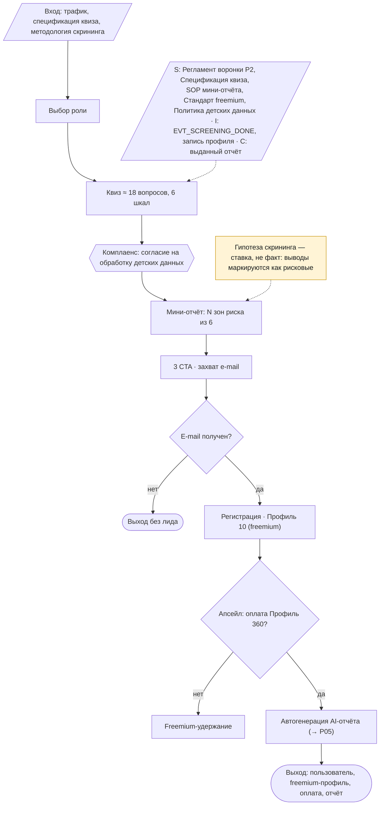

**Роли (RACI):** CMO/Growth (A воронка) · Product Owner (A продукт/цена) · Backend (R) ·
Methodologist (C) · Compliance (C детские данные).
**Инвариант:** гипотеза скрининга — ставка, не факт.

### P04 — Премиальная продажа (P1, high-touch) · D2 / D7

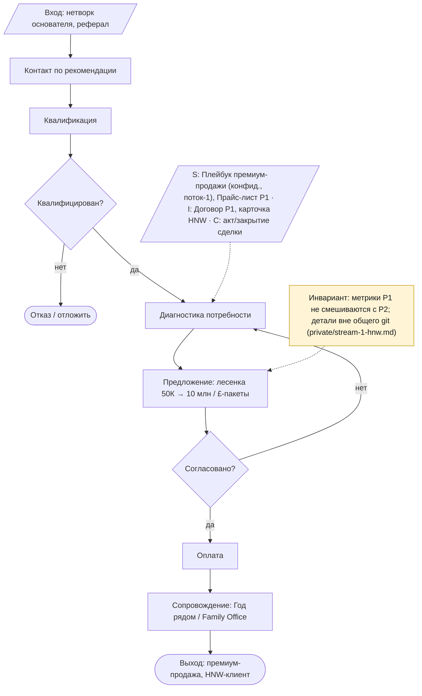

**Роли (RACI):** Owner (A, R — личный канал) · Commercial Director (C).
**Инвариант:** метрики P1 не смешиваются с P2.

### P05 — Производство цифрового профиля и AI-отчёта · D4

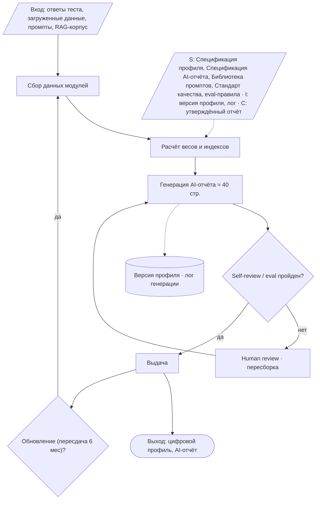

**Роли (RACI):** Product Owner (A) · AI Engineer (R) · Quality/eval (C) · Methodologist (C).
**Инвариант:** переменная стоимость единицы ≈ 0 (автоматизировано); AI не заменяет решение.

### P06 — Управление подпиской и биллинг · D3 → D4

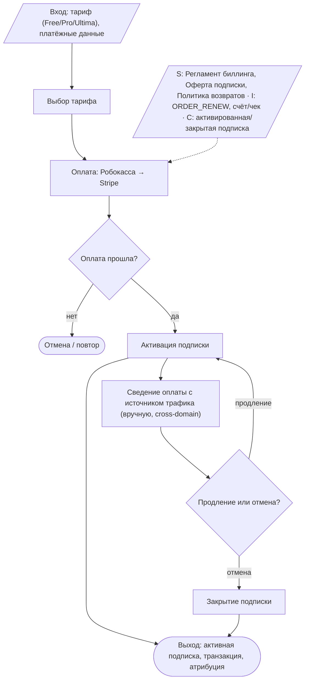

**Роли (RACI):** CFO (A) · Payments Owner / Даниил (R) · Backend (R активация).
**Инвариант:** сведение оплат с источником трафика (cross-domain, вручную).

### P07 — Онбординг и управление сетью экспертов · D6

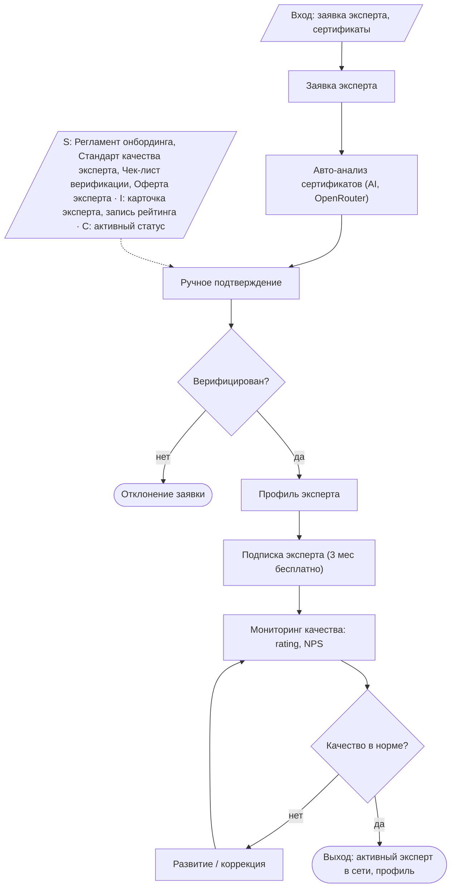

**Роли (RACI):** Head of Expert Network (A) · Support (R онбординг) · Quality Manager (C).
**Инвариант:** онбординг вручную на старте.

### P08 — Ведение каталогов (профессии/вузы/работодатели) · D6 → D4

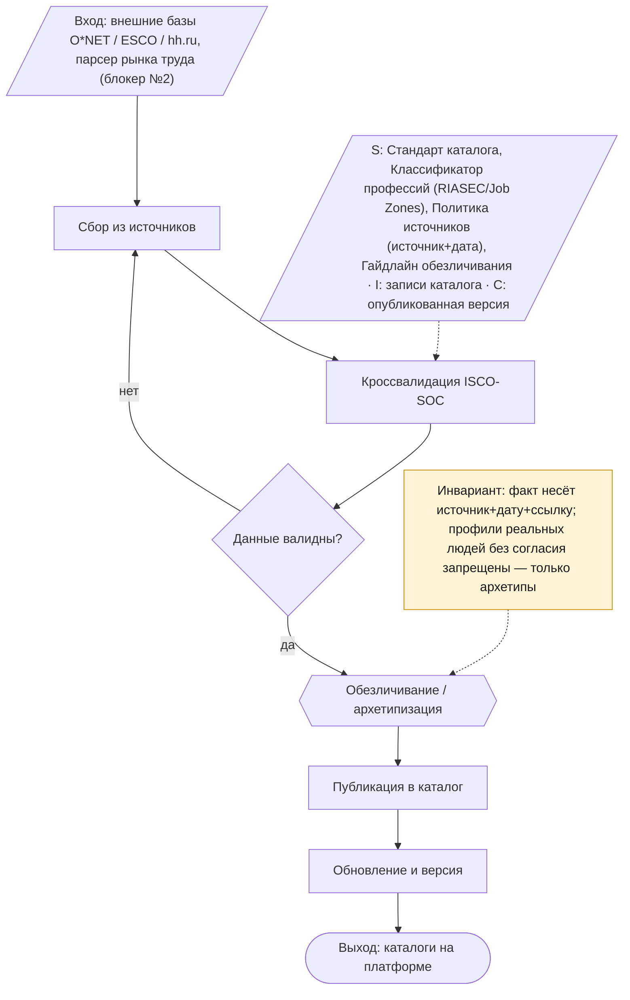

**Роли (RACI):** Content-куратор (R) · Data Engineer (R) · Methodologist (C) · Legal (C по IP/согласиям).
**Инвариант:** источник + дата на каждый факт; только архетипы, не реальные профили.

### P09 — Найм и адаптация сотрудников · D1

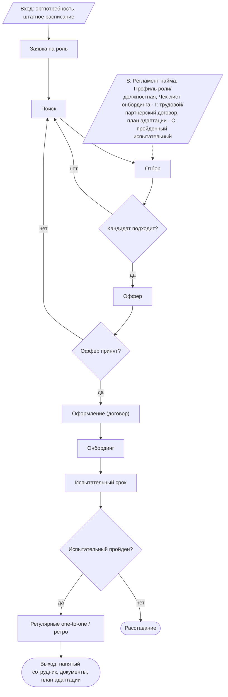

**Роли (RACI):** Head of People/COO (A) · нанимающий менеджер (R) · Legal (C).
**Инвариант:** командные документы обезличиваются на выходе (направление + ответственный).

### P10 — Управление данными и метриками · D4

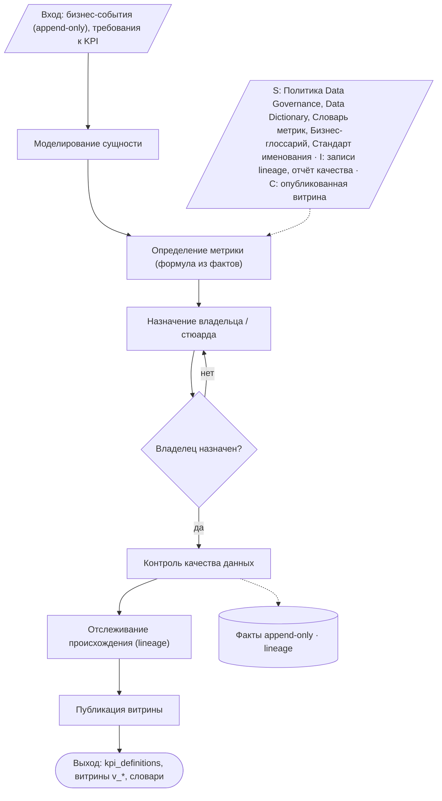

**Роли (RACI):** CTO/Data (A) · Data Steward (R) · Analyst (C) · владелец KPI (A по своей метрике).
**Инвариант:** единый источник истины; показатель считается один раз; у метрики один владелец; факты append-only.

### P11 — AI-контур: промпты, агенты, оценка · D4 → D5

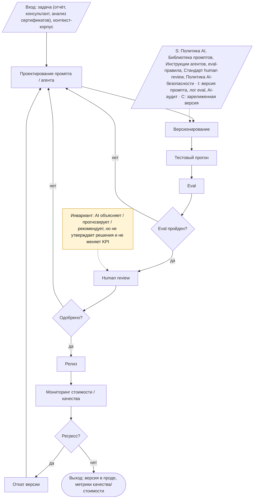

**Роли (RACI):** AI Engineer (R) · CTO (A) · Quality/eval (A по качеству) · Methodologist (C).
**Инвариант:** AI не утверждает решения и не меняет KPI (Принцип №11 канона).

### P12 — Комплаенс, риски, защита данных · D1 → D5

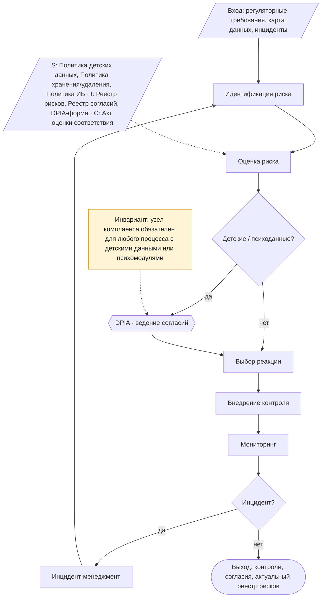

**Роли (RACI):** DPO/Compliance (A) · Legal (C) · CTO/Data (C) · Quality (R).
**Инвариант:** узел комплаенса обязателен для любого процесса, касающегося детских данных или психомодулей.

---

## Сводка процессов

| ID | Процесс | Группа | Ведущий Division | Схема |
|---|---|---|---|---|
| P01 | Стратегия и OKR | Управляющий | D7 | [↑](#p01--стратегическое-планирование-и-okr-цикл--d7) |
| P02 | Генерация спроса | Основной | D2 | [↑](#p02--генерация-спроса-и-трафик--d2) |
| P03 | Воронка P2 | Основной | D2 → D4 | [↑](#p03--скрининг--freemium--апсейл-воронка-p2--d2--d4) |
| P04 | Премиум-продажа P1 | Основной | D2 / D7 | [↑](#p04--премиальная-продажа-p1-high-touch--d2--d7) |
| P05 | Производство отчёта | Основной | D4 | [↑](#p05--производство-цифрового-профиля-и-ai-отчёта--d4) |
| P06 | Подписка и биллинг | Основной | D3 → D4 | [↑](#p06--управление-подпиской-и-биллинг--d3--d4) |
| P07 | Сеть экспертов | Основной | D6 | [↑](#p07--онбординг-и-управление-сетью-экспертов--d6) |
| P08 | Каталоги | Основной | D6 → D4 | [↑](#p08--ведение-каталогов-профессиивузыработодатели--d6--d4) |
| P09 | Найм и адаптация | Обеспечивающий | D1 | [↑](#p09--найм-и-адаптация-сотрудников--d1) |
| P10 | Данные и метрики | Обеспечивающий | D4 | [↑](#p10--управление-данными-и-метриками--d4) |
| P11 | AI-контур | Обеспечивающий | D4 → D5 | [↑](#p11--ai-контур-промпты-агенты-оценка--d4--d5) |
| P12 | Комплаенс и риски | Управляющий | D1 → D5 | [↑](#p12--комплаенс-риски-защита-данных--d1--d5) |

---

## Связи

- Источник содержания: `02-process-map.md` (текстовая карта процессов).
- Вверх: `00-architecture.md` (11 слоёв, поток ценности), `01-divisions.md` (D1–D7),
  `13-document-system.md`.
- Дальше: `04-registry.md` (документы процессов), `06-matrices.md` (Документ → Процесс).
- Канон: `../boards/03-decision-loop.md`, `../12-traffic-platform-decisions.md`,
  `../10-data-model.md`, `../04-operations.md` (V4.1, CJM).
