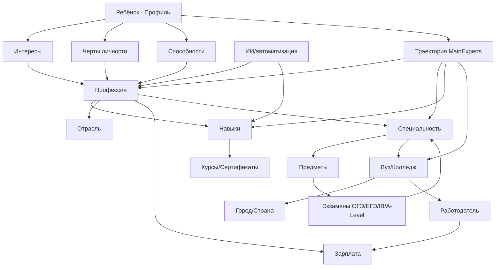

# MainExperts — Исследование спроса. Часть 2 из 3 — Поиск и знание

> Продолжение `demand-research-part1.md`. Легенда пометок и границы доступа — см. Часть 1, §0.
> Keyword-частотности/KD везде **[ПРОВЕРИТЬ]** (нет Ahrefs/Semrush/Trends). Снимок 14.07.2026.

---

## Стадия 3. Customer Journey Map по сегментам

Формат по брифу: что происходит / чувствует / ищет / читает / сравнивает / боится / мешает /
убеждает. Даю CJM для 5 ключевых сегментов; остальные наследуют паттерн. Основа — custdev
(`docs/03`, инсайт «получил отчёт → нет следующего шага») + лестница Ханта (Часть 1).

### 3.1 «Ольга Защитница» — тревожный родитель 11-классника (ЯДРО, 55%)

| Этап | Что происходит | Чувствует | Ищет | Читает | Сравнивает | Боится | Что мешает | Что убеждает |
|---|---|---|---|---|---|---|---|---|
| Осознание | ЕГЭ близко, ребёнок «не знает кем быть» | тревога, вина | «как понять кем хочет быть ребёнок» | статьи, родит. чаты | ничего пока | потерянных лет | «рано/само пройдёт» | эмоц. история узнавания |
| Поиск | гуглит/спрашивает ИИ | растерянность | «профориентация для подростка», «тест на профессию» | гайды, отзывы, YouTube | тест vs психолог vs ИИ | «развод/впустую» | переизбыток инфы, недоверие | бесплатный квиз, экспертность+эмпатия |
| Сравнение | оценивает варианты | скепсис (ИИ!) | «[бренд] отзывы», «что входит» | сравнения, кейсы | бренды, методы | «отчёт в стол» | цена, недоверие к ИИ | демо Profile360, эксперт в лицо |
| Решение | почти готова | осторожная надежда | «цена», «гарантия» | страница продукта, FAQ | цена vs ценность | переплатить | согласование с мужем | видеозвонок (7/9 custdev), премиум-дизайн (9/9) |
| Покупка | оплата | решимость+сомнение | «как оплатить/рассрочка» | оффер | — | last-minute | оплата | прозрачный onboarding |
| После | получила профиль | облегчение→«а дальше?» | «как использовать результаты» | траектория, рекомендации | — | «снова не знаю что делать» | нет next step (боль custdev!) | сопровождение, эксперт, подписка |

**[ВЫВОД]** Критическая точка — «после»: именно здесь конкуренты теряют клиента. MainExperts
должен встроить next-step-контент и сопровождение как продукт, а не как бонус.

### 3.2 Родитель 9-классника (развилка ОГЭ: 10 класс vs колледж/СПО)

| Этап | Что происходит | Чувствует | Ищет | Боится | Что убеждает |
|---|---|---|---|---|---|
| Осознание | ОГЭ, «оставаться или в колледж» | давление сроков | «идти в 10 класс или колледж после 9» | закрыть ребёнку дороги | разбор развилки без давления |
| Поиск | сравнивает пути | неопределённость | «плюсы и минусы колледжа после 9», «профессии после 9 класса» | «ошибёмся с треком» | траектория под ребёнка, а не общая |
| Решение | выбирает трек | тревога ответственности | «что сдавать/куда» | необратимость | профиль + прогноз траектории |

### 3.3 Родитель-экспат/местный MENA (выбор страны и системы)

| Этап | Что происходит | Чувствует | Ищет (EN/AR) | Боится | Что убеждает |
|---|---|---|---|---|---|
| Осознание | «диплом ≠ работа», куда/где учить | тревога инвестиции | "how to choose a career for my teenager", "IB vs A-level" | дорогая ошибка $/£ за рубежом | data-driven траектория, международный контекст |
| Поиск | сравнивает системы/страны | перегруз опций | "best university for [field]", "study abroad vs local" | безработица выпускника (ILO **[ФАКТ]**) | связка профессия→навык→страна→вуз |
| Решение | выбирает путь | нужен статус/премиум | "career counselor for teenager Dubai" | потеря денег и времени | эксперт + ИИ + данные рынка труда |

**[ВЫВОД]** MENA-CJM англо/арабоязычен, боль = «дорогая международная ошибка», сущности иные
(IB/A-Level/SAT/IELTS, страны). Нельзя переиспользовать RU-контент — нужен отдельный трек.

### 3.4 Ребёнок 11-класса (со-ЛПР, пользователь квиза)

| Этап | Что происходит | Чувствует | Ищет | Боится | Что убеждает |
|---|---|---|---|---|---|
| Осознание | давят с выбором | стресс, сопротивление | «кем мне стать тест», «что мне подходит» | ошибиться/разочаровать | не-осуждающий, «про меня» инструмент |
| Вовлечение | проходит квиз | любопытство | «профессии по интересам» | «навяжут чужое» | геймифицированный, честный результат |
| Диалог | обсуждает с родителем | облегчение | — | конфликт | профиль как нейтральный язык |

### 3.5 Студент «поступил не туда» (сам ЛПР, retention/новый вход)

| Этап | Что происходит | Чувствует | Ищет | Боится | Что убеждает |
|---|---|---|---|---|---|
| Кризис | разочарование в специальности | тревога, стыд | «перевестись на другую специальность», «бросить вуз или доучиться» | потерять ещё годы | быстрый пересбор траектории |
| Поиск | ищет альтернативу | решимость сменить | «востребованные профессии без вышки», «сменить профессию в 20» | опять ошибиться | профиль + карта переходов |

---

## Стадия 6. JTBD-карта (≥50)

Формат: **Когда… / Я хочу… / Чтобы… / Мне мешает… / Критерий успеха…**. Это *работы*, не
поисковые намерения (разведено по требованию брифа). Все — аналитические конструкции на базе
custdev/сегментов/страхов (**[ВЫВОД]**, отдельные — **[ГИПОТЕЗА]**). Сгруппированы.

### A. Функциональные — родитель (выбор пути)
1. Когда ребёнок не знает кем быть — хочу понять его сильные стороны — чтобы направить, а не навязать — мешает субъективность и конфликт — успех: ребёнок сам называет направление.
2. Когда близится ОГЭ — хочу выбрать между 10 классом и колледжем — чтобы не закрыть дороги — мешает необратимость — успех: осознанный трек с планом Б.
3. Когда близится ЕГЭ — хочу выбрать специальность и набор предметов — чтобы поступить туда, где ребёнок реализуется — мешает незнание связки предмет→специальность — успех: точный список ЕГЭ и вузов.
4. Когда выбираем вуз — хочу сравнить варианты под ребёнка — чтобы не переплатить за «имя» — мешает непрозрачность рейтингов — успех: обоснованный шорт-лист.
5. Когда думаю о будущем — хочу знать, какие профессии востребованы — чтобы ребёнок не остался без работы — мешает быстрое устаревание — успех: список профессий+навыков с горизонтом.
6. Когда ребёнок «ничего не хочет» — хочу найти зацепку интереса — чтобы вернуть мотивацию — мешает пассивность подростка — успех: ребёнок вовлекается во что-то сам.
7. Когда вкладываю в репетиторов — хочу убедиться, что цель верная — чтобы деньги не впустую — мешает страх невозвратных затрат — успех: подтверждённое направление до трат.
8. Когда ребёнок меняет интересы — хочу отличить каприз от призвания — чтобы не метаться — мешает нестабильность подростка — успех: устойчивый профиль интересов.
9. Когда выбираем профиль в 10 классе — хочу подобрать предметы — чтобы не переучиваться — мешает ранняя необратимость — успех: профиль под цель поступления.
10. Когда планирую на годы — хочу единый план 9 класс→работа — чтобы видеть маршрут — мешает фрагментарность советов — успех: цельная траектория.

### B. Функциональные — родитель (исполнение/сервис)
11. Когда выбрал метод — хочу быстрый результат без беготни — чтобы сэкономить время — мешает офлайн-логистика — успех: онлайн за дни.
12. Когда получил отчёт — хочу понятный следующий шаг — чтобы отчёт не лёг «в стол» — мешает отсутствие сопровождения — успех: чёткий next step (ядро боли custdev).
13. Когда сомневаюсь в ИИ — хочу живого эксперта — чтобы доверять выводам — мешает обезличенность автоматики — успех: разговор с экспертом (8/9 custdev).
14. Когда согласую с супругом — хочу материал для семейного решения — чтобы избежать спора — мешает разные взгляды — успех: общее решение.
15. Когда ситуация изменилась (10→11) — хочу обновить план — чтобы он был актуален — мешает разовость услуг — успех: обновлённая траектория (retention).

### C. Эмоциональные — родитель
16. Когда тревожусь за будущее ребёнка — хочу вернуть чувство контроля — чтобы спать спокойно — мешает неопределённость — успех: «у нас есть план».
17. Когда чувствую вину «плохой родитель» — хочу сделать всё правильно — чтобы не корить себя — мешает страх ошибки — успех: уверенность в решении.
18. Когда боюсь навязать своё — хочу объективный третий голос — чтобы услышать ребёнка — мешает проекция — успех: решение исходит от ребёнка.
19. Когда вижу, что ребёнок потерян — хочу ему помочь — чтобы он был счастлив — мешает бессилие — успех: ребёнок ожил, появился интерес.
20. Когда мир меняется слишком быстро — хочу снизить тревогу неопределённости — чтобы действовать — мешает новостной шум — успех: адаптивный план, а не паника.

### D. Социальные — родитель
21. Когда сравниваю с другими семьями — хочу быть не хуже — чтобы не стыдиться — мешает FOMO — успех: «мы делаем для ребёнка максимум».
22. Когда рассказываю кругу — хочу выглядеть ответственным родителем — чтобы сохранить статус — мешает страх осуждения — успех: одобрение круга.
23. Когда ребёнок среди сверстников — хочу, чтобы он не отставал — чтобы имел преимущество — мешает конкуренция — успех: ребёнок впереди/в ресурсе.

### E. Функциональные — ребёнок/подросток
24. Когда меня спрашивают кем стать — хочу понять, что мне подходит — чтобы ответить честно — мешает незнание себя — успех: «я знаю, что мне интересно».
25. Когда родители давят — хочу доказать свой выбор — чтобы меня услышали — мешает конфликт — успех: аргументы для родителей.
26. Когда выбираю предметы/профиль — хочу не ошибиться — чтобы не переучиваться — мешает нехватка опыта — успех: осознанный выбор.
27. Когда интересно многое — хочу сузить до реального — чтобы двигаться — мешает распыление — успех: 1–3 направления.
28. Когда боюсь ИИ и рынка — хочу профессию «на будущее» — чтобы не остаться без работы — мешает неизвестность — успех: понимание перспективных навыков.

### F. Эмоциональные/социальные — ребёнок
29. Когда все определились, а я нет — хочу перестать чувствовать себя отстающим — чтобы не тревожиться — мешает сравнение — успех: спокойствие и направление.
30. Когда меня «тестируют» — хочу, чтобы это было про меня, без осуждения — чтобы доверять — мешает страх ярлыка — успех: результат «узнаю себя».

### G. Пост-покупка и удержание
31. Когда получил цифровой профиль — хочу превратить его в действия — чтобы был толк — мешает отсутствие плана — успех: конкретные шаги на семестр.
32. Когда прошло время — хочу отслеживать прогресс — чтобы корректировать — мешает статичность отчёта — успех: живой, обновляемый профиль.
33. Когда ребёнок вырос до нового этапа — хочу следующий модуль сопровождения — чтобы не искать заново — мешает разовость — успех: бесшовный переход (апселл).
34. Когда доволен результатом — хочу порекомендовать — чтобы помочь другим/получить бонус — мешает нет реф-механики — успех: реферал (`MK_REF_USER`).
35. Когда есть второй ребёнок — хочу повторить для него — чтобы системно — мешает нет «семейного» тарифа — успех: семейная подписка.

### H. MENA-специфичные
36. Когда диплом не гарантирует работу — хочу выбрать востребованный путь — чтобы ребёнок был занят — мешает разрыв образование↔рынок (ILO) — успех: занятость-ориентированная траектория.
37. Когда выбираю между местным и зарубежным вузом — хочу сравнить ROI — чтобы не потерять $/£ — мешает непрозрачность — успех: обоснованный выбор страны.
38. Когда выбираю экзаменационную систему (IB/A-Level/SAT) — хочу подобрать под цель — чтобы открыть нужные вузы — мешает сложность систем — успех: верная система под страну/специальность.
39. Когда мы эмигрировали — хочу сориентировать ребёнка в новой системе — чтобы адаптировался — мешает незнание локальных правил — успех: понятная местная траектория.

### I. Роли-влияния
40. (Учитель) Когда требуют профориентацию — хочу закрыть её качественно без нагрузки — чтобы отчитаться и помочь — мешает нехватка инструментов — успех: готовый инструмент/партнёрство.
41. (Психолог) Когда семья приходит за глубиной — хочу дать инструмент сильнее теста — чтобы усилить работу — мешает ограниченность методик — успех: интеграция/направление.
42. (Репетитор) Когда ученик демотивирован — хочу вернуть смысл учёбы — чтобы удержать — мешает узость роли — успех: ученик видит цель (реферал).
43. (Родственник-спонсор) Когда финансирую — хочу быть уверен в разумности траты — чтобы не спорить — мешает недоверие — успех: понятная ценность.

### J. Финансово-рациональные
44. Когда сравниваю цену — хочу понять, что 50к оправданы — чтобы решиться — мешает якорь «тест 3–7к» — успех: рефрейм «страховка инвестиции».
45. Когда думаю о вычете/рассрочке — хочу снизить порог входа — чтобы позволить — мешает разовый крупный чек — успех: доступная схема оплаты.
46. Когда боюсь «развода» — хочу гарантий/доказательств — чтобы не рисковать — мешает неизвестный бренд — успех: соцдоказательство/гарантия.

### K. Латентные/верх воронки (Ступень 0–1)
47. Когда слышу про исчезающие профессии — хочу заранее подготовить ребёнка — чтобы не отстать — мешает «ещё рано» — успех: раннее осознание как преимущество.
48. Когда впервые задумался — хочу понять, есть ли вообще проблема — чтобы не паниковать зря — мешает нормализация — успех: трезвая оценка риска.
49. Когда читаю чужие истории «потерянных лет» — хочу не повторить — чтобы уберечь ребёнка — мешает вера «у нас иначе» — успех: превентивное действие.
50. Когда ребёнок в кризисе идентичности — хочу помочь ему найти себя — чтобы вернуть уверенность — мешает эмоц. дистанция — успех: ребёнок обрёл направление.
51. Когда хочу лучшего для ребёнка (базовая работа) — хочу дать ему опору в выборе будущего — чтобы он реализовался и был счастлив — мешает неопределённость мира — успех: ребёнок на своём пути с внутренней мотивацией (KPI успеха клиента из custdev).

**[ВЫВОД]** Ядро JTBD — не «узнать профессию», а **«вернуть родителю контроль и снять вину +
дать ребёнку язык самопонимания + встроить следующий шаг»**. Функциональные работы (выбор
экзаменов/вуза) — вход; эмоциональные/социальные — то, за что реально платят 50к.

---

## Стадия 8. Карта вопросов (тематические группы)

**Честная рамка:** ручная генерация ровно 500 вопросов без keyword-инструмента = padding.
Ниже — **исчерпывающая структура групп + репрезентативные вопросы** (seed ~180). Довести до
500+ с реальными частотностями = задача выгрузки Ahrefs/«People Also Ask»/AlsoAsked/Keyword
Planner по RU/AR-локалям — **[ПРОВЕРИТЬ]**. Группы покрывают всю лестницу Ханта и все intent.

### Группа 1 — «Мой ребёнок не знает кем быть» (Problem-Aware, ядро)
- как понять кем хочет стать ребёнок
- что делать если подросток не знает кем быть
- как определить способности и таланты ребёнка
- ребёнок не может выбрать профессию что делать
- как помочь подростку с выбором будущего
- в каком возрасте определяются с профессией
- нормально ли что в 16 лет не знаешь кем быть
- как понять к чему предрасположен ребёнок
- ребёнок ничем не интересуется что делать
- как раскрыть потенциал подростка

### Группа 2 — Мотивация и учёба
- ребёнок не хочет учиться что делать
- как мотивировать подростка учиться
- подросток потерял интерес к учёбе
- почему ребёнок ленится и как помочь
- ребёнок скатился на тройки причины
- как вернуть мотивацию школьнику
- подросток выгорел от учёбы
- ребёнок не хочет ничего делать депрессия

### Группа 3 — Развилка после 9 класса (ОГЭ)
- идти в 10 класс или колледж после 9
- плюсы и минусы колледжа после 9 класса
- какие профессии можно получить после 9 класса
- стоит ли уходить из школы после 9 класса
- куда пойти после 9 класса мальчику/девочке
- что лучше колледж или 10-11 класс
- какие экзамены сдавать после 9 класса
- как выбрать колледж после 9 класса

### Группа 4 — ЕГЭ, предметы, специальность (11 класс)
- какие предметы сдавать для [специальности]
- как выбрать специальность для поступления
- какие ЕГЭ нужны для [профессии]
- куда поступать с [баллами] ЕГЭ
- как выбрать направление подготовки в вузе
- что сдавать на программиста/врача/юриста/дизайнера
- как связаны предметы ЕГЭ и профессии
- какие специальности востребованы для поступления

### Группа 5 — Выбор вуза/колледжа
- как выбрать вуз для ребёнка
- рейтинг вузов по [специальности]
- какой вуз лучше для [профессии]
- государственный или частный вуз что выбрать
- стоит ли поступать в вуз в другом городе
- как выбрать колледж по профессии
- бюджет или платное что выбрать
- дни открытых дверей когда и как

### Группа 6 — Профессии и рынок труда
- какие профессии востребованы [год]
- какие профессии будут востребованы через 10 лет
- какие профессии исчезнут из-за ИИ
- какие профессии не заменит ИИ
- сколько зарабатывает [профессия]
- профессии будущего для подростков
- список профессий по интересам
- профессии для гуманитариев/технарей
- какие навыки будут нужны в будущем

### Группа 7 — Методы решения (Solution-Aware)
- что такое профориентация и нужна ли она
- профориентация или психолог что лучше
- помогает ли тест на профессию
- как проходит профориентация для подростков
- чем отличается диагностика от теста на профессию
- стоит ли идти к карьерному консультанту
- можно ли выбрать профессию с помощью ИИ
- профориентация онлайн или офлайн

### Группа 8 — Цена, доверие, выбор поставщика (Commercial/Branded)
- сколько стоит профориентация для подростка
- профориентация цена отзывы
- [бренд] отзывы развод или нет
- какая профориентация лучше рейтинг
- что входит в диагностику профориентации
- бесплатная профориентация для школьников
- профориентация [город] куда обратиться
- гарантии профориентации стоит ли платить

### Группа 9 — После результата (Post-purchase, голубой океан)
- как использовать результаты профориентации
- что делать после теста на профессию
- как составить образовательную траекторию
- как помочь ребёнку следовать плану
- как обсудить с ребёнком результаты диагностики
- что делать если результаты противоречивые
- как отслеживать развитие ребёнка

### Группа 10 — Семья и коммуникация
- как говорить с подростком о будущем
- ребёнок хочет одно родители другое
- как не навязать ребёнку профессию
- конфликт с ребёнком из-за учёбы что делать
- как поддержать подростка в выборе

### Группа 11 — Кризис/провал
- что делать если не поступил
- не сдал ЕГЭ что делать
- ребёнок хочет бросить вуз
- перевестись на другую специальность как
- поступил не туда что делать
- взять год перерыва после школы стоит ли

### Группа 12 — Студент/выпускник
- как выбрать профессию в 20 лет
- сменить специальность после 2 курса
- востребованные профессии без высшего образования
- как найти первую работу студенту
- что делать если не нравится специальность

### Группа 13 — MENA / EN (отдельная локаль)
- how to choose a career for my teenager
- how to help my child decide what to study
- IB vs A-level which is better
- best university for [field] for international students
- study abroad vs local university
- career counseling for teenagers near me / Dubai / Riyadh
- what jobs will be in demand in the future
- how to know my child's strengths and talents
- my teenager doesn't know what to do after school
- which subjects to choose for [career]

### Группа 14 — Детские/подростковые формулировки
- кем мне стать тест
- какая профессия мне подходит
- что мне интересно как понять
- какую профессию выбрать если ничего не нравится
- на кого пойти учиться после 11
- как понять своё призвание
- тест на профессию для подростков бесплатно

### Группа 15 — Латентные/будущее (Unaware→Problem)
- когда начинать думать о профессии ребёнка
- во сколько лет вести на профориентацию
- как подготовить ребёнка к будущему
- стоит ли рано определяться с профессией
- ошибки при выборе профессии подростком

**[ВЫВОД]** «People Also Ask»-расширение групп 1, 3, 4, 6, 9 даст наибольший объём длинного
хвоста. Группа 9 (после результата) — недоокучена конкурентами. **[ПРОВЕРИТЬ]** частотности.

---

## Стадия 9. Семантика — каркас кластеров (частотности [ПРОВЕРИТЬ])

Полное «семантическое насыщение» с объёмами невозможно без Ahrefs/Semrush. Ниже — каркас
кластеров с разметкой по брифу: Parent Topic / Entity / Intent / JTBD / Ступень Ханта / CTA /
коммерческий потенциал (**[ВЫВОД]** High/Med/Low) / сложность (**[ПРОВЕРИТЬ]**) / уверенность.
Каждый кластер разворачивается в десятки-сотни запросов (короткие + длинный хвост +
разговорные + вопросы + синонимы + LSI + опечатки + детские/родительские формулировки).

| # | Кластер (Parent Topic) | Осн. Entity | Intent | JTBD | Хант | CTA | Ком.потенц. | Сложн. | Увер. |
|---|---|---|---|---|---|---|---|---|---|
| C1 | выбор профессии подростком | Профессия, Интересы | Инфо | 1,6,24 | 1 | квиз | Med | [ПРОВ] | Выс |
| C2 | ребёнок не хочет учиться / мотивация | Мотивация | Инфо | 6,19 | 1 | квиз/вебинар | Low-Med | [ПРОВ] | Выс |
| C3 | после 9 класса: 10 класс vs колледж | ОГЭ, Колледж, СПО | Инфо/Сравн | 2 | 1–2 | квиз | Med | [ПРОВ] | Выс |
| C4 | ЕГЭ ↔ специальность ↔ предметы | ЕГЭ, Специальность, Предмет | Инфо/Транз | 3,9 | 1–2 | профиль | High | [ПРОВ] | Выс |
| C5 | выбор вуза/колледжа | Вуз, Колледж, Рейтинг | Инфо/Сравн/Локал | 4 | 2 | карточка/разбор | High | [ПРОВ] | Ср |
| C6 | профессии будущего / ИИ и рынок труда | Профессия, Навык, ИИ | Инфо | 5,28,47 | 0–1 | подписка | Med | [ПРОВ] | Ср |
| C7 | зарплаты и востребованность профессий | Зарплата, Рынок труда | Инфо | 5,44 | 1 | подписка | Med | [ПРОВ] | Ср |
| C8 | методы: тест vs диагностика vs консультант vs ИИ | Диагностика, Метод | Исслед | 1,13 | 2 | демо/консульт. | High | [ПРОВ] | Выс |
| C9 | цена и выбор поставщика профориентации | Цена, Бренд | Коммерч/Бренд | 44,46 | 2–3 | заявка | High | [ПРОВ] | Выс |
| C10 | отзывы/репутация брендов | Бренд, Отзыв | Бренд/Навиг | 46 | 3 | продукт | High | [ПРОВ] | Выс |
| C11 | после результата: что делать с отчётом | Траектория, Профиль | Пост-покупка | 12,31 | пост | сопровожд./подписка | High | [ПРОВ] | Выс |
| C12 | семья/коммуникация о будущем | Семья, Конфликт | Инфо | 14,18 | 1 | вебинар/квиз | Low-Med | [ПРОВ] | Ср |
| C13 | кризис: не поступил / не туда / бросить | Провал, Перевод | Инфо | — | 1–2 | разбор | Med | [ПРОВ] | Ср |
| C14 | студент/выпускник: смена трека, первая работа | Специальность, Работа | Инфо | — | 1 | профиль | Med | [ПРОВ] | Ср |
| C15 | локальные «профориентация [город]» | Город | Локал | 44 | 2 | гео-лендинг | Med | [ПРОВ] | Ср |
| C16 | детские «кем мне стать / что мне подходит» | Интересы | Инфо | 24,30 | 1 | квиз | Low | [ПРОВ] | Выс |
| C17 | (MENA/EN) choose career / study abroad / IB-A-level | Country, Exam(IB) | Инфо/Сравн | 36–39 | 1–2 | квиз (EN) | High | [ПРОВ] | Ср |
| C18 | карточки профессий (навигац./инфо-хаб) | Профессия | Инфо | 5 | 1–2 | квиз | Med(scale) | [ПРОВ] | Выс |
| C19 | карточки вузов/специальностей | Вуз, Специальность | Инфо/Локал | 4 | 2 | разбор | Med(scale) | [ПРОВ] | Ср |
| C20 | инструменты: тест/квиз/калькулятор | Инструмент | Инфо/Транз | 1,44 | 1–2 | инструмент→квиз | High | [ПРОВ] | Выс |

**Принципы разворачивания каждого кластера (для исполнителя с Ahrefs):**
- короткие («профессии после 9»), длинный хвост («какие профессии можно получить после 9
  класса девочке гуманитарию»), разговорные («а что если ребёнок вообще не знает кем быть»),
  вопросы (Стадия 8), синонимы («профориентация/выбор профессии/самоопределение»), LSI
  («интересы, способности, склонности, талант, призвание»), опечатки («профориентацыя»),
  детские vs родительские формулировки, смежные («репетитор», «поступление», «мотивация»).
- Каждый запрос размечается: Intent, JTBD, Хант, кластер, родит. кластер, Parent Topic,
  Entity, тип контента, CTA, ком.потенциал, KD, уверенность.

---

## Стадия 10. Entity Map (карта сущностей и связей)

### 10.1 Типы сущностей
Профессия · Специальность (направление подготовки) · Навык (hard/soft) · Предмет · Экзамен
(ОГЭ/ЕГЭ/ЕНТ/IB/A-Level/SAT/IELTS) · Вуз · Колледж/СПО · Работодатель · Отрасль · Зарплата ·
Рынок труда · ИИ/автоматизация · Город · Страна · Сертификат · Интерес/склонность · Личностная
черта (методики — рабочие названия!) · Балл/проходной балл · Стипендия · Курс/программа ·
Ступень образования · Роль в семье · Продукт MainExperts (Диагностика, Profile360, Траектория,
Подписка, Эксперт, AI-помощник).

### 10.2 Ключевые связи (ребро → тип)
- Интерес/черта **→(указывает на)→** Профессия
- Профессия **→(требует)→** Навык; **→(относится к)→** Отрасль; **→(оплачивается)→** Зарплата
- Профессия **→(достигается через)→** Специальность
- Специальность **→(преподаётся в)→** Вуз/Колледж; **→(требует)→** Экзамен+Предметы
- Экзамен **→(включает)→** Предмет; **→(открывает)→** Специальность
- Вуз **→(находится в)→** Город/Страна; **→(имеет)→** Проходной балл; **→(готовит для)→** Работодатель
- ИИ/автоматизация **→(влияет на востребованность)→** Профессия/Навык
- Навык **→(востребован у)→** Работодатель; **→(развивается через)→** Курс/Сертификат
- Продукт MainExperts **→(строит)→** Profile360 **→(рекомендует)→** {Профессия, Вуз, Навык,
  Предмет, Траектория}; **→(сопровождается)→** Эксперт/AI-помощник.

**[ВЫВОД]** Центральные хаб-сущности (высокая связность → приоритет для SEO-хабов и GEO):
**Профессия, Специальность, Экзамен, Вуз, Навык**. Уникальная сущность MainExperts —
**Траектория** (связывает всё: интерес→профессия→навык→предмет→экзамен→вуз→работа). Именно её
никто из конкурентов не раскрывает как сущность — это ядро дифференциации и Knowledge Graph.

---

## Стадия 11. Knowledge Graph предметной области

### 11.1 Иерархия (верхние узлы)
```
Ребёнок (Профиль)
 ├─ Интересы/склонности ──┐
 ├─ Личностные черты ─────┤ (методики, рабочие названия)
 └─ Способности ──────────┘
            │ формируют
            ▼
        Направление (Профессия/Отрасль)
            │ требует
            ├─ Навыки (hard/soft)
            │      └─ развиваются: Курсы/Сертификаты
            │ достигается через
            └─ Специальность
                   ├─ Предметы → Экзамены (ОГЭ/ЕГЭ/ЕНТ/IB/A-Level/SAT)
                   └─ Вуз/Колледж → Город/Страна → Работодатель → Зарплата/Рынок труда
```

### 11.2 Атрибуты сущностей (что описывать на карточках — сырьё для GEO)
- **Профессия:** описание, задачи, навыки, зарплата (вилка), востребованность, влияние ИИ,
  путь входа (специальности/экзамены), смежные профессии, «день из жизни».
- **Специальность:** код/направление, предметы ЕГЭ, проходные баллы, вузы, карьерные исходы.
- **Экзамен:** предметы, формат, для каких специальностей, сроки, минимальные баллы.
- **Вуз/Колледж:** город, специальности, проходные баллы, бюджет/платно, репутация, исходы.
- **Навык:** тип, где нужен, как развивать, горизонт востребованности.

### 11.3 Зависимости (что от чего критически зависит — для приоритизации контента)
- Выбор **специальности** зависит от **профессии** ← зависит от **интересов/способностей**
  (⇒ квиз-профиль первичен, карточки профессий вторичны).
- Выбор **предметов/экзаменов** зависит от **специальности** (⇒ связка «специальность→ЕГЭ» —
  высококоммерческий кластер C4).
- Выбор **вуза** зависит от **специальности + баллов + города/страны** (⇒ карточки вузов
  масштабируемы, но требуют данных проходных баллов — **[ПРОВЕРИТЬ]**).
- **Траектория** зависит от всей цепочки ⇒ это top-of-graph сущность MainExperts, идеальный
  «источник знания» для цитирования LLM (Часть 3, GEO).

### 11.4 Диаграмма связей (Mermaid — для интерактивной карты знаний)


**[ВЫВОД]** Knowledge Graph = архитектурная основа сайта (Часть 3, Стадия 14): каждая
сущность → хаб/карточка; каждая связь → внутренняя перелинковка; сущность «Траектория» →
флагманский цитируемый контент для AI-поиска.

---

## Промежуточный аудит Части 2

- **JTBD:** 51 шт., разведены с intent, сгруппированы, покрывают родителя/ребёнка/роли/MENA/
  retention. **Пробел:** не приоритизированы по частоте/ценности — это Стадия 19 (Часть 3).
- **Вопросы:** 15 групп, ~180 seed; до 500 — **[ПРОВЕРИТЬ]** (PAA/Ahrefs).
- **Семантика:** 20 кластеров с полной разметкой-схемой; **объёмы/KD отсутствуют** —
  главный незакрытый пробел, требует инструментов.
- **Entity/Knowledge Graph:** построены аналитически; сверить с реальным Google KG и данными
  hh/O*NET/проходных баллов — **[ПРОВЕРИТЬ]**.
- **Риск:** MENA-семантика (AR) и СНГ-локали (ЕНТ) не раскрыты предметно — отдельная задача.
