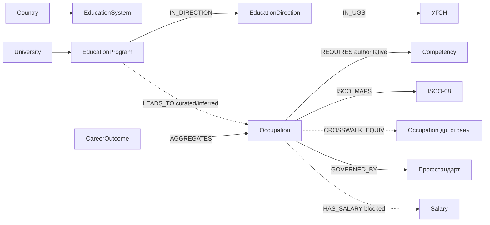

# Career Knowledge Graph — архитектура

> Граф знаний «образование → карьера» для MainExperts. Файловый версионируемый
> артефакт (JSONL + JSON Schema), питающий страницы профессий SEO-сайта; спроектирован
> под миграцию в Postgres + Neo4j + OpenSearch без переделки. Снимок: 13.07.2026.

## Принцип, снимающий конфликт «ценность в связях ↔ не выдумывать»

Ценность графа — в связях, но многих связей авторитетно не существует (аудит
`seo-platform/00-audit.md` §3: связь профессия→специальность отсутствует, «требует
внешней онтологии»). Решение архитектурное: **каждый узел и связь несут конверт**
— `method` (authoritative | crosswalk | inferred | curated), `confidence`, `status`
(факт | гипотеза | требует-проверки — словарь vault), `provenance[]` (источник+дата+
лицензия). Неуверенная связь не удаляется — помечается и фильтруется на выходе:

- **Публичная страница профессии** показывает как факт только `authoritative` (и
  проверенный `crosswalk`) со `status: факт` и источником с `publicOutput`. Всё
  прочее — либо помеченная рекомендация («сопоставление, не факт»), либо «Информация
  отсутствует». Гейт публичности — чистая функция полей узла/связи (`validate.ts::isPublicFact`).

Это поднимает правило `pipeline/types.ts` («пропуск = null, не выдумка») на уровень графа.

## Каноническая модель

Узел (`src/graph/types.ts::GraphNode`, схема `schema/node.schema.json`): `id` (URN
`me:<type>:<key>`), `type`, `localIds[]` (okso, isco08, esco, onet-soc, okz, profstandard),
`labels{ru,en,…}`, `status`, `confidence`, `validAsOf`, `provenance[]`, `version`, `attrs`.
Связь (`GraphEdge`, `schema/edge.schema.json`): `id`, `type`, `from`, `to`, `weight`,
`probability`, `confidence`, `method`, `status`, `provenance[]`, `explanation` (по-русски), `createdAt`.

Global ID детерминирован из стабильного ключа источника (идемпотентность: одинаковый вход
→ одинаковый выход). Профессия якорится на **ISCO-08** (ОКЗ РФ на нём основан) как на
узле-мосте; ESCO/O\*NET/ОКЗ цепляются как `localIds` + crosswalk-связи, сливаются в один
узел только при 1:1 ISCO и совпадении меток.

Сплошные стрелки — авторитетно/кроссволк; пунктир — курируемо/выводимо/заблокировано
(не факт в публичном выводе).

## Матрица источников

| Источник | Даёт | Метод | Лицензия (`config/graph/licenses.json`) |
|---|---|---|---|
| ВУЗ-навигатор (в руках) | University, Program, Direction, City, Region | authoritative | edu-snapshot |
| УГСН dict (в руках) | названия групп | authoritative | minobr-ugs |
| ESCO v1.2.1 | Occupation (3046), Competency (~14k), Occupation→Competency | authoritative | esco-1.2.1 (нет рус. меток) |
| O\*NET 30.3 | знания/навыки/способности/интересы/Job Zones | authoritative | onet-30.3 (RIASEC переименовать) |
| ISCO-08 | классификатор-мост | authoritative/crosswalk | isco-08 |
| ОКЗ ОК 010-2014 | русские профессии, ISCO-мост | authoritative | okz-2014 (рус. метки!) |
| Профстандарты (1682) | РФ occupation↔функция↔знания | authoritative | profstandard |
| ОКПДТР ОК 016-94 | профессии рабочих/должности | authoritative | okpdtr-016-94 |
| CIP→SOC | референс программа→профессия | inferred (не публикуем) | cip-soc |
| hh.ru | зарплаты/рынок | — | **hh-api: blocked** (ToS + источник) |

## Гейты качества (`validate.ts` + независимый `graph_audit.py`)

Схема-конверт; уникальность/стабильность id; висячие связи; полнота провенанса
(факт без источника — ошибка сборки); согласованность method↔status↔confidence
(inferred/curated не может быть фактом и не выше потолка 0.8); лицензионный гейт
(источник `blocked`/`publicOutput:false` не идёт в публичный вывод). Жёсткий отказ =
`exit(1)`. Python-контролёр пересчитывает независимо; расхождение — повод для разбирательства.

## ETL (файл-первый, миграционно-готовый)

`src/graph/`: `schema/` (JSON Schema) · `types.ts` · `ingest/*` (источник→staged) ·
`resolve/*` (ISCO-мост, дедуп, минтинг id — фаза 1) · `merge.ts` · `validate.ts` ·
`build.ts` (оркестратор, зеркало `pipeline/run.ts`). Артефакт: `build/graph/{nodes,edges}.jsonl`
+ `manifest.json` + `report.json`. Конверт JSONL **и есть** будущая схема БД: Postgres
(`attrs` в jsonb), Neo4j (`type`→метка/связь), OpenSearch (денормализованный документ) —
проекции файла, не переделка. Совпадает с решением канона «PostgreSQL при выходе на хостинг».

## Дорожная карта

- **Фаза 0 (сделано)**: каноническая модель, JSON Schema, каркас, гейты, Python-контролёр —
  сборка валидирует пустой граф зелено.
- **Фаза 1**: авторитетное ядро — ISCO+ESCO+O\*NET (профессии+компетенции+связи), education из
  витрин, ОКЗ (рус. метки), курируемые LEADS_TO для 1–2 УГСН; зарплата = «Информация отсутствует».
  Новые страницы `/professiya/` + перелинковка с `/specialnost/` + CTA в воронку.
- **Фаза 2**: профстандарты (нативные РФ authoritative), ОКЗ-мост для всех УГСН, выводимые связи
  с метками, международные аналоги через ISCO.
- **Фаза 3**: полиглот-стек на хостинге (Postgres + Neo4j + OpenSearch + Docker + CI/CD + REST/GraphQL
  API) — те же загрузчики читают тот же артефакт.
