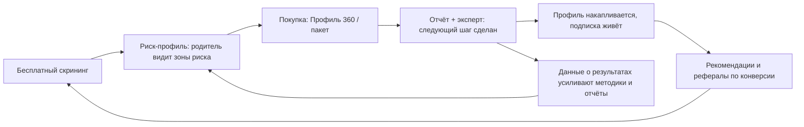
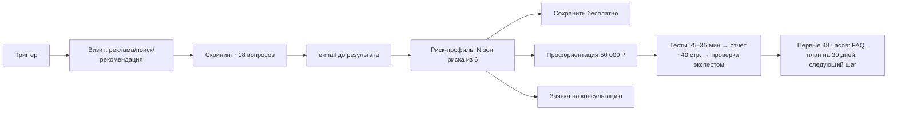
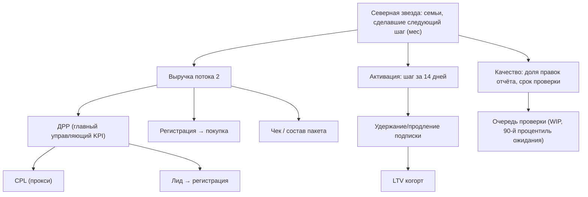

# Операционная система MainExperts v1

> **Оговорки, обязательные к прочтению.**
> 1. Центральная гипотеза скрининга («скрининг оцифровывает страхи родителя → родитель покупает диагностику») **не валидирована**. Все построения фаз «Рост», «Выход на рынок», «Продажи» и «Финансы» опираются на неё; проверки рынком нет. Каждый такой вывод — ставка, не факт.
> 2. Документ описывает **поток 2** (воронка самообслуживания). Поток 1 (премиальный, высококонтактный) упоминается только как граница и источник текущей выручки — его метрики, цены и клиенты здесь не разворачиваются и ни в один расчёт не входят.
> 3. Команда обезличена: направления — основатель, маркетинг, разработка, методология, операции-платежи; ответственный указывается направлением.
> 4. Психометрические методики названы рабочими именами: «личностная методика» и «методика интересов». Коммерческой лицензии на оригинальные названия нет; финальное переименование — открытый вопрос (методология).
> 5. Каждое утверждение маркировано: **[факт]** — из канона или внешнего источника с датой; **[план]** — плановое значение, не подтверждено; **[гипотеза]** — опирается на невалидированную гипотезу; **[допущение]** — принято для расчёта; **[пробел]** — данных нет, не выдумываем.
> 6. База знаний — снимок от 23.06.2026. Документ собран 10.07.2026: статус вебинара (предварительно 4 июля) в базе отсутствует — см. первую неудобную находку.

## 0. Резюме для руководства

### Сначала неудобное

1. **Главный недостающий вход — итог первого вебинара.** База знаний заканчивается 23.06; вебинар стоял предварительно на 04.07. Если он состоялся — его цифры (регистрации, заявки, оплаты) обесценивают и заменяют половину плановых значений этого документа. Если перенесён — блокеры (методология скрининга, парсер рынка труда, подписка) считаются открытыми. Первое действие по документу — внести фактический статус (маркетинг, основатель). **[пробел]**
2. **Цель $1 млн за 6 месяцев не операционализирована.** Она (а) не расщеплена между потоками 1 и 2 — а у них разная экономика; (б) упирается в узкое место: ручная экспертная проверка каждого отчёта. Грубая оценка канона: $1 млн только пакетами 50 000 ₽ ≈ 1700 оплат ≈ 9–10 в день, каждая тянет ручную проверку **[факт, docs/01]**. На текущей технологии проверки это недостижимо; либо меняется технология проверки, либо большая часть цели идёт через поток 1. Расщепление цели — решение основателя, здесь не выдумывается **[пробел]**.
3. **Юнит-экономика — ноль фактических точек.** Платный трафик не запускался ни разу **[факт]**. CPL ~$3, скрининг→регистрация >40%, регистрация→покупка >5% — плановые ориентиры из маркетинговой стратегии от 10.06.2026, не измерения **[план]**. Запуск идёт в неизвестность; документ строит сценарии, но подчёркивает: до первых трёх прогонов вебинара аналитика невалидна **[факт, метрики канона]**.
4. **Регуляторный контур не закрыт, а закрыт он должен быть до трафика.** Данные несовершеннолетних, бессрочное хранение профиля, граница психодиагностики, лицензии методик — реестр регулирующих воздействий не собран **[факт, docs/05]**. Любой платный запуск до закрытия реестра — принятие юридического риска в явном виде.
5. **Опора аудитории смещена.** Четыре персонажа и все клиентские инсайты выведены из 9 интервью с HNW/UHNW-родителями **[факт, docs/03]**. Перенос этих инсайтов на массовую воронку потока 2 (чек 2 990–50 000 ₽) — допущение, не факт: «цена вторична репутации» у HNW не обязана выполняться у массового родителя. Холодный кастдев массового сегмента отсутствует **[пробел]**.

### Что уже сильно

- Подтверждённый флоу скрининга (18.06.2026): роль → квиз ~18 вопросов → e-mail до результата → риск-профиль «N зон из 6» → 3 призыва к действию **[факт]**.
- Кастдев глубокий, хоть и смещённый: связка «отчёт + эксперт» обязательна (8 из 9), премиальный дизайн (9 из 9), доверие через рекомендации **[факт]**.
- Операционная методология стоит на двух проверенных базах (V4.1 «Петли управления ценностью», чек-лист построения системы) — узкое место найдено независимо в трёх аналитических слоях **[факт]**.
- Платформа в собственности (Rust, ~50 тыс. пользователей на текущем контуре, ~100 тыс. после кэша) — низкая стоимость масштабирования инфраструктуры **[факт, демо 17.06]**.
- Поток 1 уже даёт реальную выручку и финансирует стройку **[факт; без цифр — вне контура]**.

### Что это за документ

Исполнение операционного промпта v2.0 (14 фаз, 19 артефактов) на знании канона от 23.06.2026 и точечной внешней проверке от 10.07.2026. Правила канона стоят выше требований промпта: где промпт требует цифру, которой нет, — стоит пробел и задача её добыть, а не выдумка. Документ рассчитан на работу командой 12 месяцев; пересборка — после каждого существенного события (вебинар, запуск трафика, закрытие блокеров).

---

# Фаза 1. Разведка (Discovery)

## 1.1 Миссия, видение, нарратив

| Элемент | Состояние | Формулировка / статус |
|---|---|---|
| Миссия | **[факт]** черновик согласован 18.06.2026 | «Навигация человеческого развития в мире, который меняется быстрее, чем образование» |
| Сегментные ценности | **[факт]** | Родитель: видеть развитие ребёнка целиком. Подросток: понять, что в тебе растёт и какой шаг сделать. Взрослый: оставаться сильным при смене ролей |
| Видение 2030 | **[пробел]** — решение основателя | Не зафиксировано. Черновые опции для выбора — ниже |
| Ценности компании, политика качества | **[пробел]** | Отмечены как пробел в чек-листе системы (модуль 1) |
| Стратегический нарратив | **[факт]** | Продаём переход состояния: тревога → управляемость, разрозненность → единая картина. Конкурируем сначала с бездействием, потом с привычками, потом с конкурентами |

Черновые опции видения 2030 (не решение, а материал для решения основателя):

- В1. «Цифровой профиль развития — такая же норма для семьи, как медицинская карта» (платформенное видение, длинный горизонт).
- В2. «Стандарт навигации развития для русскоязычных семей мира + выход в MENA» (гео-видение).
- В3. «Семейный офис развития по подписке для миллиона семей» (продуктовое видение, стыкуется с логикой Ultima).

Рекомендация: Цель — зафиксировать видение и ценности. KPI — заполнен модуль 1 чек-листа без пробелов. Владелец — основатель (модерация: маркетинг). Приоритет — средний. Зависимости — нет. Срок — до конца июля 2026. Готово, когда: формулировки внесены в канон и не меняются месяц.

## 1.2 Северная звезда (North Star)

Требование к метрике: отражает ценность для клиента (не выручку), растёт только когда клиент реально получил навигацию, и работает как верх дерева KPI (фаза 12).

| Кандидат | За | Против |
|---|---|---|
| Семьи, дошедшие до «следующего шага» после отчёта (за месяц) | Прямо кодирует главный инсайт кастдева: «после отчёта нет следующего шага» | Требует определить событие «шаг сделан» в таксономии событий |
| Активные профили с ростом заполненности за 30 дней | Меряет накопительную ценность профиля | Достижима без реальной пользы (загрузил оценки — профиль вырос) |
| Число завершённых скринингов | Просто измерить уже сейчас | Метрика верха воронки, не ценности **[гипотеза]** — ценность скрининга сама не валидирована |

Рекомендация: принять кандидата 1 («семьи с сделанным следующим шагом»), до появления события — временно вести кандидата 3 как прокси. Владелец — маркетинг (аналитика) + методология (определение «шага»). Готово, когда: событие описано в таксономии, метрика на дашборде.

## 1.3 Маховик компании

Звено B→C — невалидированная гипотеза, на ней маховик может порваться **[гипотеза]**. Звено G→B (обучение на данных) — по V4.1 включается только после наблюдаемости (журнала событий), иначе усиливает шум **[факт, docs/04]**.

## 1.4 SWOT

| | Помогает | Мешает |
|---|---|---|
| **Внутри** | Собственная платформа (Rust, дёшево масштабируется); кастдев-глубина; методологическая база операционки; поток 1 финансирует; опыт маркетинга: SEO-кейс роста 394 млн → ~1 млрд ₽ за 2 года и воронка 800 тыс. лидов/год **[факт]** | Ручная проверка отчётов — узкое место; методология скрининга не готова (блокер №1); парсер рынка труда не найден (блокер №2); платформа переусложнена, разработчик фрустрирован пивотом; юнит-экономика неизвестна; выборка кастдева смещена в HNW |
| **Снаружи** | Детский сегмент EdTech РФ растёт быстрее рынка (+20% при +12% у рынка, 2025) **[факт, Smart Ranking/ComNews]**; страх родителей перед устареванием профессий растёт вместе с ИИ-повесткой; MENA-платёжеспособность | Регуляторный путь (данные детей, психодиагностика, лицензии методик); бесплатные тесты обесценивают вход (у изученного конкурента ~5000 тестов); домен .ru не работает с рекламой Meta; платёжные ограничения (комиссия 10%, ручная сводка оплат) |

## 1.5 Пять сил (по Портеру, качественно)

| Сила | Оценка | Почему |
|---|---|---|
| Новые игроки | Высокая | Порог входа в «тесты + ИИ-отчёт» упал: генеративный отчёт делается за недели. Ров не может строиться на тесте |
| Поставщики | Средняя | Методики без лицензии — юридическая зависимость; данные рынка труда: hh.ru API и открытые базы профессий бесплатны, MENA — за пейволом; эксперты — поставщик дефицитной мощности (узкое место) |
| Покупатели | Высокая (масс) / средняя (премиум) | В самообслуживании альтернатива бесплатна; в премиуме цена вторична репутации — но это HNW-инсайт **[допущение для масс-сегмента]** |
| Заменители | Высокая | Бесплатные тесты, школьная профориентация, репетиторы, «спросить ChatGPT», бездействие — главный конкурент по канону |
| Соперничество | **[пробел]** | Изучен один игрок (SEO-модель «психолог онлайн», ~5000 бесплатных тестов). Карта конкурентов не собрана — задача ниже |

## 1.6 Голубой океан и категория

Вычеркнуть (индустрия делает, мы — нет): гонка числом тестов (тупик — подтверждено анализом конкурента **[факт]**); научный жаргон (научность некритична — кастдев); промежуточные апдейты (не нужны — кастдев).
Усилить: премиальный дизайн; «следующий шаг» после отчёта; связка ИИ-отчёт + живой эксперт.
Создать: лонгитюдный профиль (медкарта + инвестпортфель); рыночный слой с источником и датой у каждой цифры; индекс соответствия профессии; перенаправление на эксперта по тревожным сигналам (монетизация ветки «профориентация не нужна»); семейный индекс совпадения траекторий родитель↔ребёнок.

Категория: не «профориентация» (зрелая, дешёвая), а **«навигация человеческого развития»** — профориентация лишь точка входа. Это и есть проект категории; имя категории для рынка — открытый вопрос брендинга (основатель).

## 1.7 Объём рынка: TAM / SAM / SOM

Прямых денежных оценок ниши профориентации в открытых источниках не найдено — считаем через якоря и прокси, не выдумывая долю.

Якоря (внешние, проверены 10.07.2026):

| Якорь | Значение | Источник, дата |
|---|---|---|
| Участники ЕГЭ-2026 | >750 тыс., из них ~663 тыс. выпускники года | Интерфакс, июль 2026 |
| Участники ОГЭ-2026 | ~1,71 млн девятиклассников | Интерфакс / Парламентская газета, май 2026 |
| EdTech РФ, выручка 2025 | 154 млрд ₽, +12% к 2024 | Smart Ranking, 2026 |
| Детский сегмент EdTech РФ | Впервые обогнал взрослое допобразование; +20% за 2025 | ComNews 05.05.2025, Smart Ranking |
| Онлайн-подготовка к экзаменам РФ | >19 млрд ₽/год, +50% | TAdviser, 2025 |
| EdTech GCC 2025 | Оценки $2,85–3,86 млрд (разброс агентств); СА+ОАЭ ≈ 70% выручки GCC | MarkNtel / MRFR / VynZ, 2025–2026 |

- **TAM (РФ, семьи с детьми 10–18):** каждый годовой срез 9–11 классов — это ~1,7 млн семей (якорь ОГЭ) плюс ~0,66 млн на пике решения (ЕГЭ). Денежный TAM = число семей × средний чек навигации — второй множитель в открытых данных отсутствует **[пробел]**. Ближайший денежный прокси той же аудитории и той же мотивации (поступление): рынок онлайн-подготовки к экзаменам >19 млрд ₽/год.
- **SAM:** русскоязычные онлайн-платёжеспособные семьи, достижимые каналами Meta/ВК/SEO. Доля от TAM не обоснована данными — фиксировать после первых кампаний по фактическому охвату и CPL **[пробел]**.
- **SOM (12 мес):** считается не от рынка, а от мощности: пропускная способность узкого места (проверка отчётов) и бюджет трафика. По сценариям фазы 9: 8–33 оплаты пакета в месяц на стартовом бюджете **[план]** — то есть SOM первого года определяется нашей операционной мощностью, а не спросом.
- **MENA:** рынок EdTech региона в миллиардах долларов, но ниша навигации — данных нет; источники фрагментированы и за пейволом **[факт, канон]**. До появления платёжного и юридического контура (Stripe + юрлицо) MENA считать опционом, не планом.

Рекомендация: Цель — TAM/SAM/SOM v1 с источниками. KPI — три числа с методикой и датой. Владелец — маркетинг. Приоритет — средний. Зависимости — нет. Срок — август 2026. Готово, когда: расчёт лежит в каноне и пережил критическую проверку.

## 1.8 Карта рынка и матрица конкурентов

Известное состояние: изучен один конкурент — российский сайт бесплатных тестов (SEO-воронка, ~5000 тестов, модель «психолог онлайн»); вывод: конкурировать числом тестов — тупик **[факт]**. Остальное — не исследовано.

| Тип игрока | Примеры | Модель | Статус изучения |
|---|---|---|---|
| Бесплатные тесты + SEO | изученный кейс | Трафик → онлайн-психолог | Изучен |
| Частные профориентологи | — | Часовые консультации | **[пробел]** |
| Центры и школьные программы | — | Офлайн, B2B2C | **[пробел]** |
| EdTech-платформы с профмодулем | — | Подписка/курсы | **[пробел]** |
| Международные (MENA/UK) | приёмные консультанты | Высокий чек, admissions | **[пробел]**; поток-1-смежное |

Матрица сравнения (оси: глубина отчёта, живой эксперт, лонгитюдный профиль, рыночный слой с данными, цена) заполняется в рамках той же задачи «карта конкурентов v1». Владелец — маркетинг. Срок — август 2026. Готово, когда: ≥10 игроков по РФ и ≥5 по MENA с ценами и офферами.

## 1.9 Ров и нечестное преимущество

- Ров (строится, не готов): накопительный лонгитюдный профиль — издержки переключения растут со временем; связка отчёт+эксперт (кастдев: обязательна); рыночный слой, где каждая цифра с источником и датой. Честно: сетевого эффекта на старте нет, ров возникает только при удержании.
- Нечестное преимущество: сеть основателя в HNW-среде (поток 1 финансирует поток 2); маркетинговый опыт масштабного SEO и квиз-воронок; собственная платформа без арендной платы за технологию.

## 1.10 Риски, неизвестные, вопросы основателю

Полный реестр рисков — в артефактах (раздел 15.4). Критические неизвестные:

1. Итог вебинара 04.07 (или новая дата) — **вход №1** для всех планов.
2. Конверсия скрининг→покупка: есть ли она вообще (гипотеза).
3. Денежная ёмкость ниши (TAM множитель №2).
4. Поведение массового (не HNW) родителя.
5. Регуляторные требования к психодиагностике несовершеннолетних в РФ и ОАЭ **[пробел — нужна юридическая консультация]**.

Вопросы, требующие решения основателя (не выдумываются): расщепление цели $1 млн по потокам; видение 2030 и ценности; брендовая связь названий под рынки; позиционирование основателя как лица; параметры семейного премиум-пакета (максимум детей, гарантия поступления, продление); срок подписки внутри пакета 50К (1 или 2 года); связь старой пакетной лесенки с номенклатурой «Профиль 10/360».

---

# Фаза 2. Клиент

## 2.1 Портрет целевого клиента (ICP) потока 2

Покупатель — родитель; пользователь — подросток; плательщик и ЛПР — родитель (в семье возможна рассогласованность решений — ось боли №6). Ядро: родитель 35–50 лет (Meta), мамы 25–45 (ВК) **[план, стратегия 10.06]**, ребёнок 10–18, пик мотивации — 9 и 11 класс (экзамены, поступление). География: СНГ + русскоязычные MENA. Платёжеспособность: от freemium до пакета 50 000 ₽.

**Ограничение выборки:** портреты ниже построены на 9 интервью HNW/UHNW **[факт]**; для масс-сегмента — рабочая экстраполяция **[допущение]**.

## 2.2 Сегменты и персонажи

| Персонаж | Доля | Профиль решения | Что требует от продукта |
|---|---|---|---|
| «Защитница», 42 | 55% | ИИ-скептик, страх за ребёнка, решает долго | Детальный отчёт, живой эксперт, доверие через рекомендации |
| «Лидер», 45 | 20% | Предприниматель, решает за 1–2 дня | ИИ + эксперт, скорость, конкретика |
| «Стратег», 50 | 15% | Академичен, международный контекст | Глубина 40+ страниц, траектории, вузы |
| «Технолог», 38 | 10% | ИТ, максимум автоматизации | Краткие выводы, данные, без «воды» |

Основной персонаж воронки — «Защитница» (на ней построена трёхслойная карта) **[факт]**.

## 2.3 Работы клиента (JTBD)

1. Когда ребёнок в 9–11 классе не знает, кем быть, — увидеть его сильные стороны со стороны, чтобы не навязать своё и не потерять годы.
2. Когда профессии устаревают быстрее образования, — проверить, что выбранное направление будет нужно рынку, чтобы деньги на образование не ушли впустую.
3. Когда «вроде экономист, но не уверены», — получить подтверждение или опровержение семейной гипотезы («инфа сотка»).
4. Когда семья спорит (мама одно, папа другое), — получить внешний авторитетный аргумент, чтобы согласовать решение.
5. Когда ребёнок ничем не делится, — увидеть его целиком (динамику, интересы), чтобы вернуть контакт.
6. Когда успеваемость упала и непонятно почему, — найти причину, чтобы действовать, а не давить.
7. Когда отчёт получен, — получить конкретный следующий шаг, чтобы отчёт не лёг «в стол» (главный поведенческий инсайт кастдева **[факт]**).

## 2.4 Карта болей

Оси из командного штурма 22.06 (сырьё для генерации отчётов, **[гипотеза]** — не кастдев), сведённые с валидированными болями (**[факт]**, 9 интервью):

| № | Ось | Статус |
|---|---|---|
| 1 | Будущее: не вижу будущего ребёнка; профессии устаревают | факт (страх потерянных лет — главный) |
| 2 | Несоответствие: навыки не нужны рынку / оплачиваются, но несчастлив | гипотеза |
| 3 | Таланты: не знаю сильных сторон, не уверен в «сильности» | факт (непонимание талантов) |
| 4 | Цельность: не вижу тренда развития; ребёнок не делится | факт (коммуникационный разрыв) |
| 5 | Локация: где учиться (страна/город), безопасность среды | гипотеза |
| 6 | Семья: рассогласованность родителей, нарушенная иерархия | гипотеза |
| 7 | Поступление: выбор из 2–3 вузов, бюджет, «интересы не прокормят» | факт (KPI клиента: поступление) |
| 8 | Подтверждение гипотезы: «проверьте, что мы правы» | гипотеза (частый запрос в HNW-разговорах) |
| 9 | Текущий провал: низкая успеваемость, «завалил/выгнали» | гипотеза |
| 10 | Действие: нет плана; «срочно дорогого преподавателя» | факт (нет следующего шага) |

## 2.5 Карта возражений

| Возражение | Ответ продукта | Основание |
|---|---|---|
| «ИИ ошибается, не верю алгоритму» | Связка ИИ-отчёт + живой эксперт + проверка отчёта человеком | 8/9 кастдев **[факт]** |
| «Дорого» | В HNW цена вторична репутации; в массе — не проверено: тестировать лесенкой цен | **[допущение]** для массы |
| «Хочу поговорить с человеком до оплаты» | Видеозвонок до покупки (7/9) → в массе заменяет вебинар/разбор | **[факт]** для HNW |
| «Тестов полно бесплатных» | Ценность не тест, а отчёт + план + рынок труда + эксперт | позиционирование **[факт]** |
| «Боюсь отдавать данные ребёнка» | Приватность психомодуля, управление доступом; закрытый регуляторный контур | требование, не опция **[факт, docs/05]** |
| «Наука ли это?» | Не давить научностью — кастдев: научность некритична | **[факт]** |

## 2.6 Триггеры и путь решения

Триггеры: сезонные (выбор предметов ОГЭ — осень; ЕГЭ и приёмная кампания — весна-лето); событийные (упала успеваемость, конфликт о будущем, «ребёнок не знает, чего хочет», переезд); медийные (новости об исчезающих профессиях и ИИ).

Путь решения (сжатый, 7 этапов слоя 1 **[факт]** + подтверждённый флоу):

Голос клиента (для копирайта, без имён): «потерянные годы» — главный страх; «инфа сотка» — запрос подтверждения; «работаю и толком его не знаю»; пожелания подростка к «идеальной системе»: таблица профессий, уровень зарплат, зоны роста, рекомендации по вузам и по общению **[факт, интервью из памяти]**.

## 2.7 Задачи фазы

| Задача | KPI | Владелец | Приоритет | Срок | Готово, когда |
|---|---|---|---|---|---|
| Холодный кастдев масс-сегмента (не HNW) | 10 интервью с оплатившими/отказавшимися | маркетинг + методология | высокий | параллельно первому трафику | боли/возражения масс-родителя сопоставлены с HNW-картой |
| Пересборка персонажей на данных | профили на ≥100 реальных скринингах | маркетинг | средний | после запуска | персонажи v2 в каноне |
| Словарь голоса клиента | ≥30 формулировок с источником | маркетинг | средний | август | лежит в каноне, используется в креативах |

---

# Фаза 3. Продукт

## 3.1 Архитектура: цифровой профиль (центральный элемент)

Накопительная карточка человека: собирается из модулей по мере покупок и загрузок, хранится бессрочно (регуляторный узел — фаза «Риски»), пересчитывает рекомендации, разделяет публичное/приватное, поддерживает доступ третьих лиц. Аналогия: медицинская карта + инвестиционный портфель **[факт, спецификация 09.06]**.

| Модуль | Бесплатно | Платно | Примечание |
|---|---|---|---|
| Личностные характеристики | 3 характеристики | Полный профиль с динамикой; пересдача раз в 6 мес | Источник: личностная методика + методика интересов |
| Академическая успеваемость | Загрузка оценок | Анализ (в пакете) | Согласие родителя на данные из школы |
| Карьерная траектория | Топ-3 без деталей | Полный список, зарплатные вилки, тренды | Зависит от парсера рынка труда (блокер №2) |
| Образовательная траектория | — | База вузов и программ | Подбор конкретных вузов — отдельный продукт |
| Психологический скрининг | — | — | Полностью приватный; регуляторная граница **[факт, docs/05]** |
| Карта компетенций | — | Премиум-уровень | Синтез + портфолио |
| Профиль эксперта | Публичный | — | Для взрослых, этап 2 |

Конверсионный крючок — механика незавершённости: серые плитки «доступно в пакете», счётчик «профиль заполнен на 15%», принцип прогресс-бара **[факт]**.

## 3.2 Экосистема и производственная рамка

- Этап 1 (текущий): кабинет клиента + автоматическая профориентация (Профиль 10 бесплатный, Профиль 360 платный).
- Этап 2: кабинет эксперта, бронирование, оплата пакетов, матчинг; звонки через внешний видеосервис.
- Этап 3: каталог услуг, автоматический матчинг, конструктор услуг, звонки внутри платформы, рекомендации.

Монетизационная модель: подписка с двух сторон (семьи И эксперты/агентства), комиссии с сессий нет — это приманка для экспертов; платформа не зарабатывает на транзакции **[факт]**. Агентство MainExperts (~7 исполнителей) — один из «арендаторов» платформы, не вся модель.

Производственная рамка качества **[факт, 22.06]**: «штамповка» (сырые шкалы без интерпретации — уровень бесплатных тестов) → «литьё» (стандартная методика с индивидуальным результатом — текущий продукт, «элитное литьё») → «ковка» (исследование строго под запрос — целевой премиум). По каждой услуге решение: производить самим или брать готовое.

## 3.3 Ценообразование

| Продукт | Цена | Статус |
|---|---|---|
| Скрининг (Профиль 10) | 0 ₽ | Вход воронки **[факт]** |
| Подписка Pro | 2 990 ₽/мес | В разработке (дольше всего) **[факт]** |
| Подписка Ultima | 9 990 ₽/мес | Логика «семейный офис по подписке» **[факт]** |
| Пакет профориентации | 50 000 ₽ | Включает подписку (1 или 2 года — открытый вопрос) + повторную профориентацию **[факт]** |
| Профиль 360 | **[пробел]** | Платный апсейл; связь с пакетом 50К и старой лесенкой не зафиксирована — открытый вопрос |

Правило управления ценой **[факт]**: высокий спрос → поднимать; нет продаж → снижать + сравнительный тест. Прайсинг-риск: подписочные цены (2 990/9 990) не проверены ни одной продажей **[план]**.

## 3.4 Удержание и подписка

Механики: незавершённость профиля (прогресс-бар); пересдача методики раз в 6 месяцев (лонгитюдная динамика — причина возвращаться); триггерная цепочка после отчёта (фаза 10); подписка внутри пакета 50К конвертирует разовую покупку в отношение **[факт]**. Фактических данных об удержании нет — не запускались **[пробел]**.

## 3.5 Маркетплейс и стратегия экспертов

Маркетплейс скрыт (не удалён) до прихода внешних провайдеров; корзина и маркетплейс не должны быть видны до запуска трафика **[факт]**. Возврат к маркетплейсу — только при: (а) работающей воронке, (б) закрытом юридическом вопросе прав на методологии (заблокирован **[факт]**), (в) наличии экспертов с загрузкой.

Эксперты: первые 10 — вручную из сети (онбординг руками) **[факт, горизонт]**. Три цели раннего привлечения держать раздельно: валидация продукта / проверка гипотезы скрининга / накопление опыта — смешение даёт ложные выводы **[факт, жёсткое правило]**. Валидированные боли экспертов: неоплачиваемый интейк, перепланирования, координация платежей **[факт]** — оффер платформы бьёт в них. Подписочный оффер эксперту («зачем платить») не готов — доработка (методология + маркетинг); переходная схема: 3 месяца бесплатно → подписка **[факт]**.

## 3.6 ИИ-слой продукта

- Отчёт-конструктор по разделам: «Что показал скрининг» → «Где вы сейчас» / «Где хорошо» / «Где риск» / «Почему важно сейчас» / «Что делать дальше»; пробелы выносятся наверх и красным; статусы-светофор по шкалам; статус «не проверено» — честность вместо выдумки **[факт, 22.06]**.
- Четыре голоса отчёта: психология (узор портрета личности), обучение (профицит/дефицит черт, предметы), карьера (3 сценария + индекс соответствия профессии), синтез **[факт]**.
- Тревожный сигнал (red flag): при срабатывании шкалы отчёт перенаправляет к профильному эксперту («что с ним обсудить») — монетизирует ветку «профориентация не нужна» **[факт]**.
- Граница продукта: базовый отчёт даёт направления и профессии, не имена вузов; подбор вузов — отдельный продукт. Принцип: не переобещать **[факт]**.
- Технология: генерация отчётов очередью по 5; анализ сертификатов экспертов через агрегатор моделей (переключение на другого провайдера возможно); ИИ-консультант отключён до готовности **[факт, демо 17.06]**.
- Конфликт длительности скрининга: установка «5 минут» против ~15–20 минут по методологии — решено замерить эмпирически **[факт]**; влияет на конверсию шага S→E.

## 3.7 Дорожная карта продукта и приоритизация (RICE)

Оценки R (охват, пользователей/квартал), E (трудоёмкость, недели) — **[допущение]**, до оценки разработкой; I (влияние 0,5–3), C (уверенность 0–1). Балл = R×I×C/E, важен порядок, не абсолют.

| Элемент | R | I | C | E | Балл | Комментарий |
|---|---|---|---|---|---|---|
| Методология скрининга v1 (блокер №1) | 3000 | 3 | 0,8 | 2 | 3600 | Без неё нет продукта; владелец — методология |
| Подтверждение e-mail + доставляемость | 3000 | 2 | 0,9 | 1 | 5400 | Сбой уже случился (спам-ловушка) **[факт]**; дешёвый фикс |
| Отчёт-конструктор v1 (Профиль 10→360) | 1500 | 3 | 0,7 | 3 | 1050 | Ядро оффера |
| Парсер рынка труда/зарплат (блокер №2) | 1500 | 2 | 0,5 | 4 | 375 | Источник не найден — сначала разведка источника |
| Скрыть корзину/маркетплейс | 3000 | 1 | 1,0 | 0,5 | 6000 | Гигиена до трафика; тривиально |
| Реферал по конверсии (промокоды есть) | 500 | 1 | 0,7 | 1 | 350 | Выплата только за продажу **[факт, решение 22.06]** |
| Подписка в проде (биллинг) | 1000 | 3 | 0,6 | 6 | 300 | Дольше всего в разработке |
| Кабинет эксперта (этап 2) | 300 | 2 | 0,5 | 8 | 38 | После валидации воронки |
| OAuth-вход | 2000 | 1 | 0,8 | 2 | 800 | В бэклоге; после подтверждения e-mail |

Порядок работ: гигиена (скрыть лишнее, e-mail) → методология → отчёт-конструктор → подписка → парсер (параллельно разведка источника) → остальное. Кабинет эксперта не начинать до первых денег воронки.

---

# Фаза 4. Рост: 100+ гипотез

Оценка ICE (влияние/уверенность/простота, 1–10; балл — среднее) дана априорно, до данных **[допущение]**; пересчёт — после каждого спринта экспериментов. Гипотезы, зависящие от невалидированной центральной гипотезы, наследуют её риск **[гипотеза]**. Формат гипотезы: «Если [действие], то [метрика] изменится, потому что [основание]».

### Продукт (в воронке)

| № | Гипотеза | I | C | E | ICE |
|---|---|---|---|---|---|
| 1 | Красные зоны риска наверху мини-отчёта поднимут клики на платный CTA (эффект «увидел со стороны») | 9 | 5 | 8 | 7,3 |
| 2 | Сокращение скрининга до ~5 мин поднимет долю завершений против 15–20 мин | 8 | 6 | 7 | 7,0 |
| 3 | Индекс совпадения траекторий родитель↔ребёнок поднимет конверсию в парный проход | 7 | 4 | 6 | 5,7 |
| 4 | Статус «не проверено» в отчёте поднимет доверие (честность) и NPS | 5 | 6 | 9 | 6,7 |
| 5 | Прогресс-бар «профиль заполнен на N%» поднимет возвраты в кабинет | 6 | 6 | 8 | 6,7 |
| 6 | Красная кнопка «вам нужен эксперт» (red flag) конвертирует ветку «не наш клиент» в заявки | 7 | 5 | 7 | 6,3 |
| 7 | Письмо-план «30 дней» через 24 часа после отчёта поднимет активацию | 7 | 7 | 8 | 7,3 |
| 8 | Пересдача через 6 мес с показом динамики поднимет продление подписки | 6 | 4 | 5 | 5,0 |

### Платное привлечение

| № | Гипотеза | I | C | E | ICE |
|---|---|---|---|---|---|
| 9 | Meta на родителей 35–50 (СНГ+MENA русскояз.) даст CPL ≤ $3 **[план 10.06]** | 9 | 5 | 7 | 7,0 |
| 10 | ВК на мам 25–45 даст лиды дешевле Meta | 7 | 5 | 8 | 6,7 |
| 11 | Лид-магнит «7 ошибок, из-за которых дети теряют годы» побьёт остальные два в сплите | 6 | 5 | 9 | 6,7 |
| 12 | Лид-магнит «Какие профессии исчезнут через 10 лет» даст более дешёвый лид, но худшую конверсию в оплату | 5 | 4 | 9 | 6,0 |
| 13 | Квиз-креатив (вопрос из скрининга в объявлении) побьёт баннер по CTR | 6 | 6 | 8 | 6,7 |
| 14 | Ретаргет незавершивших скрининг вернёт ≥15% на завершение | 7 | 6 | 7 | 6,7 |
| 15 | Look-alike по оплатившим (после ≥50 оплат) снизит CAC на треть | 8 | 5 | 5 | 6,0 |
| 16 | Видео-креатив с лицом (не основателя) не уступит креативу с основателем — снимает риск «одного лица» | 5 | 4 | 6 | 5,0 |

### Вебинар и запускные механики

| № | Гипотеза | I | C | E | ICE |
|---|---|---|---|---|---|
| 17 | Вебинар конвертирует регистрации в оплаты лучше холодной посадочной (опыт: вебинар эффективнее колл-центра **[факт, фон]**) | 9 | 6 | 7 | 7,3 |
| 18 | Три прогона с итерацией оффера дадут валидную базовую конверсию | 8 | 7 | 7 | 7,3 |
| 19 | Разбор обезличенного детского профиля в прямом эфире — сильнейший блок вебинара | 7 | 5 | 7 | 6,3 |
| 20 | Дедлайн-бонус (консультация первым N) поднимет оплаты на вебинаре | 6 | 6 | 8 | 6,7 |
| 21 | Автовебинар после 3 живых прогонов сохранит ≥70% конверсии живого | 6 | 4 | 6 | 5,3 |

### SEO

| № | Гипотеза | I | C | E | ICE |
|---|---|---|---|---|---|
| 22 | Перемножение атрибутов (возраст×роль×гео×запрос) даст 500–1000 индексируемых страниц за месяц (кейс маркетинга: рост каталога до ~1 млрд ₽ выручки **[факт, фон]**) | 8 | 6 | 5 | 6,3 |
| 23 | Страницы «профессии будущего для [класс/возраст]» соберут информационный спрос дешевле рекламы | 7 | 5 | 6 | 6,0 |
| 24 | Отдельный блог-домен/поддомен не нужен: раздел на .online наберёт вес быстрее | 4 | 4 | 7 | 5,0 |
| 25 | Эксклюзивные статьи экспертов (только уникальное индексируем; неуникальное — noindex/301 **[факт, решение 22.06]**) удержат качество домена | 6 | 6 | 6 | 6,0 |
| 26 | Пресс-релизы на деловых площадках со ссылкой на профиль поднимут доверие домена | 5 | 5 | 7 | 5,7 |
| 27 | Агрегатор «топ профориентации РФ» через 3–6 мес станет магнитом ссылок | 6 | 4 | 4 | 4,7 |

### GEO / видимость в ИИ-поиске

| № | Гипотеза | I | C | E | ICE |
|---|---|---|---|---|---|
| 28 | Структурированные страницы-ответы (вопрос → короткий ответ → данные с источником) попадут в выдачу ИИ-ассистентов | 6 | 4 | 6 | 5,3 |
| 29 | Публичная методика с датами и источниками сделает платформу цитируемой в ИИ-ответах о профориентации | 6 | 3 | 5 | 4,7 |
| 30 | Разметка Schema.org (FAQ, Organization, Product) поднимет попадание в обогащённые ответы | 5 | 5 | 8 | 6,0 |
| 31 | Страница «сколько существует профессий» (месседж «7–10 из 250 000») станет цитируемым фактоидом | 5 | 4 | 8 | 5,7 |

### Контент

| № | Гипотеза | I | C | E | ICE |
|---|---|---|---|---|---|
| 32 | Разборы обезличенных архетипов профессий (без живых людей — юр. правило **[факт]**) дадут органический охват | 6 | 5 | 7 | 6,0 |
| 33 | Серия «профессия растёт/падает» на данных с источником отстроит от «мотивационных» конкурентов | 6 | 5 | 7 | 6,0 |
| 34 | Телеграм-канал для родителей 9–11 классов станет прогревом к вебинару | 7 | 5 | 7 | 6,3 |
| 35 | Ролики-шортсы «3 профессии: одна растёт, две падают — угадай» дадут виральный охват | 6 | 4 | 7 | 5,7 |
| 36 | ИИ-аватары исторических личностей (юридически чистый формат **[факт]**) — виральный образовательный формат | 5 | 3 | 4 | 4,0 |
| 37 | Каждый пост с «необратимой пользой» (принцип канона) поднимает подписку канала лучше анонсов | 5 | 5 | 8 | 6,0 |

### Сообщество

| № | Гипотеза | I | C | E | ICE |
|---|---|---|---|---|---|
| 38 | Закрытый чат купивших пакет («родители 11-классников») поднимет удержание и апсейл | 6 | 5 | 7 | 6,0 |
| 39 | Ежемесячный открытый разбор вопросов родителей соберёт тёплую аудиторию | 5 | 5 | 7 | 5,7 |
| 40 | Комьюнити экспертов (обмен практикой) снизит их отток до запуска маркетплейса | 5 | 4 | 6 | 5,0 |
| 41 | Истории «нашёл путь» от подростков (с согласия) — сильнейший социальный триггер для родителей | 7 | 4 | 5 | 5,3 |

### Рефералы и вирусные петли

| № | Гипотеза | I | C | E | ICE |
|---|---|---|---|---|---|
| 42 | Выплата рефералу только за конверсию в продажу (решение 22.06 **[факт]**) даст положительную экономику канала | 7 | 6 | 7 | 6,7 |
| 43 | «Пригласи второго родителя» (совместный доступ к профилю) — встроенная вирусная петля семьи | 6 | 5 | 6 | 5,7 |
| 44 | «Сравни с другом» для подростков (обезличенно) даст p2p-распространение скрининга | 5 | 3 | 5 | 4,3 |
| 45 | Подарочный сертификат на диагностику (бабушки/дедушки, праздники) — сезонный канал | 5 | 4 | 6 | 5,0 |
| 46 | Реферальный бонус эксперту за приведённую семью запустит петлю эксперт→клиент | 5 | 4 | 6 | 5,0 |
| 47 | Шеринг красивой карточки результата подростком (без приватных данных) приведёт сверстников | 6 | 4 | 6 | 5,3 |

### Эксперты как канал

| № | Гипотеза | I | C | E | ICE |
|---|---|---|---|---|---|
| 48 | Первые 10 экспертов из сети приведут первых клиентов сами (канал, не только мощность) | 6 | 5 | 7 | 6,0 |
| 49 | Оффер «лидогенерация в обмен на подписку» закроет главную боль эксперта (валидирована потребность, платформа пока не обеспечивает **[факт]**) | 7 | 4 | 5 | 5,3 |
| 50 | Публичный профиль эксперта с SEO-страницей приведёт его личный трафик на платформу | 6 | 5 | 6 | 5,7 |
| 51 | Вебинар в паре «методолог + эксперт» конвертирует лучше соло | 5 | 4 | 7 | 5,3 |
| 52 | 3 месяца бесплатной подписки эксперту → конверсия в платную ≥30% | 5 | 4 | 7 | 5,3 |

### Школы (осторожно: данные детей — регуляторный узел)

| № | Гипотеза | I | C | E | ICE |
|---|---|---|---|---|---|
| 53 | Родительские собрания 9/11 классов (выступление, не сбор данных) дадут тёплые лиды | 6 | 4 | 5 | 5,0 |
| 54 | Партнёрство с частными школами (пилот на 1–2) даст пакетные продажи | 6 | 3 | 4 | 4,3 |
| 55 | Скрининг класса целиком юридически и операционно нежизнеспособен на текущей стадии — проверить и закрыть вопрос | 3 | 6 | 8 | 5,7 |
| 56 | Вебинар для классных руководителей — дешёвый вход в школьный сегмент без обработки данных детей | 4 | 4 | 6 | 4,7 |

### Вузы

| № | Гипотеза | I | C | E | ICE |
|---|---|---|---|---|---|
| 57 | Дни открытых дверей: стенд/выступление о навигации даст лиды 11-классников | 4 | 3 | 5 | 4,0 |
| 58 | Контент-партнёрство с приёмными комиссиями (гайды по программам) — обмен аудиторией | 4 | 3 | 5 | 4,0 |
| 59 | База программ вузов (модуль траектории) как совместный продукт с 1–2 вузами | 5 | 3 | 4 | 4,0 |

### Партнёрства

| № | Гипотеза | I | C | E | ICE |
|---|---|---|---|---|---|
| 60 | Репетиторские сервисы: их клиент = наш ICP; взаимный оффер (скрининг ↔ репетитор) | 7 | 4 | 5 | 5,3 |
| 61 | Детские лагеря/курсы (ИТ-школы, языковые) — кросс-промо в сезон | 5 | 4 | 6 | 5,0 |
| 62 | Партнёрская UTM-механика (источник=партнёр, метка=фамилия **[факт]**) уже готова — активировать 5 партнёров | 5 | 6 | 8 | 6,3 |
| 63 | Банки/страховые с семейными продуктами (детские накопления на образование) — дистрибуция в MENA/РФ | 6 | 2 | 3 | 3,7 |
| 64 | Психологические центры: обмен по red-flag веткам (мы им — тревожные случаи, они нам — профориентацию) | 5 | 4 | 5 | 4,7 |

### CRM и удержание базы

| № | Гипотеза | I | C | E | ICE |
|---|---|---|---|---|---|
| 65 | Триггерная цепочка 48ч/3д/7д/30д (CJM **[факт]**) поднимет доходимость до «следующего шага» | 8 | 6 | 7 | 7,0 |
| 66 | Письмо «что удивило в отчёте?» (день 3) вернёт в кабинет ≥25% | 5 | 5 | 8 | 6,0 |
| 67 | Апсейл на 45-й день активным пользователям даст ≥5% конверсии в следующий пакет | 6 | 4 | 7 | 5,7 |
| 68 | Реанимация «спящих» скринингов через 30 дней (новая зона риска открыта) вернёт ≥10% | 5 | 4 | 7 | 5,3 |
| 69 | Сегментация писем по числу зон риска (0–2 / 3–4 / 5–6) поднимет конверсию письма в 1,5 раза | 6 | 4 | 6 | 5,3 |
| 70 | Пуш/мессенджер вместо e-mail для доставки отчёта поднимет открытия (после фикса доставляемости) | 5 | 4 | 6 | 5,0 |

### Петли роста (составные)

| № | Гипотеза | I | C | E | ICE |
|---|---|---|---|---|---|
| 71 | Петля данных: больше скринингов → точнее нормы по возрастам → сильнее отчёт → выше конверсия | 8 | 4 | 4 | 5,3 |
| 72 | Петля контента: каждый обезличенный агрегат скринингов («57% родителей 9-классников не знают...») — публикация → трафик → скрининги | 7 | 5 | 6 | 6,0 |
| 73 | Петля экспертов: клиенты → загрузка экспертов → эксперты приводят аудиторию → клиенты | 6 | 3 | 4 | 4,3 |
| 74 | Петля семьи: профиль ребёнка → второй ребёнок/родитель → семейный профиль → подписка Ultima | 6 | 4 | 5 | 5,0 |
| 75 | Петля SEO: страницы профессий → трафик → данные о спросе → новые страницы | 6 | 5 | 5 | 5,3 |

### Международный контур (MENA, опцион)

| № | Гипотеза | I | C | E | ICE |
|---|---|---|---|---|---|
| 76 | Русскоязычная диаспора Дубая/GCC конвертируется по тем же креативам, что СНГ, при чеке выше | 7 | 4 | 6 | 5,7 |
| 77 | Английский аккаунт (глобальный) не запускать в продажи до платёжного контура (Stripe+юрлицо) — только присутствие | 4 | 6 | 8 | 6,0 |
| 78 | UK-механики потока 1 не переносимы в самообслуживание без изменения цены/оффера — проверить границу | 4 | 4 | 5 | 4,3 |

### Ценообразование и оффер

| № | Гипотеза | I | C | E | ICE |
|---|---|---|---|---|---|
| 79 | Тест цены пакета (50К против 39К против 65К) изменит выручку на визит — сплит после 3 прогонов | 8 | 4 | 6 | 6,0 |
| 80 | Рассрочка на пакет 50К поднимет конверсию массового сегмента | 7 | 5 | 6 | 6,0 |
| 81 | Годовая подписка со скидкой против помесячной поднимет LTV | 5 | 4 | 7 | 5,3 |
| 82 | Оффер «отчёт + 60 минут эксперта» как отдельная ступень между 0 и 50К закроет разрыв лестницы | 7 | 5 | 6 | 6,0 |
| 83 | Гарантия возврата в 14 дней снизит барьер ИИ-скептиков сильнее, чем скидка | 6 | 4 | 7 | 5,7 |

### Доверие и бренд

| № | Гипотеза | I | C | E | ICE |
|---|---|---|---|---|---|
| 84 | Публичная страница методологии (как считаем, источники) — конверсионный актив для «Защитницы» | 6 | 5 | 8 | 6,3 |
| 85 | Кейсы «до/после» с согласия семей (обезличенно) — главный триггер доверия | 7 | 5 | 6 | 6,0 |
| 86 | Экран приватности («данные ребёнка видите только вы») в скрининге поднимет завершение | 6 | 5 | 8 | 6,3 |
| 87 | Знак «отчёт проверен экспертом» (пока проверка ручная — это правда) отстроит от чистых ИИ-сервисов | 6 | 6 | 8 | 6,7 |

### Верх воронки: механики скрининга

| № | Гипотеза | I | C | E | ICE |
|---|---|---|---|---|---|
| 88 | Точка входа «Кто вы?» (родитель/подросток/взрослый) с ветками конвертирует лучше единой анкеты | 6 | 6 | 8 | 6,7 |
| 89 | Ветка подростка приводит родителя («покажи маме результат») — обратная петля | 6 | 4 | 6 | 5,3 |
| 90 | Ветка взрослого — отдельная воронка на подписку Pro без диагностики ребёнка | 5 | 4 | 6 | 5,0 |
| 91 | Вопрос о страхах (выбор до 2) в квизе — сильнейший персонализатор мини-отчёта | 7 | 5 | 7 | 6,3 |
| 92 | e-mail до результата (текущий флоу) теряет меньше, чем регистрация после результата — проверить на фактах | 6 | 4 | 7 | 5,7 |

### Операционные рычаги роста (узкое место)

| № | Гипотеза | I | C | E | ICE |
|---|---|---|---|---|---|
| 93 | Чек-лист проверки отчёта экспертом ×2 ускорит проверку без потери качества (мера: доля правок после выдачи) | 8 | 5 | 6 | 6,3 |
| 94 | Предпроверка ИИ (само-критика отчёта до эксперта) сократит время эксперта на треть | 7 | 4 | 6 | 5,7 |
| 95 | Выборочная проверка (100% первых 300 отчётов → выборочно при стабильном качестве) снимет потолок масштаба | 8 | 4 | 5 | 5,7 |
| 96 | Пул внешних проверяющих (не штатных) со стандартом проверки расширит мощность | 7 | 4 | 5 | 5,3 |

### Аналитика как рост

| № | Гипотеза | I | C | E | ICE |
|---|---|---|---|---|---|
| 97 | Сквозная метка от объявления до оплаты (несмотря на ручную сводку платежей **[факт]**) откроет реальную ДРР по каналам | 8 | 6 | 6 | 6,7 |
| 98 | Дашборд-светофор оператора (план/факт по дням) ускорит реакции на просадки конверсии | 6 | 6 | 7 | 6,3 |
| 99 | Запись сессий скрининга (без персональных данных) найдёт места отвала анкеты | 6 | 5 | 7 | 6,0 |
| 100 | Опрос отказавшихся от покупки (1 вопрос после CTA) даст карту возражений массового сегмента | 7 | 5 | 8 | 6,7 |

### Дополнительные (внекатегорийные)

| № | Гипотеза | I | C | E | ICE |
|---|---|---|---|---|---|
| 101 | Публичный «индекс устаревания профессий» (ежеквартальный, с источниками) — PR-магнит | 6 | 4 | 5 | 5,0 |
| 102 | Совместные эфиры с родительскими блогерами (микроинфлюенсеры 10–100К) дешевле таргета по CPL | 6 | 4 | 6 | 5,3 |
| 103 | Б2Б-отчёты для HR (профили выпускников для стажировок) — НЕ делать: «стандарт без масштаба не работает» **[факт, принцип]** — гипотеза-стоп | 2 | 7 | 9 | 6,0 |
| 104 | Сезонный пик (март–июнь: экзамены; август–сентябрь: планирование года) требует ×2 бюджета против ровного распределения | 6 | 5 | 7 | 6,0 |

**Как работать с бэклогом:** брать в спринт 3–5 гипотез с верхним ICE при условии готовности зависимости (трафик — после регуляторного контура; CRM — после фикса доставляемости). Топ-10 на старт — в артефакте 15.5. После каждого спринта пересчитывать ICE по фактам; гипотезы, живущие на центральной гипотезе (№1, 17–21, 65, 67, 91), при провале вебинаров закрываются пакетом.

---

# Фаза 5. Выход на рынок (GTM)

## 5.1 Последовательность запуска

Принцип: один продукт — один измеримый запуск; следующий продукт запускается на фактах предыдущего. Всё до закрытия регуляторного реестра — репетиция, не запуск **[факт, docs/05]**.

| Волна | Продукт | Сегмент | Канал | Оффер | Цена | KPI успеха | Владелец |
|---|---|---|---|---|---|---|---|
| 1 (сейчас) | Скрининг (Профиль 10) | Родители 9–11 кл. | Вебинар + платный трафик | «Увидьте зоны риска ребёнка за N минут» | 0 ₽ | Скрининг→регистрация >40% **[план]** | маркетинг |
| 1 | Профориентация (пакет) | Те же, после скрининга | 3 CTA мини-отчёта + вебинар | Отчёт ~40 стр. + проверка экспертом + план | 50 000 ₽ | Вебинар: 3–5 оплат = «успешный успех» **[факт]** | маркетинг + методология |
| 2 (после 3 прогонов) | Подписка Pro/Ultima | Купившие пакет; ветка взрослых | CRM + кабинет | Лонгитюдный профиль, «семейный офис по подписке» | 2 990 / 9 990 ₽/мес | Конверсия пакета в активную подписку | разработка + маркетинг |
| 3 (усл.) | Маркетплейс экспертов | Семьи с профилем + эксперты | Внутренний спрос | Подбор эксперта под зону риска | подписка эксперта | Загрузка ≥10 экспертов | методология |
| 4 (усл.) | Подбор вузов; школьный сегмент | 11 кл. / 8–9 кл. | Апсейл + партнёрства | Отдельный продукт (граница базового отчёта **[факт]**) | **[пробел]** | — | методология |

## 5.2 GTM ближайшего запуска (вебинар)

- Механика: трафик (Meta/ВК) → посадочная на международном домене (.ru не работает с Meta **[факт]**) → регистрация → вебинар на арендованной вебинарной платформе → оффер пакета → оплата через платёжный шлюз (зарубежные карты, комиссия 10% **[факт]**).
- Лестница метрик вебинара **[факт, канон]**: регистрации («просто успех») → неоплаченные заявки («средний») → 3–5 оплат («успешный успех»). До 3 прогонов выводы невалидны.
- Критерий решения по гипотезе (предложение, требует принятия): после 3 прогонов при суммарных оплатах 0 и заявках ~0 — гипотеза скрининга считается неподтверждённой в вебинарном канале; пивот-варианты: смена сегмента входа (взрослые), смена оффера (ступень «отчёт+час эксперта»), усиление потока 1. Владелец решения — основатель.
- Пост-вебинарная цепочка: CRM-триггеры (фаза 10), ручная сводка оплат с источниками (операции-платежи) **[факт]**.

## 5.3 Гигиена перед любым платным запуском (блокирующий список)

1. Реестр регулирующих воздействий собран; согласия и политика данных детей опубликованы (методология + внешний юрист) **[факт, docs/05 — «до трафика, не позже»]**.
2. Корзина и маркетплейс скрыты **[факт]**.
3. Подтверждение e-mail включено; доставляемость проверена на тестовой базе **[факт, сбой 22.06]**.
4. Методики переименованы в клиентских материалах **[факт, правило]**.
5. Сквозные метки и события верха воронки пишутся (фаза 12), иначе запуск ничего не измерит.

---

# Фаза 6. Маркетинг по каналам

Бюджеты: подтверждён только стартовый ориентир $1500–2000/мес на платный трафик и фикс $600/мес подрядчику по трафику **[план/факт, 10.06]**. Остальные каналы — без бюджета до решения (пробелы не заполняются выдумкой). Главный KPI всех платных активностей — ДРР (доля рекламных расходов от выручки); CPL — прокси **[факт]**.

| Канал | Цель | Аудитория | Этап воронки | Посадочная | Призыв | KPI | Статус |
|---|---|---|---|---|---|---|---|
| Meta | Лиды на вебинар/скрининг | Родители 35–50, СНГ+MENA | Верх | Международный домен (.ru запрещён в Meta **[факт]**) | Пройти скрининг / на вебинар | CPL ≤ $3 **[план]**, дальше ДРР | Основной; оплата через посредника/крипту **[факт]** |
| ВК | Дешёвые лиды | Мамы 25–45, РФ | Верх | Квиз | Пройти скрининг | CPL ниже Meta | Второй канал |
| Телеграм-канал | Прогрев, удержание | Родители 9–11 кл. | Середина | Канал → вебинар | Подписка → регистрация | Подписчики→регистрации | Запустить (маркетинг) |
| Инстаграм EN | Присутствие, MENA-опцион | Глобальная | Верх (позже) | Профиль | — | — | Передан (разработка/операции); продажи не вести до платёжного контура |
| Инстаграм RU | Прогрев | СНГ | Верх | Профиль → квиз | Скрининг | Переходы | Название аккаунта не финализировано **[факт]** |
| Ютуб + шортсы | Доверие, органика | Родители | Верх/середина | Видео → квиз | Скрининг | Просмотры→переходы | После вебинара (записи как контент) |
| Блог/SEO | Органические лиды | Информационный спрос | Верх | Статьи → квиз | Скрининг | Трафик, позиции | Решение по SEO не принято **[факт]** — фаза 8 |
| E-mail | Доведение до оплаты, CS | Лиды и клиенты | Середина/низ | Кабинет | По цепочке | Доставляемость, открытия, конверсия | Блокер: спам-ловушка — чинится **[факт]** |
| Пуш/мессенджер | Возвраты | Клиенты | Низ | Кабинет | Следующий шаг | Возвраты | После e-mail |
| PR | Доверие домена и бренда | Деловая аудитория | Верх | Пресс-релизы → профиль | — | Упоминания, ссылки | Релизы на деловых площадках + 301 **[факт, решение]** |
| Партнёрства | Обмен аудиторией | Репетиторы, курсы | Верх | Партнёрские метки | Скрининг | Лиды по UTM-карте **[факт]** | Механика готова, партнёров нет |
| Инфлюенсеры | Охват | Родительские блогеры | Верх | Эфиры → квиз | Скрининг | CPL против таргета | Гипотеза №102 |
| Рефералы | Продажи | Клиенты | Низ | Промокоды (есть **[факт]**) | Пригласить | Выплата только за продажу | Решение 22.06 **[факт]** |

## 6.1 Креативная стратегия

- Три лид-магнита на сплит **[план, 10.06]**: «7 ошибок, из-за которых дети теряют годы», «5 вопросов, которые откроют таланты», «Какие профессии исчезнут через 10 лет».
- Язык креативов — из словаря голоса клиента (2.6): «потерянные годы», «знаешь 7–10 профессий, а их больше 250 000», страхи из квиза.
- Запрещено: синтетические профили живых людей без согласия (красная юридическая зона **[факт]**); обещания поступления; медицинско-диагностические формулировки. Обязателен дисклеймер иллюстративности.
- Лицо канала: основатель — на старте критично, но проверять креативы без лица (гипотеза №16; открытый вопрос позиционирования **[факт]**).

## 6.2 Автоматизация маркетинга

Вебинарный контур — на арендованной вебинарной платформе (только вебинар **[факт]**); триггерные рассылки — там же (реализация: разработка); сведение оплат с источником — вручную (операции-платежи), пока платёжный шлюз не связан кросс-доменно **[факт]**. Сквозная аналитика — фаза 12.

---

# Фаза 7. Контент

## 7.1 Голос бренда (Tone of Voice)

Русский, профессиональный, конкретный; без англицизмов и мотивационного наполнителя; сжатие важнее объёма; достоверность важнее полноты — где данных нет, честное «не проверено» (это уже принцип отчёта **[факт]**). Не переобещать: направления — да, «гарантия поступления» — нет. Каждый материал даёт необратимую пользу читателю **[факт, принцип канона]**. Премиальная подача (кастдев 9/9) без люксовых штампов.

## 7.2 Каркас сообщений

| Сегмент | Ядро сообщения | Доказательства |
|---|---|---|
| Родитель | «Увидьте развитие ребёнка целиком — и конкретный следующий шаг» | Риск-профиль, отчёт с проверкой экспертом, план на 30 дней |
| Подросток | «Пойми, что в тебе растёт, и какой шаг сделать» | «Профессий больше 250 000, ты знаешь 7–10»; топ-3 направления |
| Взрослый | «Оставаться сильным при смене ролей» | Карьерный риск-профиль, ближайший шаг |

Сквозной нарратив: продаём переход состояния (тревога → управляемость), а не тест. Конкурент №1 — бездействие.

## 7.3 Столпы контента и рубрикатор

1. **Будущее профессий** (рост/падение, данные с источником и датой — правило данных **[факт]**).
2. **Таланты и методики** (как читать профиль, публичная методология — актив доверия).
3. **Поступление и траектории** (экзамены, вузы, «интересы ↔ доход»).
4. **Родительство и коммуникация** (оси болей 4, 6: контакт с подростком, семейные решения).
5. **Архетипы и истории** (обезличенные архетипы профессий, ИИ-аватары исторических личностей — юридически чистые форматы **[факт]**).

Рубрики: разбор профессии; «3 профессии: одна растёт»; вопрос родителя — ответ методолога; данные месяца (агрегаты скринингов, обезличенно); история пути (с согласия).

## 7.4 Календарь на 12 месяцев (каркас, привязан к учебному циклу)

| Месяц | Фокус аудитории | Тема месяца | Контент → воронка |
|---|---|---|---|
| Авг 2026 | Планирование года | «Год до выбора: что успеть» | Гайды → скрининг |
| Сен | Начало года, выбор предметов ОГЭ | Предметы и направления | Разборы → скрининг |
| Окт | Первая усталость, оценки | Ось «текущий провал» | Вопрос-ответ → вебинар |
| Ноя | Итоги четверти | Таланты против оценок | Данные месяца → вебинар |
| Дек | Итоги года, подарки | Подарочный сертификат (гипотеза №45) | Праздничная механика |
| Янв 2027 | Полугодие, ЕГЭ-выбор | Окончательный выбор предметов | Разборы → пакет |
| Фев | Родительская тревога | «Потерянные годы»: как не потерять | Истории → пакет |
| Мар | Пик экзаменационной тревоги | Антикризис: план из точки страха | Вебинары чаще |
| Апр | Предэкзаменационный | Стратегии поступления | Траектории → пакет |
| Май | Экзамены | Поддержка без давления (оси 4, 6) | Мягкий контент, red-flag маршрут |
| Июн | Результаты, приёмная кампания | Выбор из 2–3 вузов (ось 7) | Подбор — отдельный продукт |
| Июл | Итоги кампании | «Поступили. Что дальше» + 8–9 классы заранее | Лонгитюдный оффер, подписка |

## 7.5 Матрицы

Воронка × контент: верх — лид-магниты, шортсы, статьи-фактоиды; середина — вебинар, публичная методология, кейсы; низ — разборы отчётов, письма цепочки; удержание — данные месяца, динамика профиля.
Канал × формат: Телеграм — тексты+опросы; Инстаграм/шортсы — видео ≤60 сек; Ютуб — разборы 10–20 мин; блог — лонгриды с данными; e-mail — цепочки (фаза 10).
Призыв × этап: верх — «пройди скрининг бесплатно»; середина — «приходи на вебинар/смотри методологию»; низ — «Профориентация 50 000 ₽» / «заявка на консультацию»; удержание — «открой новую зону профиля».

---

# Фаза 8. SEO / GEO (видимость в поиске и ИИ-ответах)

**Статус-развилка (главное).** Решение «нужен ли SEO вообще» не принято — зафиксировано 22.06 **[факт]**. Сначала решение (владелец — маркетинг, срок — до конца июля), затем всё нижеследующее. Аргументы «за»: кейс маркетинга (перемножение характеристик, рост каталога до ~1 млрд ₽ **[факт, фон]**), дешёвый канал при дорогом платном трафике. Аргументы «против»: отвлечение разработки от воронки; риск ИИ-галлюцинаций в экспертных статьях → падение экспертности **[факт, опасение канона]**.

План при решении «да»:

| Блок | Содержание | Готово, когда |
|---|---|---|
| Семантическое ядро | Перемножение: роль (родитель/подросток/взрослый) × класс/возраст × запрос (профессия/тест/выбор/поступление) × гео. Оценка объёма — сотни–тысячи страниц; целевой темп 500–1000 стр./первый месяц **[план, 10.06]** | Ядро в таблице, кластеры размечены |
| Кластеры | «Профессии» (архетипы, рост/падение), «Тесты и методики», «Поступление», «Родителям» | По странице-хабу на кластер |
| Посадочные | Генерация по шаблону + ручная редактура фактов; каждая цифра — источник+дата (правило данных) | Первые 100 страниц прошли фактчек |
| Качество/EEAT | Только эксклюзив индексируем; неуникальное — noindex или пресс-релиз с 301/302 на первоисточник **[факт, решение 22.06]**; автор-эксперт у статей | Ноль страниц без автора и источников |
| Перелинковка | Хаб → статьи → квиз; из каждой статьи один призыв «скрининг» | Клик до скрининга ≤ 2 |
| Разметка | Организация, FAQ, хлебные крошки; продуктовая разметка на пакет | Валидатор без ошибок |
| GEO (ИИ-ответы) | Страницы-ответы (вопрос → ответ → данные с источником), публичная методология, цитируемые фактоиды («250 000 профессий») | Появление в ответах ИИ-ассистентов на 10 контрольных вопросов |
| Агрегатор | «Топ профориентации РФ» через 3–6 мес **[план]** | Отдельное решение после первых результатов |

Дорожная карта: месяц 1 — ядро+шаблон+первые 100; месяцы 2–3 — 500–1000 страниц, замер индексации; месяцы 4–6 — агрегатор и GEO-контур. KPI: индексируемые страницы, органические скрининги/мес, доля органики в лидах. Владелец — маркетинг; исполнение — подрядчик/генерация с редактурой.

---

# Фаза 9. Продажи и модель выручки (только поток 2)

> Вся фаза — **[план/гипотеза]**: фактических продаж воронки не было. Цифры — плановые ориентиры канона и допущения для расчёта; первый факт заменит их. Примечание к промпту: ступени «подписка $500/$1000» в каноне отсутствуют — расчёт ведётся по каноническим ценам (пакет 50 000 ₽; подписки 2 990/9 990 ₽/мес). Курс для сопоставлений: 90 ₽/$ **[допущение]**.

## 9.1 Определения ступеней

| Ступень | Определение | Источник данных |
|---|---|---|
| Показы → визиты | Рекламный охват → переходы | Рекламные кабинеты + веб-аналитика |
| Лид (=MQL) | Завершил скрининг и оставил e-mail | Событие скрининга; CPL считается сюда |
| Регистрация | Создал кабинет (после подтверждения почты) | Платформа |
| SQL | Заявка на консультацию (CTA-3) или начатая оплата | Платформа/CRM |
| Продажа | Оплата пакета 50 000 ₽ | Платёжный шлюз (сводка вручную **[факт]**) |

## 9.2 Три сценария месяца (стационарный режим после отладки)

| Параметр | Консервативный | Базовый | Агрессивный |
|---|---|---|---|
| Бюджет трафика, $/мес | 1 500 | 2 000 | 3 000 |
| CPL, $ | 5,0 | 3,0 **[план]** | 2,5 |
| Лиды/мес | 300 | 667 | 1 200 |
| Лид → регистрация | 30% | 40% **[план]** | 50% |
| Регистрации | 90 | 267 | 600 |
| Регистрация → покупка | 2% | 5% **[план]** | 7% |
| Продажи пакета/мес | ~2 | ~13 | ~42 |
| Выручка, ₽/мес | ~90 тыс. | ~667 тыс. | ~2,1 млн |
| Расход на трафик, ₽ | 135 тыс. | 180 тыс. | 270 тыс. |
| **ДРР** | **150% (убыток)** | **27%** | **13%** |
| CAC, ₽ | ~75 тыс. | ~13,5 тыс. | ~6,4 тыс. |

Комиссия шлюза 10% **[факт]** и фикс подрядчика $600/мес ухудшают каждый сценарий; в консервативном канал закрывается.

## 9.3 Неудобная арифметика цели

$1 млн ≈ 85 млн ₽ за 6 месяцев ≈ 1700 пакетов ≈ 283/мес ≈ 9–10 оплат в день **[факт, docs/01]**.
Базовый сценарий даёт ~13 оплат/мес — **~5% цели**. Даже агрессивный (42/мес) — ~15%. Вывод не «давайте ×20 бюджет» (конверсии при масштабировании не удержатся — это отдельная гипотеза), а: **цель $1 млн в горизонте 6 месяцев не достигается потоком 2 при любых реалистичных параметрах воронки; расщепление цели по потокам — обязательное решение основателя** (см. 1.10). Дополнительно потолок: ручная проверка отчётов — при 283/мес она недостижима без смены технологии проверки (гипотезы №93–96); фактическая мощность проверки не измерена **[пробел]**.

## 9.4 Чувствительность

Выручка = Бюджет/CPL × c1 × c2 × Чек — линейна по каждому множителю: ±20% любого → ±20% выручки. Ранжирует их **диапазон неопределённости**:

| Переменная | Диапазон незнания | Размах влияния на выручку |
|---|---|---|
| c2 (регистрация→покупка) | 0–7% (может быть нулём — гипотеза не проверена) | ×∞ — главный риск |
| CPL | $2,5–5 | ×2 |
| c1 (лид→регистрация) | 30–50% | ×1,7 |
| Чек | 39–65 тыс. ₽ (тест цены) | ×1,7 |
| Бюджет | Управляем | Линейно, но упирается в проверку отчётов |

Порядок снятия неопределённости: сначала c2 (три прогона вебинара), потом CPL (первые кампании), потом цена (сплит). До этого любые годовые прогнозы выручки — фикция; они здесь сознательно не приводятся.

## 9.5 LTV, удержание, окупаемость

- LTV = чек пакета + маржа подписки × месяцы удержания + повторные покупки. Удержание, отток, ARPU — **[пробел]**: нет ни одной когорты. Первая когорта (покупатели пакета с подпиской внутри) даст первые числа через 2–3 месяца после запуска.
- Окупаемость: пакет окупает привлечение в момент продажи при ДРР < 100% (базовый: CAC ~13,5 тыс. < чек 50 тыс.); подписка отдельно: CAC / (месячная маржа 2 990×(1−комиссия)) — считать после появления подписочных когорт.
- ДРР — верхний контролируемый показатель (норматив-светофор предложен: зелёный <30%, жёлтый 30–60%, красный >60% **[допущение]**, утвердить у основателя).

---

# Фаза 10. Работа с клиентом (Customer Success)

Основа — CJM «после отчёта» **[факт, 09.06]**, решающая главный инсайт: клиент получает отчёт, впечатляется и не знает, что делать дальше. Номенклатуру шагов (150К-пакет и т.п.) сверять с моделью после 18.06 — открытый вопрос лесенки **[факт]**.

## 10.1 Приём и активация (путь А — автономный пакет)

| Момент | Канал | Сообщение/действие | Цель | Владелец |
|---|---|---|---|---|
| Оплата | Кабинет + письмо | Доступ к методикам (25–35 мин, окно 7 дней) | Старт тестирования | разработка |
| Отчёт готов | Кабинет | ~40 стр. + блок «Ваши следующие шаги» с отметками | Первый шаг | разработка |
| +2 часа | Письмо | Ответы на частые вопросы | Снять растерянность | маркетинг |
| +24 часа | Письмо | План на 30 дней (автогенерация: методология+разработка) | Действие | методология |
| День 3 | Письмо | «Что удивило в отчёте?» | Возврат в кабинет | маркетинг |
| День 7 | Письмо | «Профиль заполнен на 35%» | Достройка профиля | маркетинг |
| День 30 | Письмо/кабинет | «Месяц прошёл — прогресс», новые модули | Привычка | маркетинг |
| День 45 | Письмо | Предложение следующей ступени (активным) | Апсейл | маркетинг |

Определение активации (предложение): «сделан ≥1 шаг из блока „следующие шаги“ в 14 дней после отчёта» — это же событие Северной звезды (1.2).

## 10.2 Сопровождение (путь Б — пакеты с консультантом)

Консультант включается в первые 24 часа после отчёта: видеоразбор 60 минут → письменное резюме в кабинет → мессенджер раз в 2 недели → созвон раз в месяц **[факт]**. Мощность консультантов = календарь доступного времени (складская ёмкость часовых услуг **[факт, рамка 22.06]**).

## 10.3 Продление, допродажи, перекрёстные продажи

- Продление: подписка внутри пакета (1–2 года — решить) → продление по динамике профиля (пересдача раз в 6 мес — событие ценности).
- Допродажа: день 45 активным; следующая ступень номенклатуры (открытый вопрос лесенки).
- Перекрёстные: тревожный сигнал → профильный эксперт («что обсудить») **[факт]**; подбор вузов как отдельный продукт; семейный профиль (второй ребёнок) → Ultima.
- Рекомендации: только по конверсии в продажу **[факт, решение 22.06]**; просьба о рекомендации — в момент пика ценности (после «шаг сделан», не после оплаты).

## 10.4 Метрики CS

CSAT (% довольных от ответивших) и NPS (доля 9–10 минус доля 0–6) — определения из методологической базы **[факт]**; повторная покупка/продление — «обратная связь долларом». Качество продукта: **доля правок после выдачи отчёта + срок проверки** — сильные сигналы узкого места **[факт, V4.1]**. Нормативы-светофоры на все три — установить после первых 50 отчётов (сейчас база отсутствует **[пробел]**).

---

# Фаза 11. ИИ-контур

## 11.1 ИИ в продукте (работает/строится)

| Применение | Состояние | Примечание |
|---|---|---|
| Генерация отчётов | Очередь по 5 **[факт]** | Пропускную способность генерации замерить; узкое место всё равно в ручной проверке |
| Анализ сертификатов экспертов | Работает через агрегатор моделей **[факт]** | Возможен перевод на другого провайдера — решение по качеству/цене |
| ИИ-консультант в кабинете | Отключён **[факт]** | Включать только после методологии и правил безопасности |
| Отчёт-конструктор, четыре голоса | Проектируется **[факт, 22.06]** | Психология / обучение / карьера / синтез |
| Предпроверка отчёта ИИ до эксперта | Гипотеза №94 | Рычаг расширения узкого места |
| Прогон интервью через ИИ (ценности отчёта) | Делается **[факт]** | Осторожно: материал смежен с потоком 1 — границу держать |

Правила безопасности ИИ в продукте: каждый факт рынка труда — источник+дата (защита от галлюцинаций **[факт, правило]**); статус «не проверено» вместо выдумки; психологические формулировки — с дисклеймером иллюстративности; данные детей не покидают приватный контур; красная зона — синтетические профили живых людей **[факт]**.

## 11.2 ИИ в операционке (внутренний контур)

Работает: база знаний в репозитории (канон + рабочие заметки + снимок памяти) — фактически RAG на дисциплине заметок; конвейеры «файл → заметки» и «заметки → отчёт с кириллическим PDF»; интеграции через MCP (Диск, почта, календарь, GitHub) **[факт, SYSTEM.md]**.
Кандидаты (в каноне отсутствуют — решения не принимать без задачи): оркестраторы автоматизаций (n8n/Make) для триггерных цепочек вне вебинарной платформы; автоматический сбор конкурентной карты; регулярный прогон «данных месяца» из агрегатов скринингов. Правило: автоматизация после наблюдаемости — ИИ поверх шумных данных усиливает шум **[факт, V4.1]**.

## 11.3 Исследовательская автоматизация

Рабочий инструмент «Промпт по расширению базы профессий» (открытые базы профессий + API рынка труда) **[факт]** — использовать как конвейер пополнения карьерного модуля; выход каждого прогона — через фактчек, с источником и датой на каждую цифру.

---

# Фаза 12. Данные и аналитика

## 12.1 Дерево KPI

Выручка потока 1 в это дерево не входит — отдельный контур с отдельными метриками **[жёсткое правило]**.

## 12.2 Таксономия событий (минимум для запуска)

| Событие | Момент | Ключевые свойства |
|---|---|---|
| screening_started / screening_completed | Квиз | роль, ветка, источник (utm), длительность |
| email_submitted / email_confirmed | До результата / подтверждение | доставляемость |
| risk_profile_shown | Мини-отчёт | число зон риска (0–6) |
| cta_clicked | 3 кнопки мини-отчёта | какая из трёх |
| registration_completed | Кабинет | источник |
| payment_succeeded | Шлюз | сумма, продукт; источник сводится вручную **[факт]** |
| tests_started / tests_completed | Методики | длительность (проверка конфликта 5 против 15–20 мин) |
| report_generated → expert_review_started → expert_review_completed | Производство | время в очереди, правки (журнал событий по V4.1 **[факт]**) |
| report_delivered / next_step_done | Ценность | шаг из блока «следующие шаги» — событие Северной звезды |
| profile_module_opened / retest_completed | Профиль | заполненность, динамика |
| referral_link_used / referral_conversion | Рефералы | выплата только по конверсии |

## 12.3 Инструменты

Подтверждённый стек: Яндекс.Метрика + Google Analytics + студия отчётов; карта UTM-меток (партнёрские: источник=партнёр, метка=фамилия) **[факт]**. Продуктовая аналитика событий (Amplitude/PostHog) и записи сессий (Clarity) — кандидаты, в каноне решения нет **[пробел]**; выбирать после запуска событий, не вместо него. Ограничение: оплаты со шлюзом кросс-доменно не связываются — сводка вручную (операции-платежи) **[факт]**; это делает ручной регистр оплат частью таксономии, а не временным костылём.

## 12.4 Дашборды по ролям

| Роль | Содержание | Ритм |
|---|---|---|
| Основатель | ДРР, выручка потока 2 (поток 1 — отдельно), продажи, очередь проверки, Северная звезда | Неделя |
| Операционный контур | Светофор план/факт: лиды, регистрации, оплаты, WIP проверки, срок проверки, доля правок **[факт, V4.1: по дням/неделям]** | День |
| Маркетинг | CPL по каналам, c1, c2 по источникам, ДРР по каналам, доставляемость | День |
| Продукт | Воронка скрининга по шагам, отвалы анкеты, активация, заполненность профиля | Неделя |

Норматив-светофор на каждый показатель (зелёный/жёлтый/красный) — заполняется после первых фактических данных; сейчас нормативов нет и придумывать их нельзя **[факт, пробел в чек-листе]**.

---

# Фаза 13. Финансы

> Финансовой отчётности проекта в базе знаний нет. Ниже — каркас и известные параметры; всё остальное — пробелы, требующие ввода основателя. Выдуманных прогнозов P&L здесь нет сознательно.

## 13.1 Известные параметры

| Параметр | Значение | Статус |
|---|---|---|
| Бюджет запуска трафика | $1 500–2 000/мес | **[план, 10.06]** |
| Подрядчик по трафику | $600/мес фикс | **[факт]** |
| Комиссия платёжного шлюза | 10% (зарубежные карты, рубли на ИП) | **[факт]** |
| Цены | 0 / 2 990 / 9 990 ₽/мес; пакет 50 000 ₽ | **[факт]** |
| Оплата рекламы Meta | Через посредника или криптовалюту | **[факт]** |
| Зарплаты/подряды команды, инфраструктура, юрлицо | — | **[пробел — ввод основателя]** |

## 13.2 Каркас P&L потока 2 (для заполнения)

Выручка (пакеты + подписки) − комиссия шлюза (10%) − трафик − фикс подрядчика − себестоимость проверки отчётов (часы экспертов × ставка — **ключевая неизвестная юнит-экономики**) − производство контента − команда − инфраструктура = операционный результат. Поток 1 ведётся отдельной строкой отчётности и в этот P&L не смешивается **[жёсткое правило]**.

## 13.3 Денежный поток, запас хода, сценарии

Burn и runway не считаются без данных о постоянных расходах **[пробел]**. Сценарии выручки — фаза 9.2; расходная часть сценариев заполняется после ввода 13.1. Валютный контур: выручка в ₽ (шлюз), расходы частично в $ (трафик, подрядчик) — валютный риск фиксировать в реестре; трек «международное юрлицо + Stripe» **[факт]** разводит контуры и открывает MENA.

## 13.4 План найма

Команда: 5 направлений + внешние подрядчики **[факт]**. Правило Федоренко: роли и зрелость — «при масштабе» **[факт]**. До валидации гипотезы наймов не делать, кроме: (а) юридическая консультация по данным несовершеннолетних и психодиагностике — разовая, до трафика (это расход, не найм); (б) при подтверждении гипотезы первым расширением становится **мощность проверки отчётов** (пул внешних проверяющих со стандартом — гипотеза №96), не маркетинг: масштабировать трафик в закупоренное узкое место бессмысленно.

---

# Фаза 14. Исполнение: дорожные карты

## 14.1 30 дней (до ~10.08.2026)

| Веха | Результат | KPI / Готово, когда | Владелец | Зависимости | Риск |
|---|---|---|---|---|---|
| Факт вебинара внесён в базу | Статус 04.07 + цифры или новая дата | Канон обновлён | маркетинг | — | Без этого документ полуслеп |
| Регуляторный реестр v1 | Согласия, политика данных детей, дисклеймеры; юрконсультация | Чек-лист «до трафика» закрыт | методология + внешний юрист | — | Блокирует любой платный запуск |
| Гигиена запуска | e-mail подтверждение, доставляемость, скрыты корзина/маркетплейс | Тестовая рассылка во «Входящие» | разработка | — | Спам-ловушка уже случалась |
| Методология скрининга v1 | Банк вопросов сверен с разделами отчёта; длительность замерена | Блокер №1 снят | методология | — | Держит весь продукт |
| Отчёт-конструктор v1 | Профиль 10 → Профиль 360 флоу собран | Демо на команде | разработка | методология | Инфляция скоупа **[факт, риск 22.06]** |
| Вебинар: прогоны 1–2 | Регистрации/заявки/оплаты по лестнице метрик | Данные в дашборде | маркетинг + основатель | всё выше | Гипотеза может не подтвердиться — это тоже результат |
| События верха воронки | Таксономия 12.2 пишется | Сквозной тест лид→оплата | разработка + маркетинг | — | Запуск без событий ничего не измерит |

## 14.2 90 дней (до ~10.10.2026)

- Три прогона вебинара завершены → решение по гипотезе (подтверждена / пивот по 5.2) — основатель. Готово: решение записано в журнал решений.
- Фактические CPL, c1, c2 заменяют плановые; сценарии 9.2 пересчитаны — маркетинг.
- Подписка в проде, первая когорта пакетов с подпиской — разработка.
- Решение по SEO принято; при «да» — первые 100 страниц с фактчеком — маркетинг.
- Парсер рынка труда: источник найден или зафиксирован отказ и ручной регламент обновления данных — разработка + операции.
- Расщепление цели $1 млн по потокам зафиксировано — основатель.
- Первые 10 экспертов вручную;три цели привлечения размечены раздельно — методология.
- Холодный кастдев масс-сегмента: 10 интервью — маркетинг + методология.

## 14.3 180 дней (до ~10.01.2027)

- Повторяемая выручка воронки: ≥2 месяца подряд ДРР в зелёной зоне норматива — маркетинг.
- Технология проверки отчётов v2 (чек-лист/предпроверка ИИ/выборочность — по фактам гипотез №93–96): потолок мощности поднят и измерен — методология + разработка.
- Кабинет эксперта (этап 2) — только если воронка живая — разработка.
- Международный контур: юрлицо + Stripe запущены; MENA-разведка (карта конкурентов, юридические требования к данным детей в ОАЭ/СА) — основатель + маркетинг.
- Первые данные LTV/удержания когорт; нормативы-светофоры установлены — маркетинг.
- Ретроспектива цели: $1 млн/6 мес против фактов; цель года пересобрана по семи разрезам целей (финансы, продукт, кадры, клиент, рынок, безопасность, качество) — основатель.

## 14.4 365 дней (до ~июля 2027)

- Категория «навигация развития» оформлена публично (методология, агрегатор, данные месяца) — маркетинг.
- Маркетплейс: возврат только при выполнении условий 5.1 волны 3 (воронка + юрвопрос IP + загрузка экспертов) — методология.
- Лонгитюдная ценность доказана: доля пересдач через 6 мес и продлений подписки — продукт.
- MENA: решение запуск/отказ на данных разведки, не на энтузиазме — основатель.
- Система управляема по Федоренко: модули «нужно сейчас» закрыты, дашборды живые, PDCA на событиях, а не ощущениях — операции.

Условие всей карты: вехи 90+ дней исполняются только при подтверждении гипотезы; при неподтверждении — карта заменяется пивот-планом (5.2) **[гипотеза]**.

---

# 15. Сводные артефакты

## 15.1 Карта артефактов промпта

| Артефакт | Где | Артефакт | Где |
|---|---|---|---|
| 1. Резюме | §0 | 11. Дерево KPI | §12.1 |
| 2. Стратегия продукта | Фаза 3 | 12. OKR | §15.2 |
| 3. Стратегия роста | Фаза 4 | 13. План найма | §13.4 |
| 4. Маркетинг | Фаза 6 | 14. Реестр рисков | §15.4 |
| 5. Выход на рынок | Фаза 5 | 15. Бэклог экспериментов | §15.5 |
| 6. SEO/GEO | Фаза 8 | 16. Спецификации дашбордов | §12.4 |
| 7. Контент | Фаза 7 | 17. Диаграммы | §1.3, 2.6, 12.1 |
| 8. ИИ | Фаза 11 | 18. Открытые вопросы | §15.6 |
| 9. Данные | Фаза 12 | 19. Журнал решений | §15.3 |
| 10. Финмодель | Фазы 9, 13 | | |

## 15.2 OKR на квартал (июль–сентябрь 2026, черновик к утверждению)

**O1. Проверить центральную гипотезу деньгами.** KR1: 3 прогона вебинара с полной лестницей метрик. KR2: ≥1 оплата пакета из холодного трафика (не из сети основателя). KR3: фактические CPL/c1/c2 в дашборде вместо плановых. Владелец — маркетинг.
**O2. Закрыть регуляторный контур до трафика.** KR1: реестр регулирующих воздействий v1. KR2: юрконсультация по данным детей и психодиагностике. KR3: методики переименованы в клиентском контуре. Владелец — методология.
**O3. Сделать систему наблюдаемой.** KR1: таксономия событий пишется от показа до оплаты. KR2: дашборд-светофор оператора живой. KR3: очередь проверки отчётов измерена (WIP, срок, доля правок). Владелец — разработка + операции.

## 15.3 Журнал решений (из канона, для продолжения)

| Дата | Решение |
|---|---|
| 17–18.06.2026 | Стратегический сдвиг: с маркетплейса на воронку; маркетплейс скрыт |
| 18.06.2026 | Флоу скрининга: один поток, e-mail до результата, 6 шкал, 3 CTA; миссия-черновик согласована |
| 22.06.2026 | Рефералы: выплата только за конверсию в продажу; SEO — сначала решение «нужен ли»; запуск «с тем, что есть»; принята операционная база V4.1 и стандарт схемы процесса |
| 23.06.2026 | Диск — только вехи (правило двух версий); снимок канона в репозитории |
| 10.07.2026 | Этот документ: операционная система v1; решения основателя из него — в следующую строку журнала |

## 15.4 Реестр рисков

| # | Риск | Вер-ть | Влияние | Владелец | Митигация |
|---|---|---|---|---|---|
| 1 | Гипотеза скрининга не подтвердится | средняя | критическое | основатель | 3 прогона с критерием решения (5.2); пивот-варианты готовы заранее |
| 2 | Регуляторное вмешательство (данные детей, психодиагностика) | средняя | критическое | методология | Реестр + юрконсультация до трафика; приватный контур психомодуля; дисклеймеры |
| 3 | Узкое место проверки закупорит рост | высокая при росте | высокое | методология | Гипотезы №93–96; метрики WIP/срок/правки с первого дня |
| 4 | Лицензии методик (названия, IP) | средняя | высокое | методология | Переименование до клиентского контура; вопрос IP маркетплейса заморожен вместе с маркетплейсом |
| 5 | Юнит-экономика не сойдётся (консервативный сценарий: ДРР 150%) | средняя | высокое | маркетинг | Стоп-лосс по ДРР; тест цены; смена канала |
| 6 | Фрустрация разработки, переусложнение платформы | наблюдается **[факт]** | высокое | основатель | Скоуп «достаточный минимум»; скрыть лишнее; ритм ретроспектив |
| 7 | Доставляемость e-mail (уже случалось) | высокая | среднее | разработка | Подтверждение почты; прогрев домена; замер во «Входящие» |
| 8 | Платёжный контур: комиссия 10%, ручная сводка, посредники для рекламы | реализован | среднее | операции-платежи | Трек юрлицо+Stripe; регистр оплат как часть аналитики |
| 9 | Зависимость от лица основателя в канале | средняя | среднее | основатель + маркетинг | Гипотеза №16 (креативы без лица); эксперты как голоса |
| 10 | Галлюцинации ИИ в отчётах/статьях | средняя | высокое (репутация) | методология | Правило источник+дата; статус «не проверено»; ручная проверка; предпроверка ИИ |
| 11 | Смещение кастдева (HNW → масса) | высокая | среднее | маркетинг | Холодный кастдев массового сегмента; опрос отказавшихся (гипотеза №100) |
| 12 | Валютный риск ₽/$ в расходах на трафик | средняя | низкое | операции-платежи | Учёт в нормативе ДРР |

## 15.5 Бэклог экспериментов — старт (из фазы 4)

Порядок при готовых зависимостях: №1 (красные зоны наверху), №17–18 (вебинар, 3 прогона), №7+65 (цепочка после отчёта), №2 (длительность скрининга), №11–13 (сплит лид-магнитов и креативов), №100 (опрос отказавшихся), №97 (сквозная метка до оплаты), №87 (знак «проверено экспертом»), №86 (экран приватности), №42 (реферал по конверсии). Каждый эксперимент: карточка «гипотеза → метрика → порог решения → срок ≤2 недель».

## 15.6 Открытые вопросы (сводно)

1. Итог/дата вебинара после 04.07 — **вход №1**.
2. Расщепление цели $1 млн по потокам (основатель).
3. Связь пакетной лесенки со схемой «Профиль 10/360» (основатель + методология).
4. Срок подписки в пакете 50К: 1 или 2 года (основатель).
5. Видение 2030, ценности, политика качества (основатель).
6. Брендовые названия под рынки; имя категории (основатель).
7. Позиционирование основателя как лица (основатель).
8. Параметры семейного премиум-пакета (основатель; детали — контур потока 1).
9. Названия методик после переименования (методология).
10. Оффер подписки для экспертов (методология + маркетинг).
11. Источник данных зарплат/рынка труда (разработка) — блокер №2.
12. Нормативы-светофоры KPI после первых данных (маркетинг + операции).
13. Юридические требования MENA к данным несовершеннолетних (**[пробел]**, до MENA-запуска).

---

# 16. Проверка качества (три прохода)

**Проход 1 — архитектура:** собрана по 14 фазам промпта; правила канона поставлены выше требований промпта (без выдуманных цифр, потоки раздельно, гипотеза маркирована).
**Проход 2 — жёсткая самокритика, что вскрыто и исправлено:**
- Черновая версия содержала «$1 млн через воронку достижим при агрессивном сценарии» — арифметика этого не подтверждает; заменено на честные ~15% цели и требование расщепления (9.3).
- TAM в первом проходе оценивался долей от EdTech-рынка «экспертно» — это выдумка; заменено якорями и явными пробелами (1.7).
- Требуемые промптом «подписки $500/$1000» не существуют в каноне — расхождение вынесено явно, расчёт по каноническим ценам (9.0).
- Персонажи применялись к массовой воронке без оговорки — добавлено ограничение выборки HNW (2.1, риск №11).
- Часть артефактов промпта невыполнима без данных (P&L, burn/runway, нормативы) — оставлены каркасами с владельцами, не заполнены фантазией.
**Проход 3 — остаточные слабости (признаны, не скрыты):** карта конкурентов пуста (задача поставлена); календарь контента — каркас без тем недели; ICE/RICE-оценки априорные; MENA-разделы тонкие — по состоянию источников; статус вебинара неизвестен на дату сборки. Документ исполним командой: каждый раздел заканчивается задачей с владельцем-направлением и критерием готовности.

---

# Источники

**Внутренние (канон, снимок 23.06.2026):** docs/01-strategy … docs/07-principles; memory/memory.md (снимок базы с Диска от 23.06.2026, сверен с эталоном 10.07.2026 — расхождений содержания нет); vault/20-notes (блоки методологии 5–6). Первоисточники на Диске: спецификация цифрового профиля (09.06), сценарий квиза (09.06), CJM (09.06), маркетинговая стратегия v1.1 (10.06).
**Внешние (проверены 10.07.2026):** Интерфакс — итоги ЕГЭ-2026 (>750 тыс. участников) и ОГЭ-2026 (~1,71 млн); Ведомости 08.07.2026 — 330 тыс. выпускников >70 баллов; Smart Ranking — EdTech РФ 154 млрд ₽ за 2025, +12%; ComNews 05.05.2025 — детский сегмент обогнал ДПО; TAdviser — онлайн-подготовка к экзаменам >19 млрд ₽; MarkNtel / MRFR / VynZ (2025–2026) — оценки EdTech GCC $2,85–3,86 млрд (разброс агентств, использовать как вилку). Ссылки — в git-версии документа.

---

Проверка на выходе: **поток — поток-2** (поток 1 — только границы, метрики не смешаны); **цель по экспертам** — затронута справочно (§3.5), три цели размечены раздельно; **гипотеза скрининга** — помечена во всех зависимых выводах.
